# Pickglass

Pickglass is a runtime inspector and a performance and trace viewer for the
BEAM. It attaches to a running Erlang/OTP node from a separate VM, shows who
holds the node's memory and where its time goes, and lets you take a flame
graph or a call trace of a live process without restarting anything. It's
written in Gleam, and the UI is a set of Lustre server components served on
`127.0.0.1`.

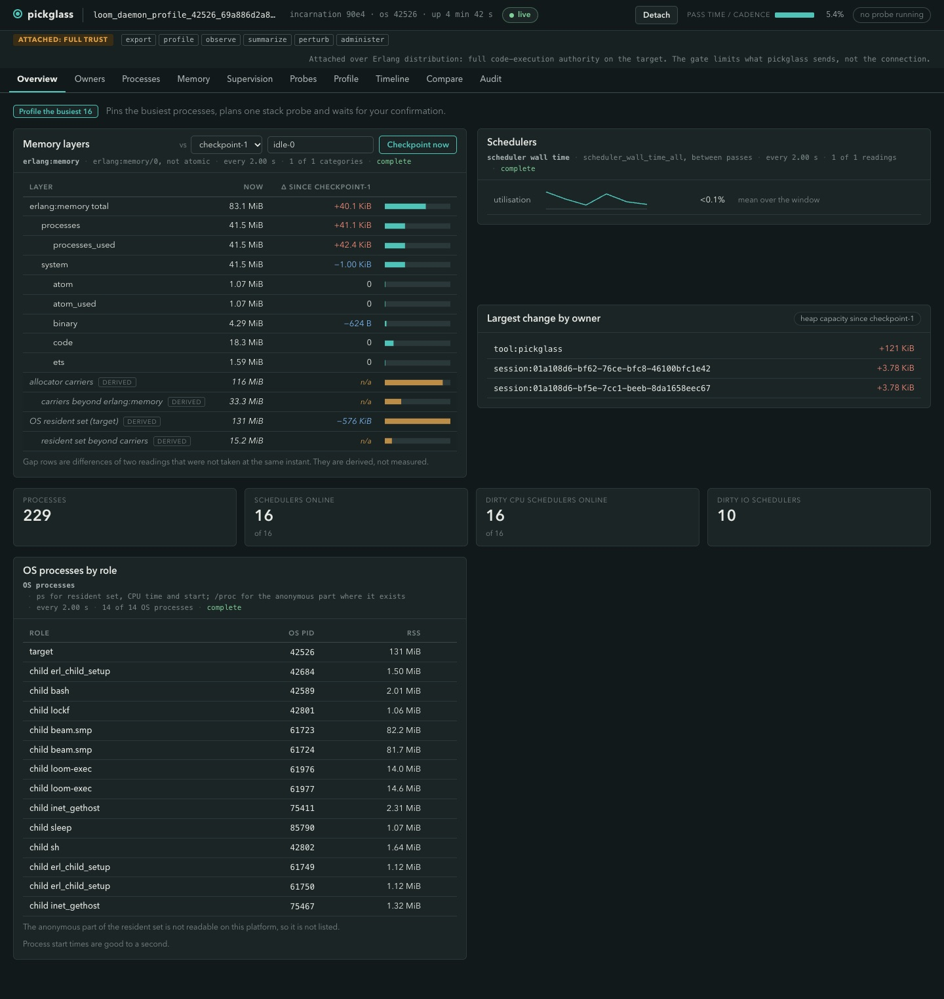

Its first job was closing [Roasbeef/loom#720](https://github.com/Roasbeef/loom/issues/720):
find out which session in a Loom daemon holds the memory, and where the work
goes, on the daemon that has the problem. Nothing in it is specific to Loom
though. Any node started with a name can be attached to (see
[`docs/attach.md`](docs/attach.md)).

## Why outside the VM

An in-process tool allocates in the heap it is trying to measure, and its own
data structures show up in the totals. Pickglass runs in its own VM, joins the
target as a hidden node, and pushes a small agent into it. The agent has no
dependencies, reads process information, ETS table properties and
reference-counted binary lists, and never reads a mailbox, a process
dictionary or a process state. When the viewer detaches, or dies, the agent
unloads itself and releases every trace flag. After a detach on the live Loom
runs we checked the target for pickglass modules, pickglass processes and
leftover trace flags, and found none.

The agent is not invisible. Its own processes are in the target, and they show
up on the Owners page as `tool:pickglass` (two processes and 1.17 MiB in one
run) so you can subtract them. The viewer's memory, its history and its
rendering are in another VM and are not in any figure it shows.

Attaching grants full code-execution authority over the target, as it does for
`observer`. Pickglass says so on every page (the "ATTACHED: FULL TRUST" strip
at the top of each screenshot below) and limits what it sends, not what the
connection could do. The cookie is read from an owner-only file and never from
the command line or the environment, and the pages are served on `127.0.0.1`
behind a single-use ticket.

## Get started

Building needs Erlang/OTP 29, `rebar3` and Gleam >= 1.19.0-rc2. The release it
produces is self-contained and runs on a machine with no Erlang installed.

```sh
make release          # self-contained release in build/release/pickglass
make install          # release, smoke test, then install under ~/.local

# A Loom daemon started with --profile, found from its state directory.
P=pickglass           # or build/release/pickglass/bin/pickglass without installing
$P open --state-dir ~/.loom

# Any node on this machine that was started with a name.
$P open --node app@127.0.0.1

# One reading written to a capture file, then a profile from a terminal.
$P attach --node app@127.0.0.1 --once --out baseline.pgcap
$P profile --node app@127.0.0.1 --top 8 --format text

# Two captures side by side, with the checks on whether they can be compared.
$P compare baseline.pgcap candidate.pgcap

# The same pages over a capture file, with no target.
$P view baseline.pgcap
```

`make install` copies the release into a new directory under
`$PREFIX/lib/pickglass`, points `$PREFIX/lib/pickglass/current` at it, and
writes a `pickglass` launcher into `$PREFIX/bin`. `PREFIX` defaults to
`~/.local`; add its `bin` directory to `PATH` to type `pickglass`. Each install
makes a new directory and never rewrites an old one, so installing again while a
viewer is running does not touch that viewer's files; the new copy is used the
next time it starts. Old directories are kept, because the install cannot tell
whether a viewer still runs from one. Delete them by hand when none does.

`open` joins the target, prints a single-use URL on `127.0.0.1`, and serves the
pages until you press Ctrl-C or use the Detach button. `--save-dir`, `--port`
and `--cadence` set where captures go, which port to serve on and how often the
viewer reads. `--node` cannot be combined with `--state-dir` or `--pid`, and
`--cookie-file` names the cookie file when it is not `~/.erlang.cookie`.
`pickglass --help` has the full usage. To start your own node so it can be
attached to, see [`docs/attach.md`](docs/attach.md).

## Memory, by layer

The Overview page lines up the `erlang:memory` categories, the allocator
carriers, and the OS resident set of the target, with the change since a named
checkpoint. The carrier and resident rows are marked as derived: they are
differences between readings taken at different instants, and the page says
so instead of presenting them as measured. The page also lists the target's OS
processes by role (the VM, its child programs, helpers).

The Memory page breaks the allocators into capacity, used and unused, and
lists the largest ETS tables.

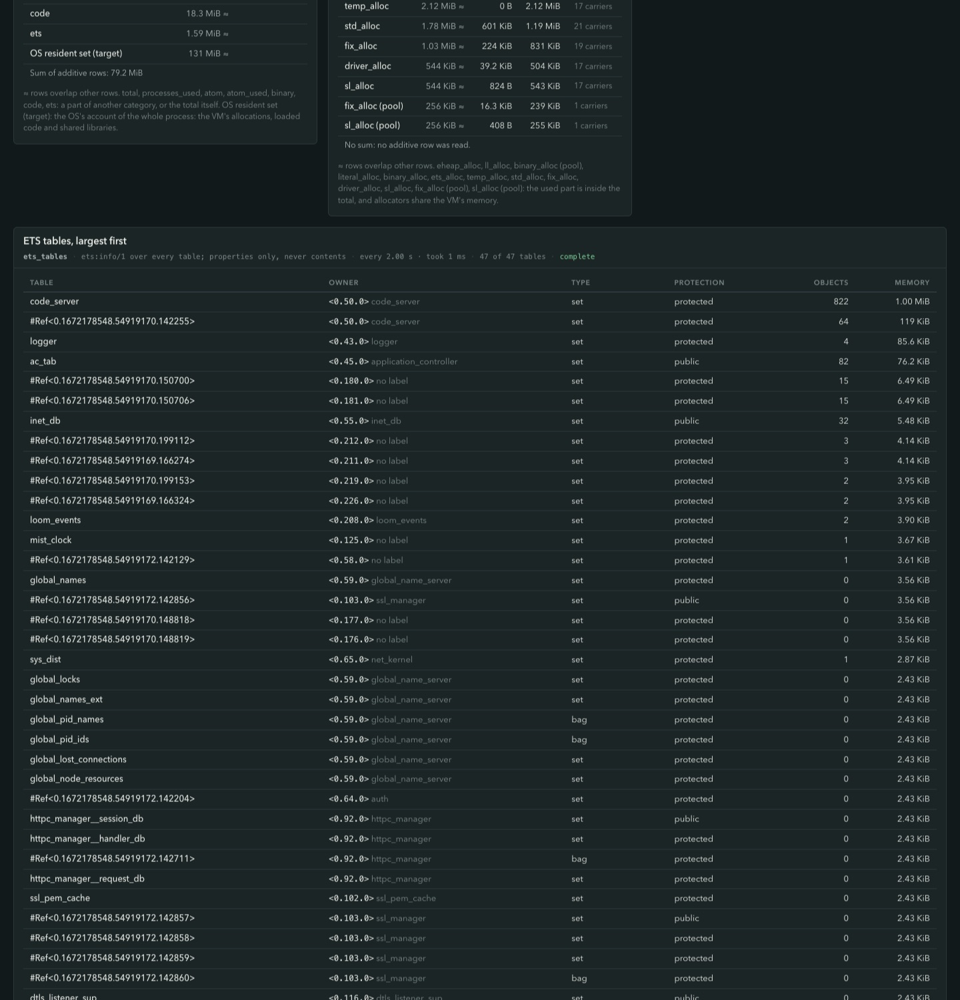

The ETS walk calls `ets:info/1`, which returns a table's properties and no
object, so a table is described without being read. Each table shows its
owner's registered name (or "no label"), type, protection, object count and
memory, and the page states that `erlang:memory(ets)` is larger than the sum
of the table figures because it also counts allocator overhead. The walk has a
two-second deadline, and when it stops early the page says every figure
understates.

## Owners, by label

The Owners page groups processes by who owns them, from labels the program
sets with `proc_lib:set_label/1` (see [Labelling your own
processes](#labelling-your-own-processes)). Each row has the process count,
heap capacity, ETS bytes and tables, the change since the checkpoint, mailbox,
reductions per second, and a Profile and a Record button.

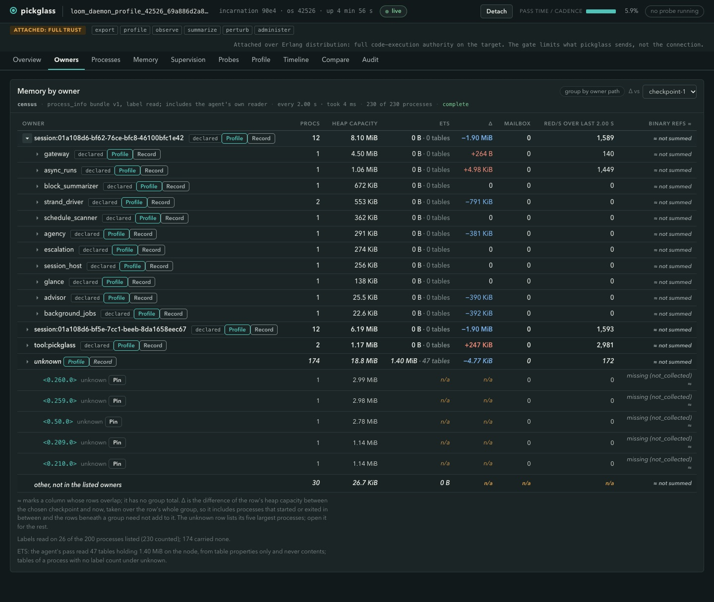

A process with no label is always shown as `unknown`, and the page says how
many it read labels on ("26 of the 200 processes listed (230 counted)"). It
never guesses an owner from a pid, a link or a module name. A link or monitor
is shown as evidence on the process page, not as ownership. Columns whose rows
overlap (binary references, here) have no group total and are marked.

## One process

The Process page shows sizes, garbage collection settings, the counters over
time, and the process's links as evidence. Two actions go beyond reading the
process table.

"Read binaries" lists the distinct reference-counted binaries the process
holds: how many, their total size, how many references it holds to them, and
the largest with how many references each has on the node. A sub-binary counts
the whole binary it points into, so the figure is what the process keeps
alive, not memory it alone owns. A process with more than 50,000 references is
refused with no partial figure.

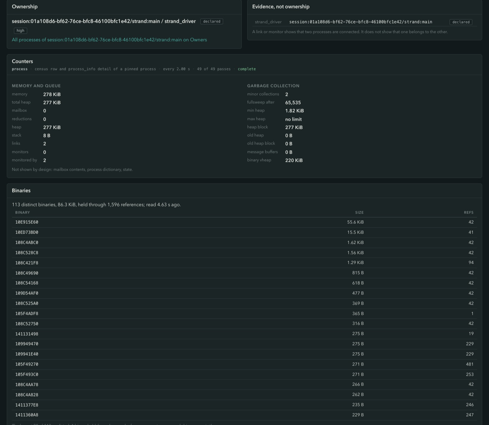

"Plan targeted GC" collects one process and reports its heap before and after,
with the age of the collection, so a heap that is garbage can be told apart
from one that is live data.

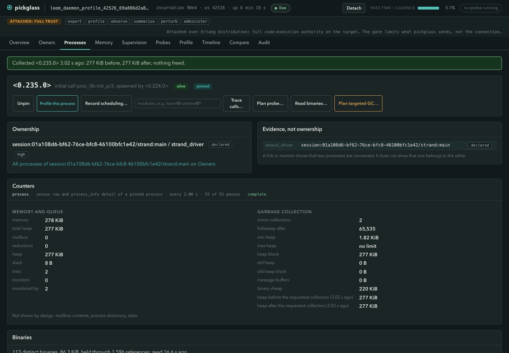

## Plan, confirm, audit

Anything that disturbs the target is planned first and runs only after you
confirm: a stack probe, a call trace, a scheduling recording, a collection, a
binaries read. The plan card states the scope, what will be asked of the
target, the cost (a window, an event budget, a byte bound), the perturbation,
and a line headed "Does not prove". Cancelling or letting it lapse runs
nothing, and the pins a plan took are released when it ends.

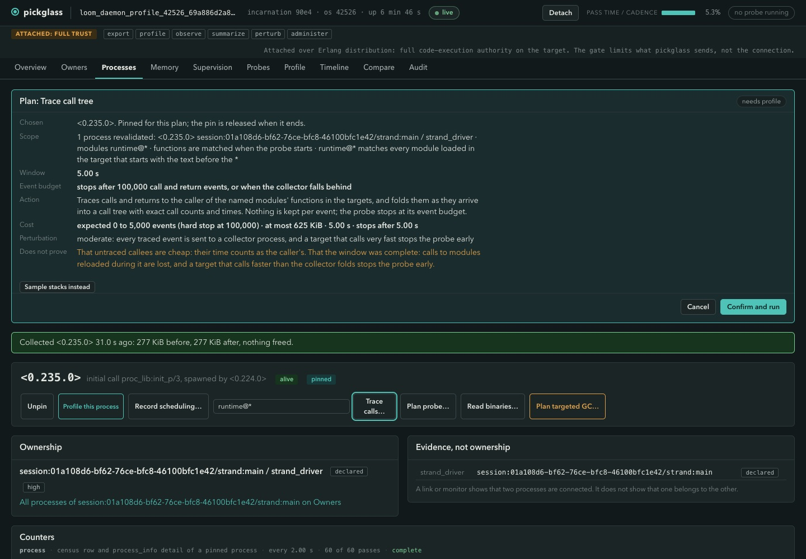

The strip at the top of every page names the authority classes the viewer
holds (`export`, `profile`, `observe`, `summarize`, `perturb`, `administer`).
Every command passes one policy function in the viewer before it can reach the
agent, and a page's principal is set once from the single-use ticket at
WebSocket admission and never read from an event. Every allow and deny is
recorded on the Audit page. The agent checks budgets, admission and pin
validity again on its side.

## Profiling

The Overview, Owners, Processes and Process pages each have a profile button
("Profile the busiest 16", "Profile" on an owner row, "Profile this process").
It pins the processes it needs, plans one stack probe, and waits for you to
confirm. From a terminal it is `pickglass profile`, which goes through the same
plan, confirm and audit path as the pages:

```sh
$P profile --node app@127.0.0.1 --owner session:abc --seconds 10
$P profile --state-dir ~/.loom --top 8 --format text
```

The Profile page shows one profile as a flame graph, an icicle, a pprof-style
call graph, a Top table, Peek and Source, with a filter chain (focus, ignore,
show from and tag steps) in front of all of them. The three views below are of
one call trace taken on a live Loom strand.

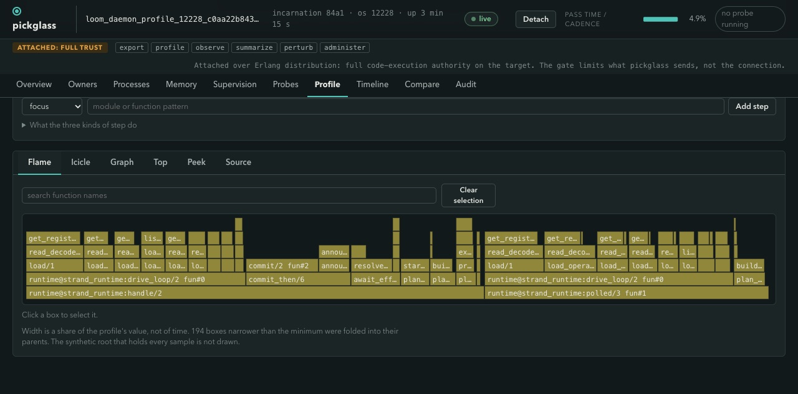

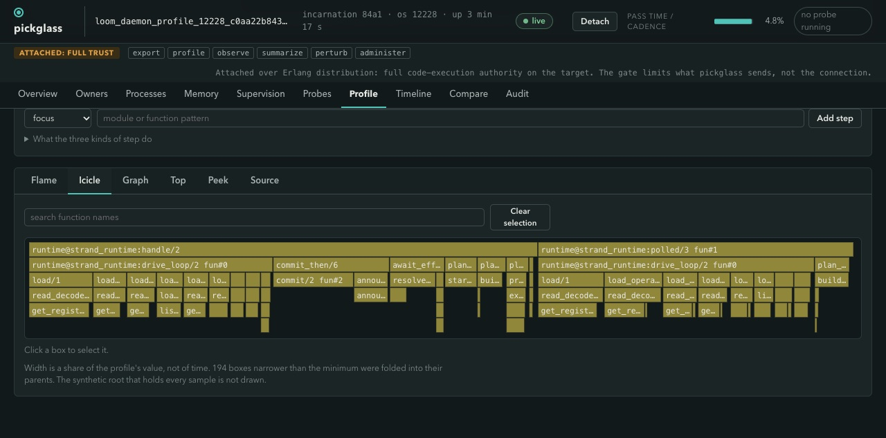

In the call graph each node shows its flat (self) time and its cumulative time
with their shares of the total, shade follows the cumulative share, and an edge
shows its weight when that is at least 2% of the total. It is scaled to fit the
frame by default, with a "Full size" toggle. On the 46-function trace we
measured, the unfocused graph was 3,233 px wide at natural size and 1,196 px
drawn to fit, and a focus step brought it to 902 px.

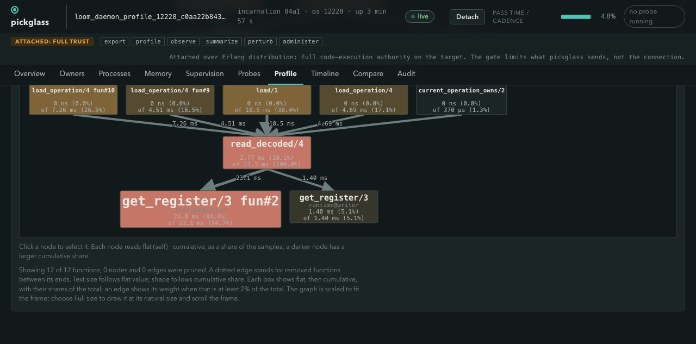

Stack sampling counts only the samples taken while a process was running or
runnable, because on an idle node most samples find processes waiting in
`receive` and the heaviest functions would be the waits. The summary says how
the whole set split, and `--include-waiting` counts all of them.

## Call trace of real calls

Sampling shows where time lands. A call trace shows what was called, with
exact counts and times.

```sh
$P profile --node app@127.0.0.1 --top 3 --trace-calls --module 'my_app*' --seconds 5
```

A module name ending in one `*` is a prefix, so `my_app*` stands for every
loaded module that starts with it. The agent traces calls to them in at most
four processes for at most ten seconds, folds them into a call tree in the
agent, and stops at 100,000 events or when its collector falls behind. Tracing
every function, or a module every process calls such as `lists`, is refused.

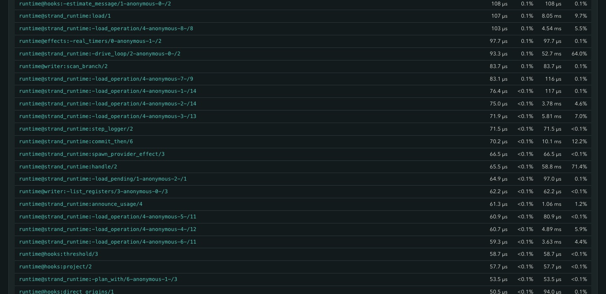

On the live Loom run, a 5 s trace of one strand driver caught 8,096 events and
156 of the 751 functions in the matched modules, and the largest self time was
34% of the 82.3 ms traced. A trace of an idle strand caught nothing, and the
page said "no call to any of the 751 traced functions in 5.00 s" instead of
drawing an empty graph.

## Timeline

The Timeline page draws the viewer's own history of readings (memory by
category, process count, scheduler utilisation, with probes and checkpoints
marked) and the recordings from the probes. A scheduling recording draws each
traced process's runs and garbage collections, and totals them per process.

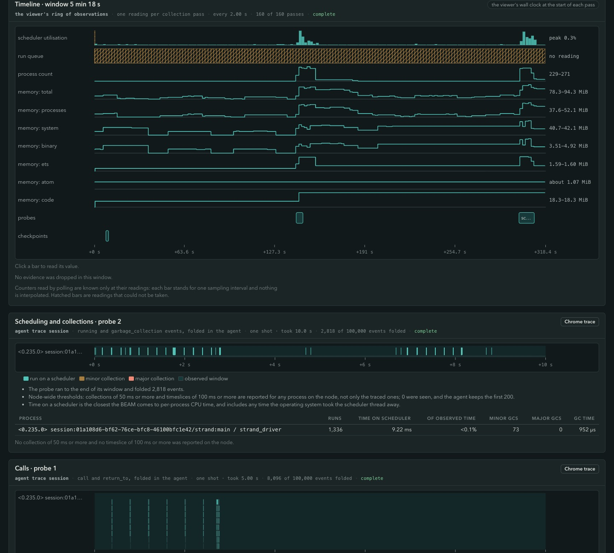

In the recording above, one strand driver had 1,336 runs, 9.22 ms on a
scheduler and 73 minor collections in 10 s. Hatched bars are readings that
could not be taken, and nothing is interpolated.

## Compare, with noise bands

`pickglass compare` and the Compare page set two captures side by side. First
the provenance fields (method, runtime, budget, workload, warmup, cadence,
role, build), with which of them match and which are "not stated", then every
figure with a verdict.

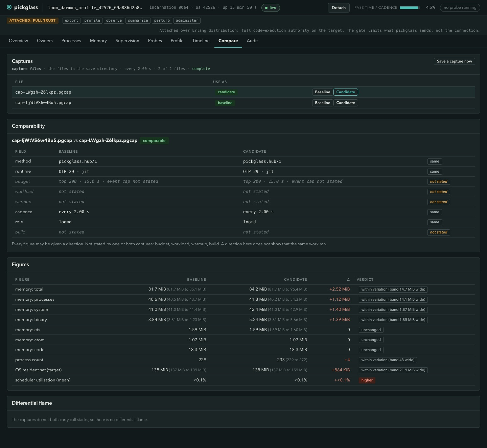

A verdict of "within variation (band 14.7 MiB wide)" means the difference is
smaller than the spread of readings inside the captures themselves. A field a
capture does not state is not assumed to match.

## Supervision

The Supervision page draws the supervision tree, marking supervisors, workers
and leaves, and shows the owner label beside each process that has one.

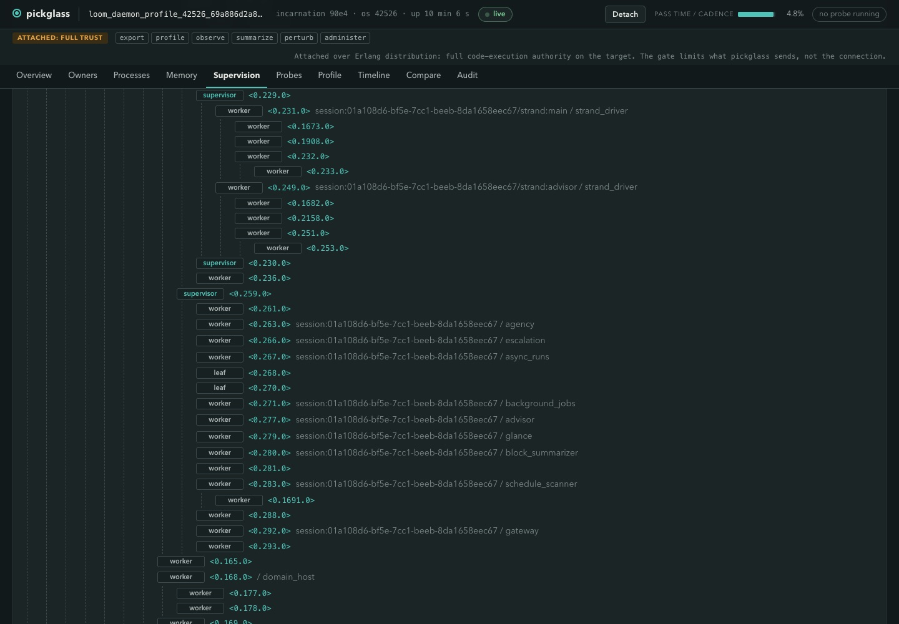

## Detach and teardown

Detach unloads the agent from the target and ends every pin and probe. The
profile, timeline, compare and audit pages keep what the viewer holds, and no
command can run. If the viewer dies instead, the agent unloads itself.


## How it measures honestly

- **A missing value is a word, never zero.** A reading that could not be taken
  is shown as `n/a`, `not stated` or a stated reason (`not_collected`), and a
  sum that would include one is not shown. The same holds in captures.
- **Reductions are not time.** Reductions per second say how much work a
  process did, not how long it ran. Time columns come from scheduler wall
  time, scheduling recordings or call traces, and each says which.
- **Sampling is biased toward reduction safe points.** Stack samples land where
  the VM can inspect a process, so time in long BIFs and NIFs is under-counted.
  The profile caveats say so.
- **Probes are bounded and torn down.** Every probe has a window, a sample or
  event budget and a byte bound, stated on the plan card before you confirm.
  The agent stops early when its collector falls behind and says so, and trace
  sessions are destroyed with the agent.
- **Every panel shows its source.** Each one carries where the figure came
  from, the interval, how many passes completed, and whether it was truncated.

## Labelling your own processes

Pickglass groups processes by one label tuple, set by the process itself as its
first step:

```erlang
proc_lib:set_label({pickglass_owner, 1, [{<<"session">>, SessionId}], <<"worker">>}).
```

The second element is the label version, the list is a path of `{Kind, Id}`
binaries from the outermost owner to the innermost, and the last element is the
role. A label of any other shape counts as `unknown`, and a label belongs to
one process and is not inherited by the ones it spawns.
[`docs/attach.md`](docs/attach.md) has the bounds, the same line in Elixir and
Gleam, and how a process can measure itself for pickglass.

## Exports

A profile exports as speedscope JSON (opens at speedscope.app), as collapsed
stacks (the input `flamegraph.pl` reads), and as a Chrome trace (opens in
Perfetto or `chrome://tracing`). Call traces and scheduling recordings also
export as Chrome traces. On the command line `--format` takes `speedscope`,
`collapsed`, `chrome`, `pgcap` or `text`.

A capture is `pickglass.capture/1`, an NDJSON file with a header, one record
per reading and a footer, conventionally named `*.pgcap`. It keeps the
provenance that `compare` needs. `attach --once --out` writes one, the Compare
page's "Save a capture now" writes more, and `view` serves the pages over one.

## Platforms

Tested live on macOS and on Linux, both with Erlang/OTP 29. The Linux run
attached to a plain `erl` node (not a Loom daemon), took a sampled profile and
a call-trace profile, compared two captures, and ran `make check` on the Linux
box. The release copies the build machine's Erlang runtime, so a release is per
platform, and `make dist` packages it.

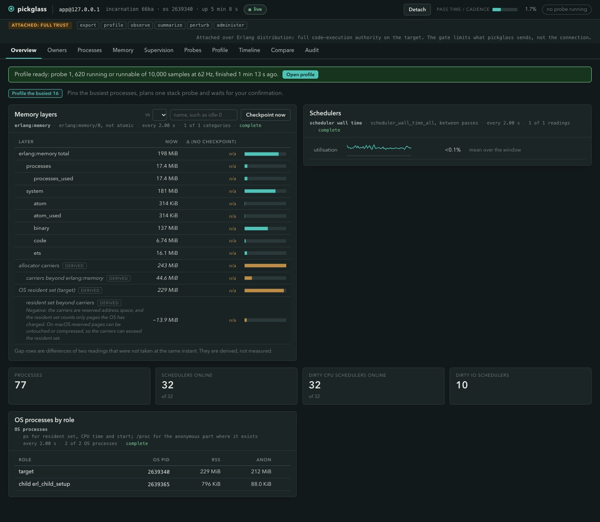

The target needs OTP 28 or newer (the viewer refuses an older one). Building
the viewer needs OTP 29 and Gleam >= 1.19.0-rc2; with Gleam 1.18.1 the format
check in `make check` fails.

## A worked example: Loom #720

[`docs/case-studies/loom-720.md`](docs/case-studies/loom-720.md) walks through
the investigation that started this, on two live runs of a Loom daemon with
real model-backed sessions. It goes through the memory layers, the allocators
and ETS, the owners page, a targeted collection, binaries, a profile, a call
trace, a scheduling recording, a baseline and candidate comparison, and
detach. For each step it says what the page showed and what it cannot prove. In
the first run the resident set tracked the allocator carriers and not the sum
of the categories, and 115 MiB of about 155 MiB of listed heap capacity sat in
processes Loom did not label.

## Known limits

- **Localhost only.** The target's host must be `127.0.0.1`, `::1`,
  `localhost` or this machine's own name, and anything else is refused. The
  check is one function and can be relaxed later.
- **No IPv6 testing.** `::1` passes the check, but it needs both nodes to run
  IPv6 distribution, which pickglass does not set up and we have not tested.
- **Sampling bias.** Stack samples are taken at reduction safe points, so time
  in long BIFs and NIFs is under-counted.
- **No native memory or allocation sites.** Native memory (NIFs, ports, mmap)
  appears only as the derived gap between the resident set and the carriers.
  Pickglass does not say which function allocated a term.
- **Capacity is not live data.** Heap capacity, carriers and resident set
  include memory that is free but not returned. The pages say which figure is
  which, and a targeted collection tests one process.
- **A probe perturbs the target.** The plan card states how much before you
  confirm.

## Working on pickglass

The repository is a workspace of Gleam packages under `packages/`:

- `packages/core` is the pure core: measurements and units, the ownership
  vocabulary, the agent's wire decoders, the capture format, the authority
  policy, and every analysis and layout.
- `packages/agent` is the code pushed into the target. It has no dependencies.
- `packages/web` is every page as a Lustre application.
- `packages/pickglass` is the viewer: attach, the collector, the HTTP and
  WebSocket host, captures and the command line.
- `tools/lint` is Loom's house lint, vendored.

`make help` lists the commands. `make check` is the full gate: format check,
warning-free build, tests, lint, doc-check, and the agent's import and
end-to-end checks against a peer node. `make release-smoke` boots the release
with no `erl` on `PATH`. `make install` installs it under `PREFIX`. Each package has a `CLAUDE.md` with its types,
traffic and invariants.

The docs map:

- [`docs/attach.md`](docs/attach.md): attaching, cookies, naming, labels, and
  what to check when attaching fails.
- [`docs/case-studies/loom-720.md`](docs/case-studies/loom-720.md): the worked
  example.
- [`docs/design/plan.md`](docs/design/plan.md): the plan of record the code is
  built to.
- [`docs/research/`](docs/research): what was studied before building.
- [`docs/gleam-style.md`](docs/gleam-style.md),
  [`docs/lustre.md`](docs/lustre.md) and [`docs/weft.md`](docs/weft.md): code
  style, the Lustre rules the pages follow, and process machinery.

## Inspiration

`observer` set the model: attach from outside to a running node and look at
it. Observer Web showed what that looks like in a browser. Go's `pprof` and
`go tool trace` are the reference for call graphs, flat and cumulative
columns, and scheduler traces. [speedscope](https://www.speedscope.app) is a
format and viewer pickglass exports to, and Brendan Gregg's [flame
graphs](https://www.brendangregg.com/flamegraphs.html) are the source of the
flame view. [`docs/research/`](docs/research) has what was studied.

## Licence

Apache-2.0; see `LICENSE`.
