# Case study: answering Loom issue #720 with pickglass

This page shows what pickglass does on a real daemon, so you can read the
result without running the tool. It walks through two live runs against a Loom
daemon with real model-backed sessions, step by step. Each step says what the
page showed and what it cannot prove. The screenshots are in
`docs/case-studies/loom-720/`.

## The question

[Roasbeef/loom#720](https://github.com/Roasbeef/loom/issues/720) asks why a
Loom daemon's resident memory grows while its sessions look idle. It wants to
know which live process owns the extra heap, whether that memory is live data,
garbage waiting for collection, shared binaries, ETS, allocator capacity or
native memory, and which session accounts for any CPU use. It also asks for
evidence that can be compared before and after a fix, gathered without
restarting the daemon.

## Setup

Start the daemon with profiling enabled, and attach pickglass to it from its
state directory:

```sh
loomd --profile --ui --state-dir <dir> --config <config>
pickglass open --state-dir <dir>
```

`--profile` makes the daemon a distributed node that pickglass can join.
`open` prints a single-use URL on `127.0.0.1` and serves the pages there until
you press Ctrl-C or use the Detach button. `docs/attach.md` explains
attaching in full.

An owner label is how a process says who it belongs to. Loom sets one on each
of its session processes with `proc_lib:set_label/1`, for example
`session:<id>/strand:main` with the role `strand_driver`. Pickglass reads the
labels and groups processes by them. A process with no label is shown as
`unknown`; pickglass never guesses an owner from a pid, a link or a module name.

Two runs are used below. Run A had three sessions and ran for about 14
minutes, with the daemon built from loom commit `ae1a319a4`. Run B had two
sessions and was made later, after the defects run A found were fixed. Each
screenshot says which run it comes from. Every session was a real one, making a
few short model calls on GLM-5.3. The sessions are small, so the heaps below are
small; the point is what each page can and cannot say, not the absolute sizes.

## The walk

### 1. Memory layers (run A)

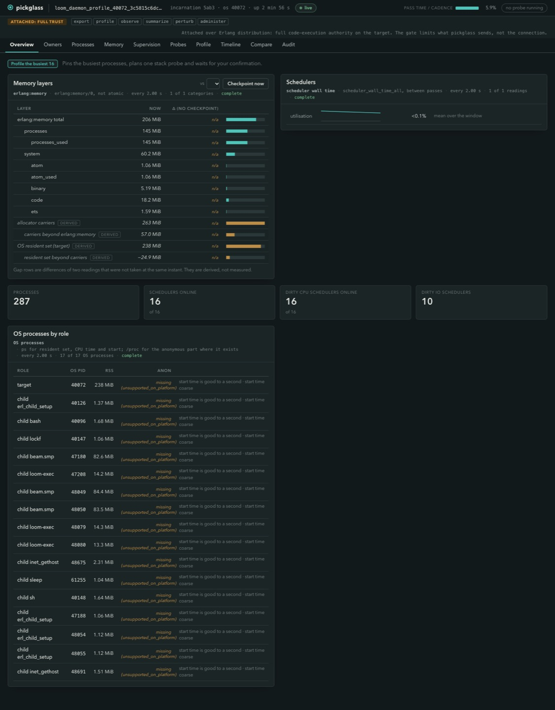

The Overview lists the `erlang:memory` categories (206 MiB total, 145 MiB of
it processes), then three derived rows in a different colour: allocator
carriers (263 MiB), carriers beyond `erlang:memory` (57.0 MiB) and the OS
resident set of the daemon (238 MiB). The table below lists the 17 OS
processes by role: the daemon, three `beam.smp` code-mode children, `loom-exec`
sandbox helpers and shells. Each carries its own resident size, which is
separate from the daemon's accounting.

What it shows: the resident set is close to the allocator carriers, not to the
sum of the categories. That is the first answer to #720's question about live
data versus capacity.

What it cannot prove: the derived rows are differences between readings taken
at different instants, and the page says so. The row "resident set beyond
carriers" reads -24.9 MiB. It is negative because macOS counts only touched or
uncompressed pages in the resident set. Native memory (NIFs, ports, mmap) shows
up only as this derived gap and is never measured directly.

### 2. Allocators and ETS (run B)

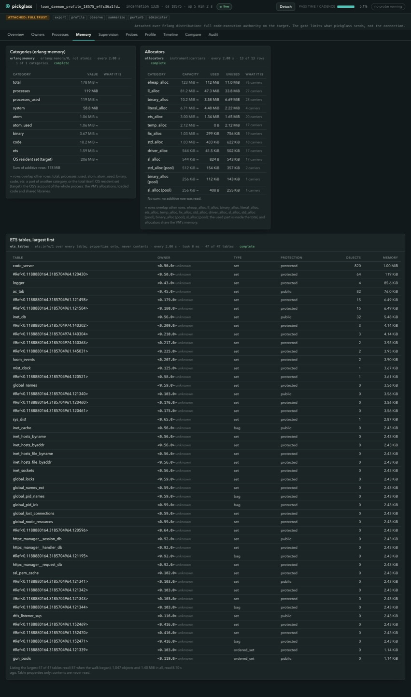

The Memory page puts capacity, used and unused side by side for each allocator.
In this run `eheap_alloc`, which holds process heaps, had 123 MiB of capacity
with 112 MiB used, and `ll_alloc` had 81.2 MiB of capacity with 47.3 MiB used.
Those two allocators hold most of the carriers. Below them is the ETS table
list: 47 tables, 1,047 objects, 1.40 MiB, with name, owner pid, type,
protection, object count and memory.

What it shows: most of the daemon's resident memory is allocator capacity that
is reserved, some of it unused, and not live process data. ETS is small
(1.40 MiB) and no single table stands out.

What it cannot prove: capacity that is unused is not necessarily returned to
the operating system, and this page does not show whether it will be. The ETS
listing reads table properties only and never contents. Every owner column
reads `unknown`, because Loom labels no process that owns an ETS table.

### 3. Owners by session (run A)

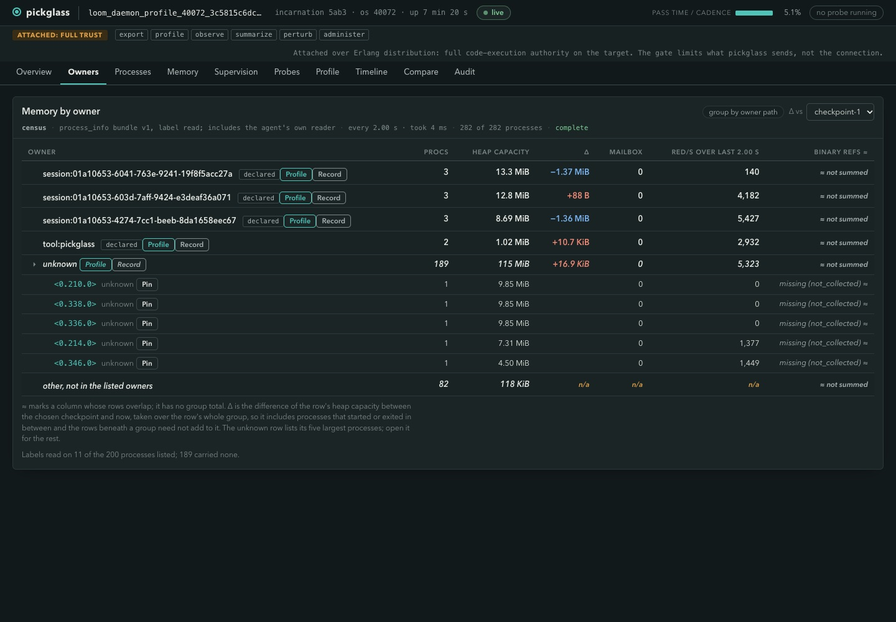

The Owners page groups the census by label. Three `session:<id>` owners had
three processes each (a gateway and two strand drivers) and between 8.69 and
13.3 MiB of heap capacity. `tool:pickglass` is the viewer's own agent, labelled
by pickglass, with 1.02 MiB. The `unknown` row had 189 processes and 115 MiB, with
its five largest members listed beneath it. Three of those five are 9.85 MiB
each, all hibernating, with zero reductions.

What it shows: of about 155 MiB of heap capacity in the listed processes, 115
MiB is in processes Loom does not label, and the sessions together hold about
35 MiB. The delta column is measured against a checkpoint taken earlier: the
session heaps shrank by 1.4 MiB at most while idle, which is garbage
collection, not growth.

What it cannot prove: capacity is not live data. The page also reads labels on
only 11 of the 200 processes it lists, and says so; the other 189 carried none.
The grouping is by label, so it says nothing about a session's memory that sits
in a process Loom did not label. A link or a supervisor does not make a
process belong to a session, and the page shows those as evidence, never as
ownership.

### 4. Drilling into a process, and a targeted garbage collection (run A)

The largest session owner's gateway, pid `<0.371.0>`, had 9.12 MiB.

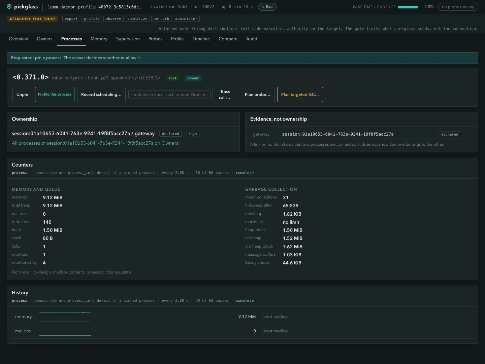

The process page shows the counters: heap 1.50 MiB, old heap 1.52 MiB, and an
old heap block of 7.62 MiB, with a mailbox of 0 and 140 reductions. It does not
show the mailbox, the process dictionary or the state, and says so on the page.
Collecting garbage is a planned action: the plan card states the target and what
the collection will and will not prove, and nothing runs until you confirm. The
decision lands in the Audit page.

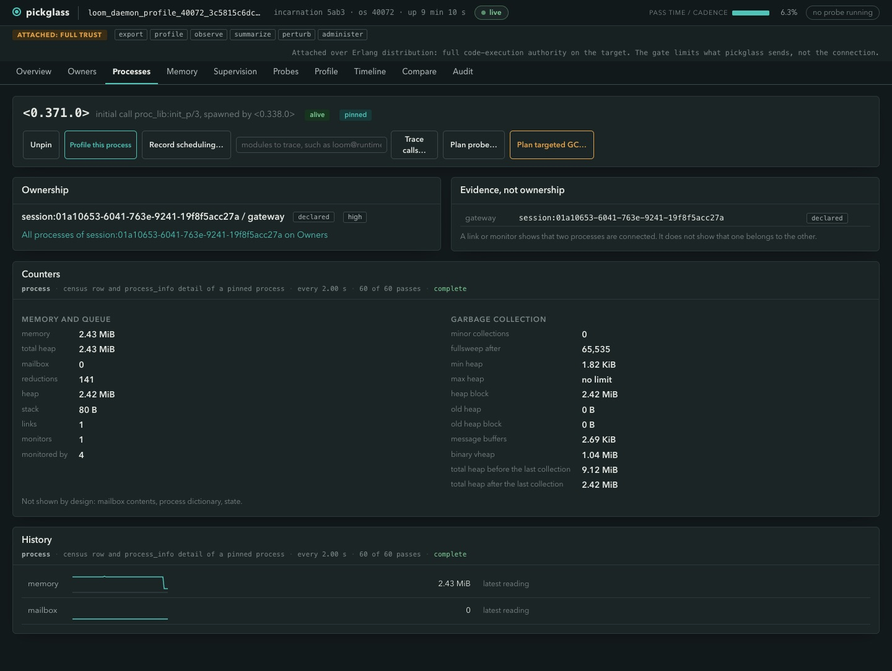

After the collection the process held 2.43 MiB, the old heap was 0 B, and the
page recorded "total heap before the last collection 9.12 MiB" and "after the
last collection 2.42 MiB". The history sparkline steps down at that point.

What it shows: about 6.7 MiB of the 9.12 MiB was garbage in an old heap block
that a full sweep releases, and about 2.4 MiB was live. This is the process
holding capacity for garbage, which is what #720 suspected.

What it cannot prove: it does not show whether the process refills the block
under load, nor whether the freed memory went back to the operating system. The
collection also changed the thing measured, so it is never run during ordinary
sampling or a baseline.

### 5. Binaries a process holds (run B)

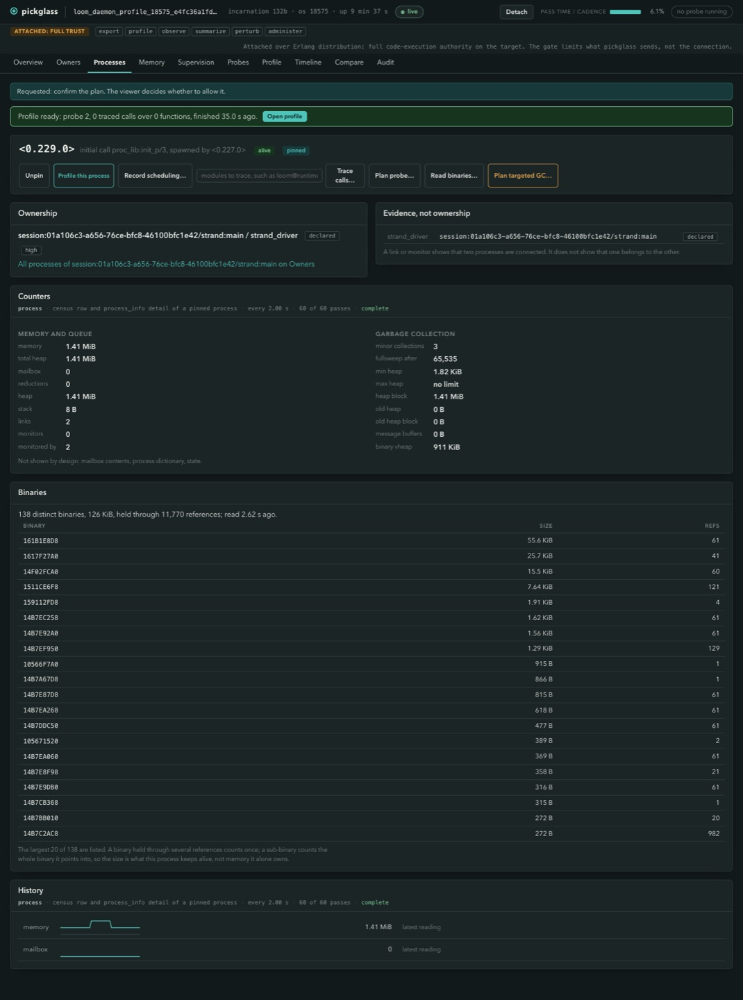

Reading binaries on a session's strand driver showed 138 distinct binaries,
126 KiB, held through 11,770 references, with the largest 20 listed with their
reference counts. Its binary virtual heap was 911 KiB.

What it shows: this process does not retain a large binary. The largest is 55.6
KiB.

What it cannot prove: a binary referenced from several processes is counted once
per process, so per-process figures must not be added up. A sub-binary counts
the whole binary it points into, so the size is what this process keeps alive,
not memory it alone owns. The page says both.

### 6. One-click profile with the on-CPU and waiting split (run A)

The Profile button on an owner row, or "Profile the busiest 16" on the
Overview, plans a stack-sampling probe over the processes it picks and waits for
a confirmation. Here it sampled 10 seconds at 62 Hz over the 16 busiest
processes by reductions per second, which gave 10,000 samples.

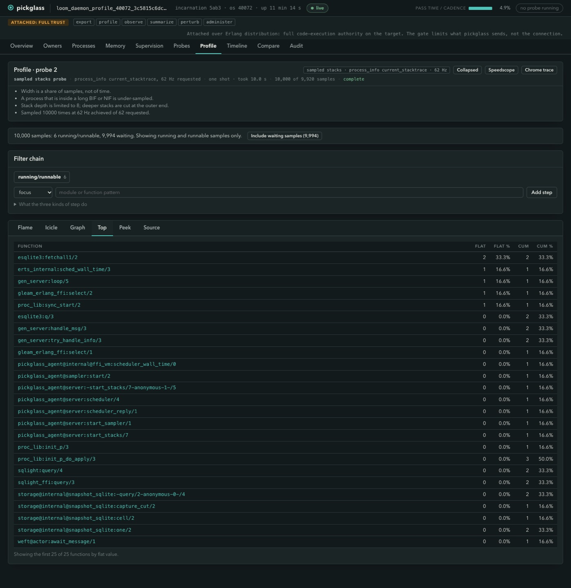

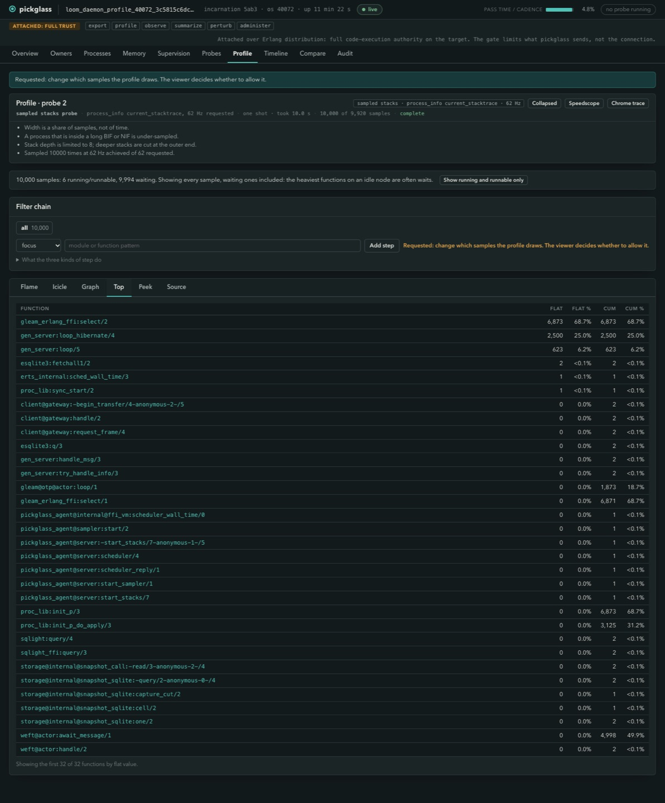

By default only samples taken while a process was running or runnable are
drawn: 6 of 10,000. They show `esqlite3:fetchall1/2` under the storage
snapshot code, and the pickglass agent's own readers. With the waiting samples
included (9,994) the heaviest functions are `gleam_erlang_ffi:select/2` at
68.7% and `gen_server:loop_hibernate/4` at 25.0%.

What it shows: on an otherwise idle daemon no sampled process was burning CPU.
Sixteen processes were on a scheduler for 6 of 10,000 samples.

What it cannot prove: a width in the flame graph is a share of samples, not of
time, and sampling happens at reduction safe points, so a long BIF or NIF is
under-counted. A hibernated process shows only the hibernation loop on its
stack, so a waiting sample there says it is idle and nothing about what it last
did. In run A the picked set included two of pickglass's own agent processes;
the later plan card says it leaves out the agent's own processes.

### 7. Call-tree trace (synthetic node)

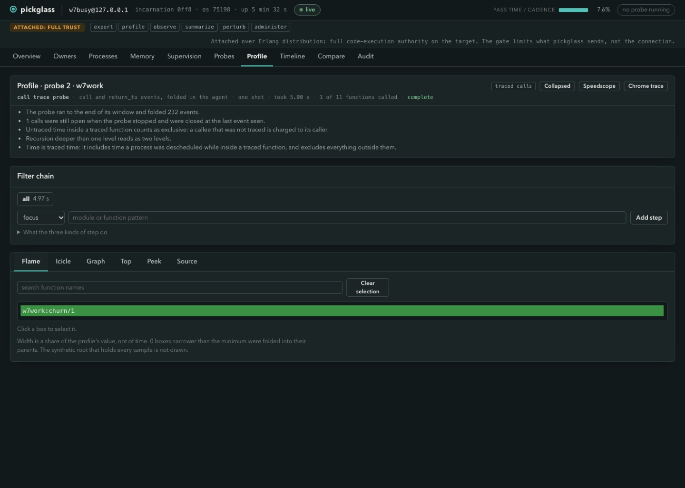

A call trace records the calls to the functions in the modules you name and
builds a call tree with exclusive and inclusive time. The screenshot is from a
small test node running a busy function, not from Loom, because it shows a
populated tree clearly. On the Loom daemon the same probe was run from the
command line against a strand driver during a live model turn, with the module
`runtime@strand_runtime`: 1,615 calls over 111 functions in 112.83 ms of traced
time, with `runtime@strand_runtime:read_decoded/4` the largest at 48.6% of
exclusive time.

What it shows: where traced execution went inside one process during one turn,
and that it was a decode function.

What it cannot prove: it is traced time, which includes time the process was
descheduled inside a traced function, and an untraced callee is charged to its
caller. It does not show why the work was requested. The pattern must name a
module that exists: a prefix such as `runtime@*` was accepted by the plan but
refused by the agent as an unknown module, and tracing `lists` is refused as too
broad. In run B a trace of two idle strand drivers over the `runtime@*` prefix
caught 0 calls, and the page says "0 calls" and shows an empty tree, not a
guess.

### 8. Scheduling and garbage-collection recording (run A)

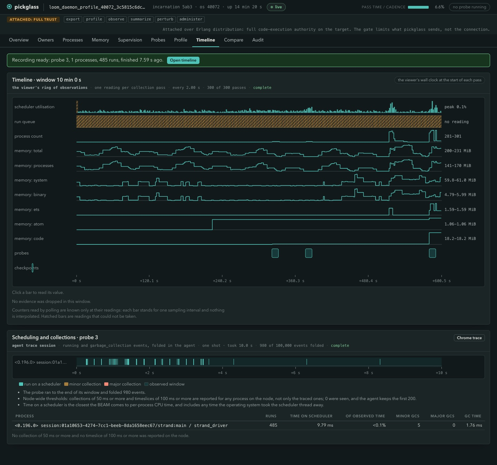

The Timeline draws the viewer's own ring of observations over 10 minutes:
scheduler utilisation (peak 0.1%), process count (281 to 301), and memory by
category. Below it, "Record scheduling" on a strand driver during a turn
produced 980 events, 485 runs, 9.79 ms on a scheduler (under 0.1% of the
window) and 5 minor collections taking 1.76 ms.

What it shows: while idle, `memory: processes` swings between 141 and 170 MiB,
a swing of about 30 MiB between collections, and a session's strand driver uses
under a thousandth of a scheduler. The run queue row is hatched because that
counter was not read, and a missing reading is never drawn as zero.

What it cannot prove: counters read by polling are known only at their
readings, so nothing between two samples is interpolated. Time on a scheduler is
the closest the VM gets to per-process CPU time, and includes any time the
operating system took the scheduler thread away.

### 9. Baseline and candidate with noise bands (run B)

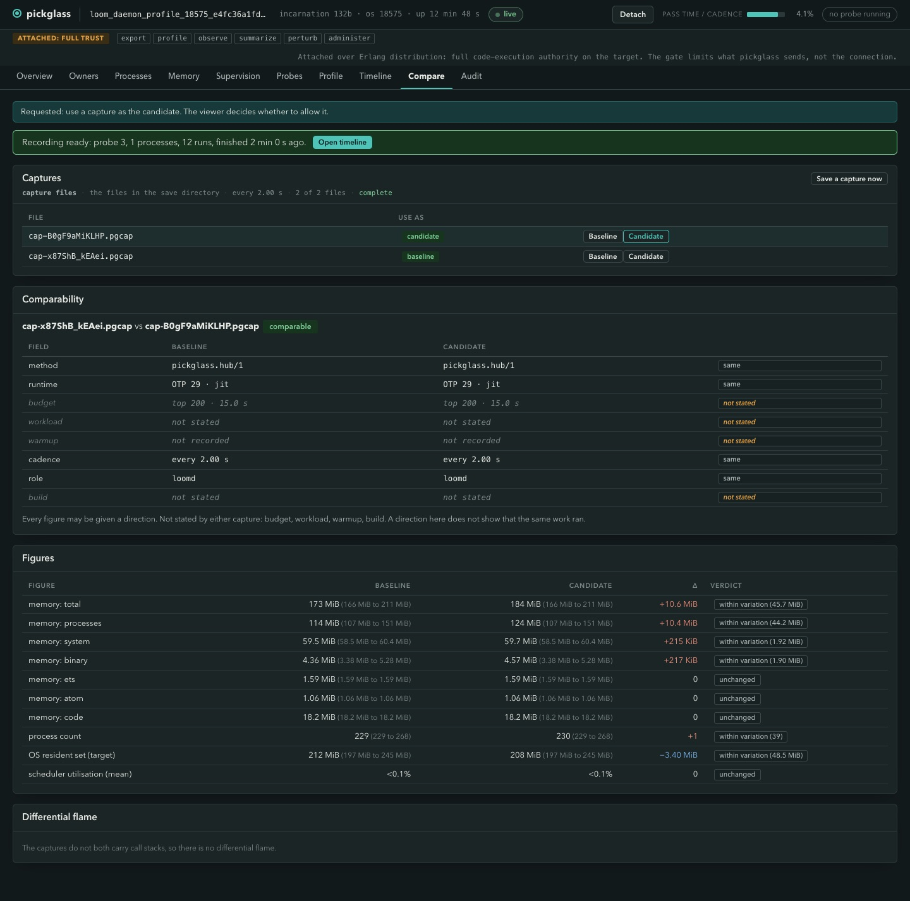

Two captures were saved from the page, one at idle and one after one more
prompt in a session, and compared. The page says they are comparable, then lists
the fields that make a comparison unsafe: budget, workload, warmup and build were
"not stated". Each figure shows the range seen during its capture. Total memory
was 173 MiB against 184 MiB, a difference of +10.6 MiB, with the verdict "within
variation (45.7 MiB)". The ETS, atom and code figures read "unchanged".

What it shows: a 10 MiB difference in total memory between these two captures is
smaller than the swing within each of them, so it is not evidence of a change.

What it cannot prove: the page itself states that a direction does not show the
same work ran. The two captures do not state a workload or a build, so a
comparison across builds would be unlabelled.

### 10. Detach and teardown (run B)

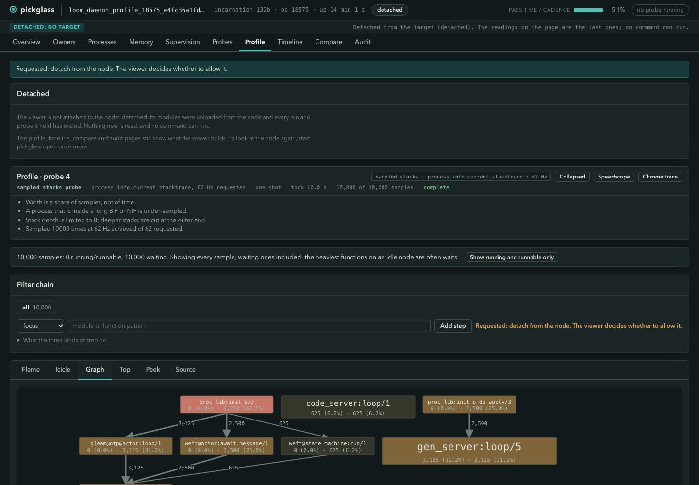

Detach unloads the agent from the daemon and releases every pin and probe. The
strip reads "detached: no target" and no command can run; the profile, timeline,
compare and audit pages still show what the viewer holds.

The teardown evidence came from a separate hidden Erlang node, not from
pickglass: after detach, no pickglass module was loaded in the daemon, no process
mentioned pickglass, no process had a leftover trace flag, and the two Loom
sessions were still alive and labelled. In run A a second pickglass was killed
with `kill -9` five seconds into a call trace, and the same check, made at once
and again 35 seconds later, found the same clean state and a daemon that answered
a further prompt.

What it cannot prove: OTP does not allow listing trace sessions from outside, so
"no trace session exists" is inferred from the agent's modules and processes
being gone, because a session dies with its owner. It is not read directly.

## What the evidence says about #720 today

These are findings from small sessions on one machine, not a diagnosis of a
large long-lived daemon.

- Most resident memory is allocator capacity, not live data. Run A's resident
  set was 238 MiB and its allocator carriers 263 MiB, and the heap allocators
  held most of them, with a share unused.
- Most process heap is in processes Loom does not label. 115 MiB of about 155
  MiB of listed heap capacity was under `unknown`, including three hibernating
  processes of 9.85 MiB each. The sessions together were about 35 MiB.
- Part of a session's heap is garbage awaiting a full sweep. One gateway held
  6.7 MiB of its 9.12 MiB as old-heap garbage.
- Sessions idle cheaply. A strand driver ran for under 0.1% of a 10-second window
  during a turn, and a profile of the 16 busiest processes caught 6 running
  samples in 10,000. No session burned measurable CPU while idle. Gateway
  reductions flip between about 140 and about 34,600 per two seconds, which is a
  periodic burst of a few milliseconds, not sustained load.
- ETS is small and ownerless in the labels. 1.40 MiB over 47 tables.
- The idle `memory: processes` swing of about 30 MiB between collections is
  larger than the +10 MiB difference between the two compared captures, so a
  comparison needs a longer window or a forced-collection protocol before it can
  support a claim.

What Loom should label next, in order of how much it would explain: the three
9.85 MiB hibernating processes and the rest of the large `unknown` rows (find
the owner of each from its initial call and spawner on the process page and
label it where it starts); the processes that own ETS tables, so the table list
stops reading `unknown`; and the strand-level path for every process a strand
starts, so owners can be grouped below the session.

## How the tool was verified

The package tests cover the pure analyses and the total decoders, with property
tests for round trips and layout bounds. `make check` runs them with the
formatter, a warning-free build, the lint and the doc check. An end-to-end check
pushes the agent into a peer node and verifies the counters, the call trace, the
refusals, that no new atom is created, and teardown on a link drop and on `kill
-9`. Beyond those, two live runs against a real daemon with real sessions drove
every page in a browser, found defects (an owner-profile that failed for every
Loom session, a trace refusal with no visible outcome, an unnamed checkpoint and
a silent save failure among them) and the fixes were re-driven in run B. The code
went through independent review passes.

## Known limits

- Native memory is the derived gap only. Per-process binary figures overlap and
  are never summed.
- Loom labels no ETS-owning process, so per-owner ETS reads `unknown`.
- A call trace needs an existing module name; a trace of an idle process records
  nothing, and a trace during a model turn from the browser was not shown in run
  B. The Loom call-tree numbers above came from the command line.
- Compare has no stated workload or build unless the capture carries them, and
  noise bands come only from the captures' own sampling range.
- Only one pickglass may attach to a node at a time, so command-line commands
  run after the page is detached.
- The OS process table prints "missing (unsupported on platform)" for some
  columns on macOS, and the installed client and the daemon were different
  builds in both runs.
- The sessions were tiny. A daemon with long transcripts and many sessions has
  not been measured.
