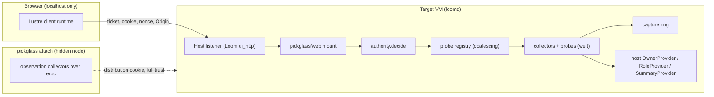
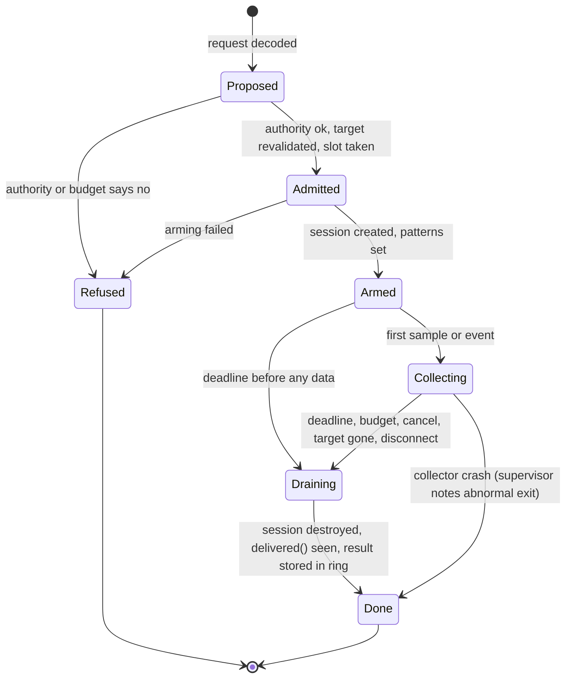

# Pickglass design concept — label `fable`

## 1. Thesis

Pickglass is a capture-first inspector that lives where the handle must
live. Every probe worth having on the BEAM (a trace session, a reference
counted scheduler flag, a timer, a label read, a host-owned ownership
lookup) has to be owned by a long-lived process inside the target VM, and
every authority decision has to be made before any of them starts. So the
collector is an OTP application the host embeds, not a sidecar, and the
one data structure the whole product is built around is the `Capture`: a
versioned, provenance-stamped value that the live pages, the offline viewer,
the exports and the comparison view all read through the same pure `core`
code. A live page is "the newest capture plus a bounded ring of older
ones", never a separate live model. That one decision makes before/after
comparison, file export, JavaScript-target decoding and the forged-event
story fall out of the design instead of being bolted on. The static release
is the same code in two other roles: an offline viewer and comparator of
capture files, and a full-trust *observation-only* attach client over
Loom's existing `--profile` distribution node. Probes never run over
distribution, because an `erpc` call's temporary process cannot own
anything.

## 2. Deployment model

### Three roles, one codebase

| Role | Where the collector runs | Reaches a Loom daemon how | Authority | What it can do |
|---|---|---|---|---|
| **Embedded** (primary) | inside the target VM, as the `pickglass_probe` OTP application started by the host | `loomd --inspect` (or `[daemon] inspect = true`) starts it; the page is mounted under Loom's existing `/ui` listener | the host's owner credential, mapped to pickglass's `Diagnostic` principal | everything: observation, probes, GC, host-provided summaries, export |
| **Attach** (secondary) | in the static release, as a hidden node | `pickglass attach` finds a `loom_daemon_profile_*` node the way `scripts/observer.sh` does and reads the cookie through a private `HOME` | local user who can read the 0600 cookie; **full mutual trust, labelled as such on screen** | observation-class collectors only (`process_info`, `memory`, `statistics`, `instrument`, `ets:info`), snapshot export; no probes |
| **Viewer** | nowhere; `core` only | opens `.pgcap` files | file access | every view, comparison, every export |

The embedded role is what closes #720. The attach role replaces `loomd
observer` for the web era and subsumes `loom-profile` (a one-shot census
becomes `pickglass attach --once --out cut1.pgcap`). It does not replace
`--profile`: that launcher already does the right thing with the cookie
(0600 file under `<state-root>/tokens/`, never in argv or environment) and
pickglass reuses it unchanged. The attach client starts with `-hidden
-dist_listen false -kernel inet_dist_use_interface {127,0,0,1}` and the
cookie reaches it only through Erlang's private `HOME`, as `observer.sh`
does today.

### Why embedded, in one paragraph

The runtime research settled it: the strong trace session handle must sit
in exactly one process and be destroyed on every exit path, a tracer that
dies leaves function patterns counting until the session is destroyed,
`scheduler_wall_time` stays on only while the enabling process lives, and
`erpc` runs each call in a temporary process that exits when the call
returns. A sidecar therefore cannot own a probe. It can only ship a closure
to the target, which is code injection by another name and is what #720
forbids. Observation calls (`process_info`, `memory`, `statistics`) need no
owner and are safe over distribution, which is exactly the attach role's
limit.

### The trust boundary



Two independent credentials, two scopes. The browser holds only the host's
page cookie and nonce; it never sees a distribution cookie, and the
embedded role needs no distribution at all. The attach role holds the
distribution cookie, which is arbitrary execution on the target; the page
it serves says so in its header and offers no probe controls, because a
"read-only" label on a full-trust channel would be a lie.

### How the static release fits

`make release` already bundles ERTS. The release carries one entry point,
`pickglass`, with subcommands `view <files>`, `compare <a> <b>`, `export
<file> --as chrome|speedscope|collapsed|pprof`, and `attach <node>` (or
`attach --loom-state-dir DIR`, which runs the same discovery as
`observer.sh`). The embedded role is a hex dependency of the host:
`pickglass_probe` and `pickglass_web` are ordinary applications in Loom's
release closure, so nothing is loaded into a daemon at runtime and the
release-smoke proof covers them.

## 3. Package layout

```
packages/
  core        pure: capture model, analysis, exports, authority decisions
  probe       impure host: collectors, probes, rings, providers, FFI
  web         Lustre server components, SVG renderers, routes, enforcement
  attach      hidden-node observation client over erpc (release only)
  pickglass   the release entry point (CLI over the three above)
```

| Package | Owns | Pure | Depends on |
|---|---|---|---|
| `core` | `capture` (format, total decoder/encoder), `identity`, `owner`, `coverage`, `measure` (typed values with units), `stacks` (collapse, flame tree, differential), `graph` (pprof-style DAG build, trim, entropy order, layered layout), `transform` (focus/ignore/hide/show chain), `compare` (provenance check, deltas), `memory` (category model and overlap rules), `timeline` (tracks, uncertainty), `export/{chrome,speedscope,collapsed,pprof}`, `authority` (the decision table), `source_map` (decides from debug metadata the probe fetched) | yes; no `@external`, no `gleam_erlang`/`gleam_otp`; JavaScript-target clean | `gleam_stdlib`, `gleam_json` |
| `probe` | `app` (OTP application, supervisor), `registry` (probe table, coalescing, concurrency budget), `budget`, `ring`, `census`, `scheduler`, `memory`, `os`, `trace_session` (the one owner of a session handle), `profile`, `sampler`, `call_trace`, `gc`, `summary`, `provider` (the three extension points), `label`, `internal/ffi_*` | no | `core`, `weft`, `gleam_erlang`, `gleam_otp`, `simplifile` |
| `web` | `mount` (a handler the host routes into), `listener` (pickglass's own mist listener for the standalone roles), `page`, `socket`, `enforce` (principal, per-event authority, audit), `views/*`, `svg/{flame,dag,timeline,sparkline}` | no | `core`, `probe`, `lustre`, `mist`, `weft` |
| `attach` | node discovery, `erpc` observation collectors producing the same `Capture` | no | `core`, `probe` (shares the decoders), `gleam_erlang` |
| `pickglass` | CLI | no | all |

Loom-specific code lives in Loom: `packages/client` registers the three
providers and mounts `web.mount` under `/ui/inspect` in a protocol-change.
Pickglass has no Loom knowledge.

### Every FFI binding, and why

All bindings are typed `@external` declarations in `probe/internal/ffi_*`
modules; no `.erl` file and no NIF. Calls that raise are wrapped with
`exception.rescue`. `gleam_erlang` 1.3 exports no introspection function
at all (its `process` module is spawn, send, selectors, monitors, timers,
registration), which is the reason each of these exists.

| Module | OTP functions | Why no pure alternative |
|---|---|---|
| `ffi_proc` | `erlang:process_info/2`, `erlang:processes_iterator/0`, `erlang:processes_next/1`, `erlang:garbage_collect/2`, `erlang:ports/0`, `erlang:port_info/2`, `ets:all/0`, `ets:info/2`, `proc_lib:set_label/1` | process and table introspection has no wrapper anywhere; `processes_iterator` is the only chunkable walk |
| `ffi_vm` | `erlang:memory/0`, `erlang:system_info/1` (closed list of keys), `erlang:statistics/1` (closed list), `erlang:system_flag/2` (`scheduler_wall_time` and `microstate_accounting` only), `os:getpid/0` | node counters; the flag is reference counted per process, so the binding is called from one owner |
| `ffi_alloc` | `erlang:system_info({allocator, A})`, `instrument:carriers/1`, `instrument:allocations/1` | allocator and carrier data; one reader, because the "max since last call" fields reset for every caller |
| `ffi_trace` | `trace:session_create/3`, `session_destroy/1`, `session_info/1`, `process/4`, `function/4`, `info/3`, `system/3`, `delivered/2` | the session handle is an opaque external type; isolation from legacy `dbg` is the point |
| `ffi_os` | `erlang:open_port/2` with `{spawn_executable, Path}` and a fixed `args` list | `gleam_erlang`'s `port` module is empty; `ps`, `footprint` and `perf` need a bounded port. `/proc` reads use `simplifile` |
| `ffi_beam` | `code:get_debug_info/1` (OTP 28+), `beam_lib:chunks/2`, `application:get_application/1` | source mapping reads module metadata the stdlib does not expose |
| `attach/internal/ffi_erpc` | `erpc:call/5`, `erlang:nodes/1` | the attach role only; `gleam/erlang/node.connect` covers the connect |

About 30 functions. Two things stay out because they need C: tracer
modules (`erl_tracer`) and msacc extra states.

## 4. Data model

### The capture

A capture is JSON (`"format": "pickglass.capture/1"`), gzip-compressed
on disk as `.pgcap`. JSON rather than msgpack because `core` must decode
it on the JavaScript target with no extra dependency, and the sizes in
play (a 100k-process census is about 10 MB uncompressed, 1 MB
compressed) do not need a binary encoding. The decoder is total: any
unknown field is reported as a decode error naming its path, never
skipped, and a later `pickglass.capture/2` is a new decoder behind the
same `core/capture.decode`.

```
Capture
  provenance: Provenance      -- see below
  node: NodeIncarnation
  os_processes: List(OsProcess)
  generations: List(Generation) -- census samples, oldest first
  series: List(Series)        -- node-level counters over time
  profiles: List(Profile)     -- stack sets (flame, DAG, Top)
  events: Option(EventLog)    -- timeline events
  summaries: List(Summary)    -- host-provided typed summaries
  audit: List(AuditEntry)     -- what was done to obtain this capture
```

**Provenance** is the comparison key: runtime version, ERTS version,
emulator flags that change measurement (`+Muatags`, `+JPperf`, `+L`,
msacc build flavour), host application name and build revision (supplied
by the host's `BuildProvider`, see 4.5), platform, workload label (typed
by the operator), session count at capture, warmup and duration, the
probe configuration that produced each section, and pickglass's own
version. `core/compare.comparable(a, b)` returns a `Comparability` with
the list of fields that differ, and the view labels a diff `unmatched`
unless the list is empty.

**Measured values are never zero by default.** Every number is
`Measure = Measured(value: Int, unit: Unit) | Unavailable(reason: Why)`,
where `Why` is a closed type (`NotSupported`, `NotEnabled`, `BudgetHit`,
`TargetGone`, `Refused`, `UnknownKey`). A column is `Column { name, unit:
Unit, method: Method, source: Source }` with `Unit = Bytes | Words |
Count | Reductions | Microseconds | Ratio` and `Method` naming the OTP
call. Reductions carry their own unit so the view cannot format them as
time.

**Coverage and truncation** ride with every section:
`Coverage { requested: Int, scanned: Int, admitted: Int, elapsed_us: Int,
truncated: Truncation }` with `Truncation = Complete |
TruncatedBy(Budget)` and `Budget = Processes(Int) | Samples(Int) |
WallMs(Int) | Bytes(Int) | Depth(Int) | Events(Int) | Concurrency(Int)`.
A `Generation` is one census: its start timestamp, its elapsed
collection interval (measured with monotonic time, not the configured
cadence), its coverage, and its rows. A row is a `ProcessRef` plus one
`Measure` per column plus an `Attribution`.

**Series** are node-level counter samples (scheduler utilization per
scheduler, run-queue lengths, `erlang:memory` categories, allocator
carrier totals, OS RSS), each sample stamped with the elapsed interval it
was computed over. **Profiles** are pprof-shaped: a frame table, a stack
table (frame indexes, root first), samples with one value per column, and
a `ProfileSource = PolledStacks(hz, pids) | TracedCalls(session) |
CallCounters(kind) | PerfImport(map_file)` label that every view prints.
**EventLog** is a list of tracks, each with typed events (`Slice`,
`Instant`, `Counter`, `Flow`) and a `ClockSource`, plus a `Dropped` count
per track and a `coverage` window.

### Identity across restarts

```
NodeIncarnation { name: String, creation: Int, os_pid: Int, os_start: OsStart, booted_at: Int }
ProcessRef      { node: NodeIncarnation, pid: PidText, birth: Birth }
Birth           { generation: Int, seq: Int, parent: Option(PidText), initial_call: Mfa, registered: Option(String) }
OsProcess       { os_pid: Int, start: OsStart, role: Role, parent_os_pid: Option(Int) }
```

`creation` is `erlang:system_info(creation)`. `Birth` is collector-issued
at first sight and is the handle every later request must carry. A pid
is revalidated before any action by re-reading `parent`, `initial_call`,
`registered_name` and `reductions` and refusing if any of the first three
differ or `reductions` decreased; a dead target answers `TargetGone` and
is drawn as historical evidence (greyed row, "last seen generation N"),
never dropped from the capture. An OS process is `(os_pid, start time)`
from `/proc/<pid>/stat` field 22 on Linux and `ps -o lstart=` on Darwin,
so a reused PID is a different `OsProcess`.

### Attribution and the ownership provider

```
Attribution { owner: Owner, source: OwnerSource, confidence: Confidence }
Owner       = Known(scope: List(#(String, String)), role: String) | Unknown
OwnerSource = Label | Registry | Supervision | Link | Inferred
Confidence  = Asserted | Observed | Guessed
```

Ownership enters through three generic extension points the host
registers at `probe.start`:

1. **`label`**: `pickglass/label.set(Owner)` writes `proc_lib:set_label`
   on the calling process with a fixed tagged tuple
   `{pickglass_owner, 1, Scope, Role}`; the census reads it with
   `process_info(P, label)` and decodes it totally. This is the only
   channel that survives Loom's closure-spawned weft actors, whose
   `initial_call` is `erlang:apply`. Loom adopts it beside
   `telemetry/log.adopt`: the same `{session, strand, op, step}` context
   that stamps logger metadata stamps the label, so the two never
   disagree. Labels are readable by any local code and any distribution
   peer, so the host's redaction rule applies to them (identifiers only,
   never text).
2. **`OwnerProvider`**: `fn(List(ProcessFacts)) -> List(Attribution)`,
   called once per generation in its own weft task with a deadline and a
   row budget. Loom answers from its gateway and session registries: pid
   to session/strand/service, the current worker, the restart keeper, the
   provider and LSP managers, the page runtime, the code-mode execution.
   The provider cannot run inside the census; the census runs it and
   joins the answer by `ProcessRef`.
3. **`RoleProvider`**: `fn(List(OsProcess)) -> List(#(Int, Role))` maps OS
   PIDs the collector found (`port_info(os_pid)`, `/proc` children) to
   roles. Loom answers daemon, client, satellite, language server, helper
   from its own process tables. A PID no provider claims is
   `Role.Unknown`, drawn as such.

Supervision, links and registered names are gathered separately and
shown in the supervision view. They are evidence columns with
`OwnerSource = Supervision | Link`, and the attribution join prefers
`Label` over `Registry` over `Supervision`; a row whose sources disagree
shows both.

### Host summaries (phase 3)

`SummaryProvider`: `fn(ProcessRef, SummaryKind, Bounds) -> Result(Summary,
Refusal)`. The host (not pickglass) walks a term it owns and returns a
typed, depth-bounded, byte-bounded `Summary` (a tree of `{label, flat_size,
kind}` nodes with aggregate bytes). Pickglass never calls `sys:get_state`
on an arbitrary process. Loom's provider summarises a restart keeper's
callback environment, which is exactly the `hooks`-capture shape the
2026-09-07 investigation found by hand with `mem_dig.erl`.

## 5. Collectors and probes

Everything that touches the VM is a weft primitive. Collectors are
periodic and cheap; probes are explicit, authorized, budgeted and owned.

| Collector | Primitive | Mechanism | Budget | Cleanup |
|---|---|---|---|---|
| `census` | `weft/actor` with `periodic(every:)` | `processes_iterator` walk in chunks of 2,000; per process `process_info` with the cheap item bundle, then `label`; `OwnerProvider` join in a `weft.deadline` task | processes scanned, wall ms per generation, per-request deadline (p99 was 1.4 ms on Darwin under load); refusal when the registry's concurrency budget is full | nothing to release; a chunk that misses its deadline marks the generation `TruncatedBy(WallMs)` |
| `scheduler` | same actor shape | holds the `scheduler_wall_time` flag (the actor is the owning process), reads `scheduler_wall_time_all`, `run_queue_lengths_all`, `active_tasks_all`, `reductions` totals; msacc deltas only if the flag was already on or the operator enabled it through a probe | one sample per cadence | disables the flag in `on_shutdown`; the actor dying releases it anyway |
| `memory` | same | `erlang:memory/0`, `system_info({allocator, A})` (single reader), `instrument:carriers/1` (reports `UnscannedSize` as coverage), ETS totals via `ets:info/2` single items, `persistent_term:info/0`, OS RSS | wall ms; carriers off on nodes without `runtime_tools` (`Unavailable(NotSupported)`) | none |
| `os` | same, low cadence | `port_info(os_pid)`, `/proc` or `ps`, `RoleProvider` | bounded port deadline | port closed by the task |
| `ring` | plain data in the registry actor | `min_age` and `max_bytes` like Go's flight recorder; oldest generation dropped first | bytes | none |

The registry coalesces: pages subscribe to the ring, they never request
a census. Two tabs cost one census. A page's refresh choice is a view
setting (which generation to draw), not a collector setting.

### Probes

| Probe | Primitive | Mechanism | What it can claim | Budget | Cleanup |
|---|---|---|---|---|---|
| `profile` | `weft/state_machine` | one `trace:session_create` owned by the machine process, which is also the tracer; `trace:function` with `call_time`, `call_memory` or `call_count` and `silent`, `trace:process(S, Pid, true, [call, silent])` on explicit pids; `trace:info(S, MFA, traced)` re-read at collect time | per-function totals per process (Top, Peek); **not** a tree; untraced callees fold into the nearest traced caller; counts are not per process | pids, MFA patterns (concrete module and function only), wall ms | `session_destroy` on every exit; the strong handle is never sent, returned or logged |
| `sampler` | `weft/state_machine` with a periodic timeout | `process_info(P, current_stacktrace)` on explicit pids at N Hz (default 50) | a flame graph labelled "sampled at reduction safe points, not wall time"; biased against long BIFs (98% vs 45% in the research test) | samples, pids, wall ms, depth (`backtrace_depth`) | timer dies with the state |
| `call_trace` | `weft/state_machine` | session with `call` plus `return_to` (tree), or `running`/`garbage_collection`/`send`/`receive` (timeline) on explicit pids; the machine process is a high-priority tracer that counts events and calls `session_destroy` at the event budget, then `trace:delivered` to drain; overshoot reported as `in_flight` | a traced-call tree or a timeline, with per-call overhead stated and dropped events counted | events, bytes, wall ms, pids | `session_destroy`; mailbox drained to the budget then abandoned to the machine's exit |
| `gc` | `weft.deadline` task | revalidate target, read `garbage_collection_info` and OS RSS, `garbage_collect(P, [{type, major}, {async, Ref}])`, read again | that a major GC changed these counters; not that memory returned to the OS | one target per request | the task's exit |
| `summary` | `weft.deadline` task | calls the host's `SummaryProvider` | what the host's walk says, labelled `intrusive` with its measured cost | depth, bytes, wall ms | the task's exit |
| `perf_import` (Linux, phase 4) | bounded port | `perf record -g -p PID` with `+JPperf map` present; reads the map file | an on-CPU native flame graph of scheduler threads, symbolised to Erlang functions; no process attribution | wall ms, bytes | port closed |

### Probe lifecycle



<!-- transitions: probe.Phase -->

| State | Event | Next | Effect |
|---|---|---|---|
| `Proposed` | `Decide(Allow)` | `Admitted` | registry takes a concurrency slot; audit entry written |
| `Proposed` | `Decide(Deny(reason))` | `Refused` | audit entry; reply to page |
| `Admitted` | `Arm` | `Armed` | `session_create`, patterns, flags; the state timeout is the probe deadline |
| `Admitted` | `ArmFailed(reason)` | `Refused` | partial session destroyed |
| `Armed` | `Data` | `Collecting` | first chunk into the result |
| `Armed` | `Deadline` | `Draining` | `session_destroy` |
| `Collecting` | `Data` | `Collecting` | budget counters updated; at the budget `session_destroy` and go to `Draining` |
| `Collecting` | `Deadline`, `Cancel`, `TargetDown`, `OwnerDown` | `Draining` | `session_destroy`; reason recorded |
| `Draining` | `Delivered(ref)` or drain timeout | `Done(reason)` | result sealed with coverage and `in_flight`; slot released |
| any | machine exit | — | the strong handle dies with the process; the VM destroys the session before `DOWN` is delivered |

Rules the port is held to (from `docs/weft.md`): the state payload does
not change within a state (the running budget lives in data), every
`case state, message` pair is written, the deadline is a state timeout so
it is cancelled by the transition out of `Collecting`, and the test suite
deletes each timeout and names the failing test. Hot code reload drops
local patterns; the probe re-reads `trace:info` at collect time and marks
the result `Incomplete(PatternsLost)` rather than reporting lower counts.

### Flame graph and DAG sources, honestly

| Source | Produces | Claims | Cannot claim |
|---|---|---|---|
| `CallCounters` (profile probe) | Top and Peek tables only | time or words per traced function per process | any calling tree; a flame graph is refused for this source |
| `PolledStacks` (sampler) | flame/icicle, DAG, Top | where selected processes were at safe points | wall time share; time in long BIFs or NIFs |
| `TracedCalls` (call_trace) | flame/icicle, DAG, Top, Peek, timeline slices | exact call sequence for traced functions | anything outside the pattern set; the overhead is per call and stated |
| `PerfImport` | flame, DAG | on-CPU samples per scheduler thread | process or owner attribution |

`core/graph` reimplements pprof's pipeline as pure functions: node and
edge construction with `seen_node`/`seen_edge` deduplication, residual and
inline edge flags, node and edge fraction cutoffs, top-N selection with
the entropy ordering, redundant residual edge removal. Layout is a small
layered algorithm (longest-path ranking, barycenter ordering, straight
edges) that is enough for the default cap of 80 nodes; DOT export exists
for anyone who wants Graphviz.

## 6. Authority model

```
Principal   = Diagnostic(subject: String) | Attached(cookie_dir: String) | Viewer
Capability  = Observe | ProbeRun(ProbeKind) | Perturb | Export | Summarise | ManageProbes
Request     = ViewGeneration(..) | StartProbe(..) | CancelProbe(..) | RunGc(..) | AskSummary(..) | ExportCapture(..) | ...
Decision    = Allow(audit: AuditEntry) | Deny(reason: DenyReason)
```

`core/authority.decide(principal, request, target: Revalidated)` is a pure
total function and the only place the capability table lives. In the
embedded role the host maps its own credential to a principal at the
socket upgrade: for Loom, only the daemon owner credential (never an
invited operator, never an observer, never a session) becomes
`Diagnostic`. A session operator's right to steer a session grants
nothing here. In the attach role the principal is `Attached`, which holds
`Observe` and `Export` only, by construction of the capability table.

Server-side enforcement, in order, for every socket event:

1. The Lustre runtime dispatches only to a handler present in the last
   rendered tree with a decoder that succeeds, which drops paths that
   were never rendered.
2. The decoder produces a `Request` with bounded fields and the `Birth`
   of any target.
3. `web/enforce` revalidates the target against the current ring, then
   calls `authority.decide` with the principal the socket was admitted
   with. `update` never sees a request that was denied; it sees a
   `Refused(reason)` message to draw.
4. The registry checks concurrency and budget and may still refuse.
5. Every `Allow` for a probe, a GC, a summary or an export appends an
   `AuditEntry { at, principal, request, target, outcome }` to a bounded
   audit ring that is part of every capture, and the host's logger hook
   receives it (Loom: a `telemetry` line with `Ident` fields).

Tests: `lustre/dev/simulate` sends every mutating event to an `Observe`
principal's component and asserts the history shows a refusal; a raw
socket test holds a valid cookie and nonce and posts forged `EventFired`
frames at paths that exist on the `Diagnostic` page but not on the
attached page; a fixture with another session's secret in a process label
proves no page renders it. These are the forged-event tests #720 asks for.

When remote access arrives (TLS origin, protocol-change/052 style), the
only change is how a principal is established at the upgrade. The
capability table, the revalidation and the audit ring do not move. The
design keeps that door open by never reading the principal from anything
but the socket's admission record.

## 7. Web UI

### Information architecture

```
/ui/inspect                      Overview
/ui/inspect/processes            Process browser (owners, supervision tabs)
/ui/inspect/process/<birth>      Process detail
/ui/inspect/memory               Memory categories, allocators, OS processes
/ui/inspect/scheduler            Scheduler and run-queue trends
/ui/inspect/profiles             Profile list, probe launcher
/ui/inspect/profile/<id>/flame   Flame or icicle (also /dag, /top, /peek, /source)
/ui/inspect/timeline/<id>        Timeline
/ui/inspect/compare              Baseline / candidate
/ui/inspect/captures             Export, import, audit
```

Each page is one server component. The route is in the URL so a link
is shareable; the component's model is the page's view state (selected
generation, sort, transform chain, pivot) plus the ring subscription. A
capability banner at the top of every page says the role (`Diagnostic` or
`Attached: full trust`) and the data source line (`census: 50,112 of
50,112 processes, 112 ms, generation 418, 2.0 s ago`).

### Rendering choice: server-rendered SVG with hard box budgets

Flame graphs, the DAG, the timeline and sparklines are SVG elements in
the server component's tree, rendered by `web/svg` from `core` values.
Reasons, against the alternatives:

- **Bandwidth.** A flame graph is drawn to a width budget: boxes narrower
  than 1/2,000 of the width are dropped (as pprof's 4 px rule at a fixed
  width), and recursion is collapsed, so a frame is at most about 3,000
  `<rect>`+`<text>` pairs, under 400 KB on `Mount` and a small keyed diff
  after. The DAG is at most 80 nodes by construction. The timeline draws
  one bounded window. Everything larger is paged server-side.
- **The CSP and client-component rules.** `docs/lustre.md` allows client
  components only over numeric or identity attributes and slotted
  children, and forbids inline script and styles from content. A canvas
  flame graph needs the whole stack set in the browser, which is the one
  thing the posture forbids. Server SVG needs no new script and no policy
  change: fills come from a closed class list (one class per package hue
  bucket, computed with the same golden-ratio hash as pprof, bucketed to
  24 literal classes so Tailwind can see them), `<title>` children carry
  the hover text natively, and hit-testing is a Lustre click handler on a
  keyed `<g>`.
- **Interaction cost is one round trip.** Pivot, zoom-to-subtree, search,
  swap diff direction and the transform chain are server messages that
  change a small model and emit a small diff, because every `<g>` is keyed
  by frame id and memoized on its inputs. Scrolling is CSS overflow in the
  browser. A page under 100 ms round trip feels direct enough; the
  research viewers that do better do so by holding the data client-side,
  which is the trade this design refuses.

One optional client component is reserved for phase 4: `<pg-ruler>` for a
timeline cursor readout, over a numeric `offset` attribute only. Nothing
else needs script.

### Responsiveness under large captures

Derived data is computed in `update`, never in `view`; tables render a
window (default 100 rows) over a sorted index held in the model; every
list is keyed by `Birth` or frame id and memoized; a page subscribes to
the ring with `server_component.select` once at `init` and `init`
performs no collection, so the 1,000 ms start budget holds even on a
100k-process node; a probe's result arrives as one message when sealed,
not per event.

### Key screens

**Overview**

```
+----------------------------------------------------------------------+
| pickglass  loomd pid 4411 (daemon)  node loom_daemon@127.0.0.1 #3    |
| role: Diagnostic   census gen 418 (2.0 s ago, 112 ms, 50,112/50,112) |
+-------------------+------------------+-------------------------------+
| Runtime           | Memory (bytes)   | OS processes                  |
| OTP 29.0.5 JIT    | erlang total 646M| 4411 loomd      daemon  1.28G |
| atags: off  perf: n/a | processes 597M| 4420 loom       client   41M |
| swt: on (ours)    | binary   2.9M    | 4502 loom-exec  helper   18M  |
| msacc: off        | ets      1.4M    | 4530 ?          unknown  12M  |
|                   | carriers unavail.|  (RssAnon on Linux, ps on mac)|
+-------------------+------------------+-------------------------------+
| Schedulers (util %, 10 s)   Run queues   Reductions/s (work counter) |
| [sparkline x16]             [sparkline]  [sparkline]                  |
+----------------------------------------------------------------------+
| Owners by process memory (gen 418)      | Capabilities               |
| session s-7f…  22 procs  520M  Label    | census        ok           |
| session s-10…   3 procs   61M  Label    | profile       ok           |
| daemon core    140 procs  11M  Registry | sampler       ok           |
| unknown         48 procs   4M  —        | perf import   unavailable  |
+----------------------------------------------------------------------+
```

Every number carries its unit and method in a `<title>`; "unavail." is a
word, never 0.

**Process browser**

```
+----------------------------------------------------------------------+
| Processes  gen [418 v] [pause] group by [owner v] sort [memory v]     |
| filter owner=session:s-7f   100 of 50,112 rows (sorted index)        |
+--------+-------------------+-------+-------+------+-----+------------+
| pid    | owner (source)    | mem B | heapW | mq   | reds| current fn |
| <0.812>| s-7f/main worker  | 120M  | 15M   | 0    | 1.2M| gen:loop/3 |
| <0.790>| s-7f keeper (L)   |  98M  | 12M   | 0    | 310 | weft@sm:…  |
| <0.805>| s-7f advisor (R)  |  26M  |  3M   | 0    | 88k | …          |
| <0.651>| unknown           |  12M  |  1M   | 17   | 9k  | …          |
+--------+-------------------+-------+-------+------+-----+------------+
| tabs: [owners] [supervision tree] [links]  (evidence, not ownership) |
+----------------------------------------------------------------------+
```

The supervision tab draws the tree from `parent` and `$ancestors` where
present, with the application-master gap stated ("Loom's root starts
outside an application; tree is from `parent` links").

**Process detail**

```
+----------------------------------------------------------------------+
| <0.790.0>  birth g102#77  alive  owner session:s-7f role=keeper (Label)|
| memory 98,304,112 B (process_info memory)  heap 12,288,000 W  old 11M W|
| mq 0   reds 310 (+0 since g417)   status waiting   gc minor 4 fullsweep 0|
| binary refs: 3 (1.0 MiB unique in this gen; shared with <0.812>)      |
| links: <0.700> (sup)  monitors: 2   label: {session, s-7f, keeper}    |
+----------------------------------------------------------------------+
| Actions (audited):  [Run major GC]  [Ask host summary]  [Sample 10 s] |
| Last GC probe: none.   Host summary: available (Loom keeper env)      |
+----------------------------------------------------------------------+
```

No mailbox contents, dictionary, or state are shown or fetchable.

**Flame graph**

```
+----------------------------------------------------------------------+
| profile p-31  source: PolledStacks 50 Hz, 2 pids, 10.0 s, 998 samples |
| caveat: sampled at reduction safe points; long BIF/NIF time is under- |
| counted.  width = share of samples, not time.   [flame|icicle] [diff] |
| transforms: focus(gleam@otp@actor) > hide(gleam@list)   [reset]       |
| search [________] (regexp, sets pivot)                                |
+----------------------------------------------------------------------+
| ########################## root (998) ###############################|
| ####### weft@actor:loop/2 (610) #######  ## client@gateway:… (300) ## |
| ### storage@sqlite:step (402) ###   ...                               |
+----------------------------------------------------------------------+
| 2,114 boxes drawn; 340 below 1/2000 width folded into parents         |
+----------------------------------------------------------------------+
```

**DAG**

```
+----------------------------------------------------------------------+
| profile p-31  Graph  nodes 62/80 (0.5% cut)  edges 118 (0.1% cut)     |
| totals: focus/ignore change them; hide/show do not  [download .dot]   |
|            [root]                                                     |
|          /        \                                                   |
|   [actor:loop]   [gateway:…]        box size = flat; colour = cum     |
|       |  \........(residual, dotted)                                  |
|   [sqlite:step]   [json:parse]                                        |
+----------------------------------------------------------------------+
```

**Timeline (phase 4)**

```
+----------------------------------------------------------------------+
| timeline t-9  clock: monotonic_timestamp (one source)  dropped: 41    |
| coverage 10.0 s of 10.0 s   events 48,912 / budget 50,000             |
| <0.812> run  |===|  |==|      |=====|   gc|   |====|                  |
| <0.790> run     |=|       |=|           gc|                           |
| mq <0.812> counter  ______/\____/\______                              |
| run queue  counter  __/\___/\_/\________                              |
| ops (host events)   [op 44  ........]  [op 45 ...]                    |
| select a range -> aggregate table (slices by name, count, total)      |
+----------------------------------------------------------------------+
```

Host operation events (Loom's `{session, strand, op, step}`) arrive only
if the host emits them on the same clock through an `EventProvider`;
otherwise the ops track is absent, not empty.

**Compare**

```
+----------------------------------------------------------------------+
| baseline cut1.pgcap (loom 22bc9b5, OTP 29.0.5, workload "2 idle")     |
| candidate cut2.pgcap (loom 4ed357f, OTP 29.0.5, workload "2 idle")    |
| comparability: UNMATCHED  build revision differs. Deltas shown; no    |
| improvement claim will be labelled. [compare anyway, labelled]        |
+-------------------+----------+----------+----------+------------------+
| owner             | base B   | cand B   | delta    | delta %          |
| session s-7f      | 520M     | 61M      | -459M    | -88%             |
| daemon core       | 11M      | 11M      | 0        | 0%               |
+-------------------+----------+----------+----------+------------------+
| diff flame graph (traced or sampled source must match) [swap]         |
+----------------------------------------------------------------------+
```

**Probe launcher** (inside Profiles): choose kind, pids from the browser's
selection, MFA patterns (concrete only; `'_'` is refused in the decoder),
duration, budgets; the form shows expected scope ("2 processes, 14
functions match, estimated 60-110 ns per call") before the button. The
button exists only on a `Diagnostic` page.

## 8. Answering #720

### The idle-daemon memory question

*Resident memory grows while sessions appear idle. Which actor owns it?*

1. **Overview.** OS table: `loomd` 1.28 GB RSS, clients and helpers small,
   one unknown PID marked unknown. `erlang:memory` total 646 MB,
   `processes` 597 MB. Evidence: the growth is inside the BEAM and in
   process heaps; carriers `unavailable` on this release (named, not
   zero). Cannot prove: whether the gap between 1.28 GB and 646 MB is
   allocator retention or native memory; that needs `instrument:carriers`
   in the release.
2. **Owners by memory.** Group by owner: `session s-7f` 520 MB across 22
   processes, `unknown` 4 MB. Evidence: one session's processes hold the
   step (attribution source `Label`, confidence `Asserted`). Cannot prove:
   that the bytes are live rather than garbage, or unique rather than
   shared.
3. **Process browser, filtered to the session, sorted by memory.** Twenty
   processes at 20-120 MB each, no single owner, `heapW × 8 ≈ memory`.
   Evidence: heap capacity, not binaries or ETS. The binary column dedupes
   by `BinaryId` within the generation, so the shared 1 MB is counted
   once.
4. **Process detail of the keeper.** Memory 98 MB, mailbox 0, status
   waiting. Evidence: idle but large. Cannot prove: what the heap holds.
5. **Run major GC** (separately authorized, audited). Before 98 MB, after
   96 MB; RSS unchanged. Evidence: the data is reachable, not awaiting
   collection; the GC perturbed the target (recorded). Cannot prove:
   memory returned to the OS, which the screen says.
6. **Ask host summary** (phase 3). Loom's `SummaryProvider` walks the
   keeper's callback environment and returns a typed tree: `hooks` 22 MB
   flat, inside it a closure capturing `hooks` 14.7 MB, inside it another
   7.3 MB. Evidence: a retention path with a doubling shape, labelled
   `intrusive` with its measured walk cost and `flat_size` semantics
   ("copy cost, not unique bytes"). Cannot prove: a dominator graph; the
   screen says so.
7. **Compare.** Baseline before the fix, candidate after, both labelled
   workload "2 idle sessions, 60 s warmup". The provenance differs in
   build revision (expected: the fix), so the diff shows deltas and refuses
   the word "improvement" until the operator picks "compare anyway,
   labelled". Delta: session owner -459 MB; `erlang:memory` total -400 MB;
   RSS -700 MB with a note that RSS lags allocator release.

Every step's evidence line is on screen, and every "cannot prove" is a
sentence next to the number, not a footnote.

### A CPU question, briefly

*Which session is burning schedulers?* Overview shows scheduler
utilization per scheduler (from `scheduler_wall_time` deltas) and
reductions per second as a work counter. Process browser sorted by
reductions delta per generation, grouped by owner, names the session.
Start a **sampler** probe on its two busiest pids for 10 s: the flame
graph says `PolledStacks` and the safe-point caveat; the DAG and Top show
`sqlite:step` dominant. If the suspect is a NIF or a long BIF, the caveat
is the finding and the next step is a **call_trace** probe on the
concrete functions (overhead stated per call), or on Linux a `perf`
import with `+JPperf map` for scheduler-thread truth with no process
attribution. The timeline from the same call_trace session aligns `running`
spans with GC instants and mailbox counters on one monotonic clock.

## 9. Phasing

| Phase (#720) | Milestone | Exit criteria |
|---|---|---|
| 1 Feasibility and contract | `core/capture` with total decoder and property tests; `probe/census` + `memory` + `scheduler` collectors measured on a real `loomd` with 50k processes; capability matrix rendered from the running node; protocol-change for `[daemon] inspect`, the `/ui/inspect` mount and the `Diagnostic` principal; the three provider interfaces frozen | overhead numbers recorded (census ms per 10k processes, swt cost); Observer Web sidecar comparison written against the same daemon; proposal merged |
| 2 Bounded observation page | Overview, Process browser (owners, supervision, links), Memory, Scheduler pages; attach role with the same pages minus actions; Loom registers `label` adoption and the Owner/Role providers | forged-event and cross-session fixtures green; 100k-process and four-tab stress with budgets and truncation visible; no page requests a census; `make check` plus daemon/browser tests on Linux and macOS |
| 3 Memory evidence and comparison | `.pgcap` export/import; Compare page with provenance refusal; GC probe with audit; `SummaryProvider` and Loom's keeper summary; lifecycle checkpoints (idle, close, worker restart, keeper retirement) as labelled generations | the keeper fixture, worker release, ETS growth and shared-binary fixtures each reproduce with the right column moving and the others still; proof that ordinary sampling never GCs or copies state |
| 4 Bounded deep probes | profile (counters), sampler, call_trace with timeline; flame/icicle/diff, DAG, Top/Peek/Source; Chrome, speedscope, collapsed and pprof exports with loss lists; perf import on Linux | cancellation, deadline, disconnect, target death, collector crash, daemon shutdown, concurrent legacy `dbg` user and hot reload each leave no session behind (`trace:session_info(all)` checked); event storm test shows budget stop and `in_flight` count |

What ships first to be useful soonest: phase 2's Overview and Owners
table, because that is the first useful answer to the idle-daemon
question, plus `pickglass attach --once` so the one-shot census replaces
`loom-profile` on day one.

## 10. Risks and open questions

Measure before committing:

- **`process_info` latency under load.** p99 1.4 ms per call on Darwin
  with 48 spinners means a 50k census can exceed a second; the chunked
  walk with per-request deadlines is the mitigation, and the generation's
  coverage shows the cost. If it is worse on a real daemon, lower the
  default cadence (5 s) rather than the item bundle.
- **`scheduler_wall_time` default-on.** No measurable cost in the
  compute-bound test; unmeasured on event-heavy workloads. Default on,
  with the flag's ownership shown, and revisit after phase 1 numbers.
- **SVG size for wide flame graphs.** The 1/2,000 cutoff bounds boxes but
  the text budget may still make a `Mount` slow on a 3,000-box frame;
  fall back to a lower box budget or server-side tiling if measured.
- **Sampler bias.** Known and labelled; whether it is useful enough for
  Loom's workload (SQLite NIF time, JSON) is the open question. If not,
  call_trace on concrete functions carries the weight.
- **`instrument` in the release closure.** Loom's release lacked it in
  the September investigation; the capability matrix must show it per
  release and the memory page must say `unavailable` rather than hide the
  column.
- **Lustre forged events.** The research did not exercise whether a
  client can reach a handler absent from the current tree; the design
  does not depend on it (authority runs regardless) but the test must
  exist.

Cut first, in order: perf import, the timeline's operation track (needs
host events on a common clock), pprof export (speedscope and Chrome cover
the viewers), the DAG's own layout (ship DOT export and a Top/Peek first),
the attach role's web pages (keep `attach --once`).

## 11. What was rejected

- **Sidecar-only (Observer Web shape).** Cannot own a probe, cannot read
  host ownership, and its authority is the distribution cookie. Kept only
  as the observation-only attach role, labelled full trust.
- **A client-side SPA or canvas flame graph in a client component.**
  Puts the capture in the browser against the client-component rule and
  needs script the CSP does not grant; interaction gains do not pay for
  a second rendering path.
- **pprof `profile.proto` as the native format.** It cannot carry
  coverage, truncation, method or `Unavailable` per value. It is an
  export with a loss list.
- **Wrapping `tprof`.** `tprof:get_session/1` hands out the strong handle
  and its ad-hoc mode kills the target on timeout; owning the session
  directly is smaller and reviewable.
- **A query engine over captures.** Export Chrome JSON and let Perfetto's
  SQL run outside the daemon.
- **`recon`, `os_mon`, Graphviz as dependencies.** The numbers come from
  the same OTP calls; `os_mon` starts ports and `sasl` and raises alarms;
  the DAG is capped at 80 nodes so a small layered layout suffices.
- **Per-tab collection and census-then-truncate.** Pages subscribe to a
  coalesced ring; the walk is budgeted before it happens.
- **A separate pickglass listener inside Loom.** Loom's ticket, cookie,
  nonce, Origin and CSP machinery already exists; a mount under it via a
  protocol-change reuses all of it. The standalone listener exists only
  for the attach and viewer roles.
- **Process kill, suspend, message send, ETS contents, state dumps.**
  Out of scope by #720 and by design: not a capability in the table, so
  not a handler in any tree.
