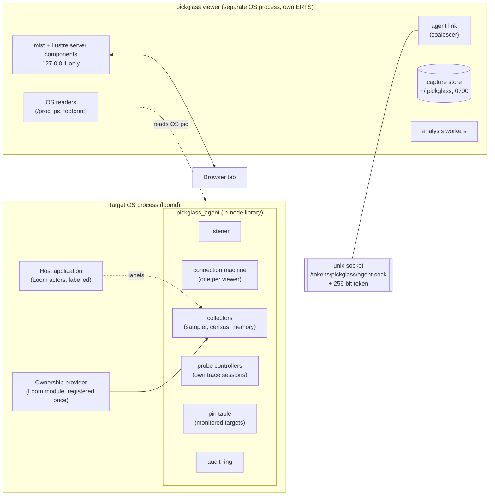
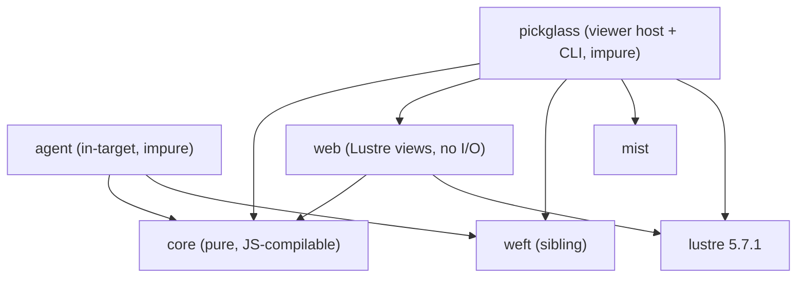
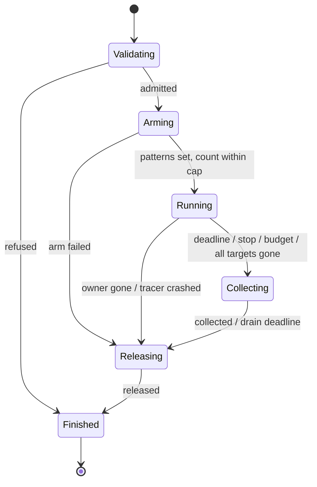

# Pickglass design concept: a small agent, a separate viewer, and a typed wire between them

Label: `opus`. Date: 2026-10-03.

## 1. Thesis

Pickglass splits into two programs. A small **agent** library runs inside the
target VM. It is the only code that touches the runtime, the only holder of
trace sessions, and the only enforcer of authority and budgets. A separate
**viewer** OS process (the self-contained pickglass release) does everything
else: the Lustre UI, capture storage, analysis, layout, comparison, exports,
and OS-level readings. The two talk over a closed, versioned, typed protocol
on an owner-only unix-domain socket, **not over Erlang distribution**. The
reason is #720's own question. "Resident memory grows while sessions appear
idle" cannot be answered by a tool whose capture buffers, Lustre runtimes and
flame-graph layouts live in the heap being measured, and it should not be
answered by a tool whose transport grants arbitrary code execution on the
daemon. With this split, the inspector's footprint in the target is a
handful of processes with fixed budgets that the agent reports as its own
owner. The authority a viewer holds is exactly the set of typed operations
the agent grants that connection, so a compromised viewer or a forged
browser event can do no more than a correct one. The second rule follows from
the first: **the wire is the capture**. Every agent reply is a self-describing
record with timestamps, units, method, coverage and truncation, and a capture
file is those records as they were received. A view therefore cannot
show anything that the saved capture lacks, and a comparison cannot drop the
provenance that would refuse it.

## 2. Deployment model

### 2.1 The pieces



**The agent** is a Gleam library (`pickglass_agent`) that a host adds as a
dependency and starts under its own supervision tree with one call:
`pickglass_agent.supervised(config)`. It is off unless the host enables it.
When on, it listens on a unix-domain socket at a path the host chooses, in a
directory the host has made owner-only (0700). It reads the VM with about 35
direct OTP bindings and owns every trace session it creates.

**The viewer** is the pickglass release: Gleam, mist, Lustre server
components, bundled ERTS, no `erl` needed on `PATH`. It is a separate OS
process. It connects to one or more agents, serves the UI on `127.0.0.1` with
a random port, stores captures in its own owner-only data directory, and
reads OS process data (RSS, CPU time, start time) for any OS pid the agent
names, without involving the target VM at all.

### 2.2 Why not distribution

Distribution between viewer and target is rejected for the normal path for
three reasons, all measured in the runtime research:

1. A connected node can run any function on its peer. The research ran
   `os:cmd` from a hidden sidecar. A viewer holding the cookie therefore holds
   code execution on the daemon, and every bug in the viewer's HTTP or Lustre
   handling becomes a path to that authority. Observer Web shows the
   consequence: an authenticated "read-only" page reaches `Code.eval_string`.
2. `erpc` runs each call in a temporary process on the target. A trace session
   created in such a call dies when the call returns. Probes need a long-lived
   owner in the target, so target-side code is required anyway. Once the
   target runs agent code, the agent can also be the enforcement point.
3. A census shipped as a closure (`erpc:call(T, erlang, apply, [Fun, []])`)
   is code injection. A census done as one `erpc` per process costs about 38
   us each over loopback and moves O(processes) data across the boundary
   before truncating, which is the census-then-truncate shape that #720
   rules out.

The unix socket carries length-prefixed frames (`gen_tcp` with
`{packet, 4}` and a `packet_size` limit). Each frame is one JSON document
decoded by a total decoder in `core`. The agent never calls `binary_to_term`
on input and never creates an atom from input.

Measured while writing this concept, on this machine (Darwin, OTP 29):
`gen_tcp:listen(0, [{ifaddr, {local, Path}}, {packet, 4}, ...])` accepts and
delivers frames; a 172-byte socket path is refused with `einval` (the macOS
`sun_path` limit is 104 bytes); and `socket:getopt(S, {socket, peercred})`
is not supported on Darwin. So file permissions on the directory are the
first factor, and a 256-bit token is the second. Peer credentials are not
available as a factor on Darwin; they are an unverified option on Linux.

### 2.3 Trust boundary

| Party | What it holds | What that lets it do |
|---|---|---|
| Owner OS user | read access to `<state-root>/tokens/pickglass/` | open the socket, read the token, start a viewer |
| Viewer process | one agent connection with a grant set | issue typed operations within the grant and the agent's budgets |
| Browser page | `HttpOnly`, `SameSite=Strict` cookie plus a per-page nonce in `sessionStorage` | dispatch events to handlers the viewer rendered for that page's grant |
| Jailed session tools, code-mode satellites | nothing: `tokens/` is masked from them already | nothing |
| Invited session operators and observers | Loom session credentials | nothing in pickglass; the diagnostic authority is the local OS owner, not a session role |

The Erlang distribution cookie does not exist in this model unless the host
also started distribution for other reasons. If it did, the agent never reads
it, never logs it, and never exports it.

### 2.4 How pickglass reaches a Loom daemon

Loom adds one dependency (`pickglass_agent`) and one module of its own, the
ownership provider (section 4.4). Configuration follows the `--profile`
precedent exactly, because the same constraint applies: allocator tagging is
a boot flag.

- `loomd --inspect` or `[daemon] inspect = true` starts the agent and adds
  `+Muatags true` (per-process allocation attribution needs it at boot). The
  launcher creates `<state-root>/tokens/pickglass/` with mode 0700, as
  `profile-launcher.sh` does for the cookie directory.
- The agent writes `agent.sock` and a descriptor `agent.json` beside it:
  OS pid, OS process start identity, node creation, an agent boot id, role
  (`daemon`), and the token. The descriptor is the discovery mechanism. It
  replaces `observer.sh`'s parsing of the process table: a descriptor whose OS
  pid is not alive, or whose start identity does not match, is stale and is
  ignored.
- `loom inspect` (and `loomd inspect`) finds the descriptor under the selected
  state root, starts the viewer with `--agent <descriptor>`, and prints a
  single-use `http://127.0.0.1:<port>/t/<ticket>` link. The ticket exchange,
  `Origin` check, cookie and per-page nonce copy protocol-change/051's
  design, re-implemented generically in pickglass.
- `--profile` remains as it is. It serves `loom observer` and `loom-profile`.
  The viewer can also use it, in a mode named **bare attach** (section 6.4),
  for a node that does not carry the agent. Bare attach is observation only
  and is labelled as full-trust in the UI.

A terminal client that wants inspection runs its own agent (`loom
--inspect`) with its own descriptor, and the viewer shows it as a second
agent with role `client`. Satellites, language servers and sandbox helpers
are never agents. They appear as OS processes with roles the daemon's
provider declares, and the viewer reads their OS counters directly.

### 2.5 The static release

The viewer release is what `make release` already builds: bundled ERTS,
`lustre` client runtime served from `priv/static`, no network beyond
loopback. It needs `runtime_tools` only for bare attach and offline
`beam_lib` source mapping. The agent is not a release; it is a library
compiled into the host's own release. A host must include `runtime_tools`
for `instrument` (Loom already does). Loom's `make install-debug` can bundle
the pickglass viewer release beside the daemon. A normal install finds it on
`PATH` or takes `--viewer PATH`.

## 3. Package layout



| Package | Pure? | Owns |
|---|---|---|
| `core` | yes; R6 gates it | the capture record types and their JSON codecs (total decoders); units and `Measurement`; coverage and truncation; provenance and the comparability check; the wire protocol (requests, envelopes, grants, refusal codes); the ownership vocabulary; analysis: pprof-style graph building, trimming and entropy ordering; flame and icicle layout; the layered DAG layout; Top, Peek, the transform chain; diffs; timeline layout; exporters to Chrome trace JSON, speedscope, collapsed stacks and pprof protobuf bytes |
| `agent` | no | the listener and connection machines; collectors; probe controllers and tracers; the pin table; budgets and admission; the provider API; the audit ring; the agent's own FFI |
| `web` | no I/O, imports `lustre` | every page as a Lustre application; view functions; event decoders into `core` request types; no process machinery |
| `pickglass` | no | the viewer: agent links, capture store, analysis pool, OS readers, HTTP and WebSocket host, tickets, CLI (`open`, `capture`, `compare`, `export`, `capabilities`) |

`core` compiling to JavaScript keeps one later option open without promising
it: a static offline viewer that opens a `.pgcap` file in a browser using the
server's own decoders and layouts.

### 3.1 FFI bindings

Each binding is a typed `@external` to an existing OTP function in an
`internal/ffi_*.gleam` module. None needs a new `.erl` file. Calls that raise
are wrapped with the `exception` package's `rescue`. `gleam_erlang` 1.3.0 has
none of these (it exports spawn, monitor, link, selectors, timers and
registration only), and weft has no runtime introspection.

**Agent (`agent/internal/`)**

| Module | OTP functions | Why there is no alternative |
|---|---|---|
| `ffi_proc` | `erlang:process_info/2` (fixed item lists only), `processes_iterator/0`, `processes_next/1`, `garbage_collect/2` with `{async, Ref}`, `ports/0`, `port_info/2`, `system_info(process_count)` | the only access to per-process counters and bounded enumeration |
| `ffi_vm` | `erlang:memory/0`, `system_info/1` (closed key list: `creation`, `otp_release`, `wordsize`, `schedulers`, `dirty_cpu_schedulers`, `atom_count`, `atom_limit`, `process_limit`, `port_count`, `ets_count`), `statistics/1` (closed key list), `system_flag(scheduler_wall_time, Bool)`, `os:getpid/0` | node counters |
| `ffi_alloc` | `instrument:carriers/1`, `instrument:allocations/1` | allocator capacity and per-process allocation tags |
| `ffi_ets` | `ets:all/0`, `ets:info/2` | table sizes and owners |
| `ffi_trace` | `trace:session_create/3`, `session_destroy/1`, `process/4`, `function/4`, `info/3`, `system/3`, `delivered/2` | isolated trace sessions; tprof is not used directly (section 5.6) |
| `ffi_size` | `erts_debug:flat_size/1` | used only by the provider helper that lets a process measure its own term |
| `ffi_socket` | `gen_tcp:listen/2` with `{ifaddr, {local, Path}}`, `accept/2`, `recv/3`, `send/2`, `close/1` | look first at `glisten` and `mug`; if neither binds unix sockets, these five bindings are the minimum |
| `ffi_logger` (phase 4) | `logger:add_handler/3`, `remove_handler/1` | operation events from host log metadata (section 5.5) |

**Viewer (`pickglass/internal/`)**

| Module | OTP functions | Why |
|---|---|---|
| `ffi_os` | a bounded port running `ps` and `footprint` with a fixed argument vector; `/proc` reads go through `simplifile` | OS counters for other OS processes |
| `ffi_zlib` | `zlib:gzip/1`, `gunzip/1` | capture compression |
| `ffi_beam` | `beam_lib:chunks/2` (`debug_info`, `"Line"`) | offline Gleam source mapping, read from the release's files, not from the target |
| `ffi_dist` (bare attach only) | `net_kernel:start/2`, `erpc:call/5` against a closed list of observation MFAs | the fallback mode |

`proc_lib:set_label/1` is not in pickglass at all. The host labels its own
processes. A weft extension (`actor.labelled`, `state_machine.labelled`,
`weft.labelled` on a task) is the right place for Loom to do it, so a
label is set inside the process before `init` runs.

## 4. Data model

### 4.1 Measurements never default to zero

```gleam
pub type Measurement {
  /// The counter was read and has this value in the series' unit.
  Known(value: Int)
  /// The counter could not be read; the reason is a closed code.
  Missing(reason: MissingReason)
  /// The counter does not exist for this subject (a port has no heap).
  NotApplicable
}

pub type MissingReason {
  ProcessExited
  CounterDisabled
  UnsupportedOnPlatform
  UnsupportedOnRuntime
  BudgetExhausted
  DeadlineReached
  DecodeFailed
}
```

Units are a closed type: `Bytes`, `Count`, `Reductions`, `Nanoseconds`,
`Ratio(per: Int)`. `Reductions` is its own unit so that no code path can
convert it to time. Words are converted to bytes in the agent with the
`wordsize` recorded in the header.

### 4.2 The capture format, `pickglass.capture/1`

A capture is gzip of newline-delimited JSON. Each line is one record with a
`t` field. Records arrive from the agent in this shape, so the store appends
them as received and adds only viewer-side records (OS readings, checkpoints,
audit).

| Record | Fields | Purpose |
|---|---|---|
| `header` | schema version; capture id; producer versions (pickglass, agent, core schema); target identity (node name digest, `creation`, agent boot id, OS pid, OS start identity, role); runtime (OTP release, ERTS version, emulator flavor, wordsize, scheduler counts, `+Muatags`, `+JPperf`); build (host application name, version, revision, Gleam compiler version); workload (label, session counts from the provider, warmup, notes); redaction policy | provenance |
| `clock` | agent monotonic ns, agent system time ms, viewer system time ms, round trip ns | converts between clocks with a stated uncertainty |
| `strings` | base index, values | interned names |
| `owner` | id, kind, display string id, parent owner id, source (`declared`, `provider`) | ownership vocabulary instances |
| `proc` | ref, pid text, birth token, first seen, owner id, registered name, initial call fn id | process identity |
| `fn` | id, module, function, arity, Gleam file, Gleam line, line precision (`exact`, `function_level`, `none`) | function identity and source mapping |
| `stack` | id, frame fn ids (leaf first) | stack table |
| `series` | id, kind, unit, method, scope (`node`, `process`, `owner`, `os_process`), subject ref, requested cadence | describes one column |
| `samples` | series id, timestamps, elapsed intervals, values (`null` for missing), missing reason codes | columnar values |
| `profile` | id, source (`sampled_stacks`, `traced_calls`, `traced_counters`, `allocation_counts`), value types with units, rows `[stack, v1, v2, ...]`, per-row labels | flame, DAG, Top input |
| `events` | track id, kind, timestamps, durations, args | timeline |
| `coverage` | scope, requested budget, achieved values, outcome (`complete`, `partial`, `refused`, `error`), truncation reason, dropped and in-flight event counts, unscanned bytes | per collection |
| `checkpoint` | name, agent monotonic, system time | idle window, session close, worker restart, keeper retirement |
| `perturbation` | probe id, what was enabled, measured cost (events, collector reductions, bytes, wall time) | observer effect |
| `audit` | entry (section 6.3) | what was done during the capture |
| `footer` | record counts, SHA-256 of the uncompressed body | integrity |

The format is append-only and streamable, so a flight-recorder ring and a
long soak write the same records. Readers refuse an unknown major schema and
keep unknown record kinds as opaque counts, reporting them rather than
dropping them silently.

**Derived exports and their loss lists**

| Export | Carries | Loses |
|---|---|---|
| Collapsed stacks | one profile, one value type | units, coverage, labels, every other value type, provenance |
| speedscope JSON | sampled or evented profiles with units, frame table with file and line | coverage, owner labels (only as profile names), node counters |
| Chrome trace JSON (Perfetto) | events as `X` slices, `C` counters, `i` instants, `M` names; owners in `args` | stacks beyond event names, coverage except as instants, provenance except as metadata |
| pprof `profile.proto` | value types with units, stacks, owner labels as sample labels | coverage, truncation, method, the missing-versus-zero distinction (missing values become absent samples) |

Each export writes its loss list into a sidecar `.loss.txt` and into the UI's
export dialog.

### 4.3 Identity

- **Node incarnation**: `{node name digest, system_info(creation),
  agent boot id}`. The boot id is generated by the agent at start from an
  injected generator. A daemon restart changes it, which invalidates every
  pin and every cached reference.
- **OS process identity**: `{os pid, start identity}`. On Linux the start
  identity is `/proc/<pid>/stat` field 22 plus `/proc/sys/kernel/random/boot_id`.
  On Darwin it is `ps -o lstart=`, which has one-second resolution, and the
  UI marks it `coarse`.
- **Process birth**: a census row carries a pid text and the census epoch in
  which the agent first saw it. That is display identity, not authority.
- **Pins**: to act on a process, the operator pins it. The agent checks that
  the pid is alive, monitors it, and returns a pin token bound to the boot
  id. Every probe names its targets by pin token. A `DOWN` invalidates the
  token, so a later probe against a reused pid or a restarted worker is
  refused with `TargetGone`. The pin table is bounded (64 by default). A
  terminated pin stays in the viewer as historical evidence with its last
  counters and the time of death.

### 4.4 The ownership provider

The provider is how Loom-specific meaning enters without pickglass knowing
any Loom type. A host registers one value at agent start:

```gleam
pub type Provider {
  Provider(
    /// The owner kinds this host uses, in nesting order, with display names.
    kinds: List(OwnerKind),
    /// Turns one process label term into an owner path, or says it is not
    /// this host's label. Runs in the census worker; must be pure and cheap.
    decode_label: fn(Dynamic) -> Result(OwnerClaim, Nil),
    /// Roots for the supervision walk that the OTP application tree misses.
    supervision_roots: fn() -> List(Pid),
    /// OS processes this host started, with their roles.
    os_children: fn() -> List(OsChild),
    /// Workload facts for capture provenance (session counts, idle state).
    workload: fn() -> List(#(String, Int)),
    /// Typed summaries the host can compute on request (section 5.4).
    summaries: List(SummaryKind),
  )
}

pub type OwnerClaim {
  OwnerClaim(
    /// For example [Segment("session", "s-12"), Segment("strand", "main")].
    path: List(Segment),
    /// Role labels such as #("role", "restart_keeper").
    labels: List(#(String, String)),
  )
}
```

The label is the primary channel. Loom's actors are spawned as closures, so
their `initial_call` is `erlang:apply` and carries no ownership. A label set
by the process itself is the one channel that does not depend on how the
process was spawned. Reading it costs about 0.8 us per process with
`process_info(P, label)`. The raw label never leaves the agent: only the
`OwnerClaim` does, and the provider decides which identifiers are
displayable. Session ids are fine to show to the local owner; message text
never belongs in a label.

Every ownership edge carries its source, and the UI keeps the sources apart:

| Source | Strength | Shown on |
|---|---|---|
| `declared` (the process's own label) | an assertion by the process | Owners page |
| `provider` (a summary or OS child the host reports) | an assertion by the host | Owners, OS processes |
| `supervision` (`which_children`) | structural evidence | Supervision page |
| `link`, `monitor`, `registered_name`, `ets_owner`, `port_owner`, `parent` | evidence | Process detail |
| none | `unknown` | an explicit `unknown` group on every grouped view |

Supervision is never used to fill in a missing owner. If Loom forgets to
label a process, the process appears under `unknown`, and that is the
signal to label it.

## 5. Collectors and probes

### 5.1 Capability classes

| Class | Contents | Default |
|---|---|---|
| `observe` | VM gauges, memory categories, census, ownership, supervision walk, ETS and port listings, pins, OS roles | granted to the local owner |
| `summarize` | provider-defined domain summaries; may run code inside a target process | granted, but each kind declares its cost class and the UI shows it |
| `profile` | trace-session probes and stack sampling | granted, each start audited |
| `perturb` | targeted GC; enabling node-global flags (`msacc`) | granted, each action audited, confirmation required in the UI |
| `export` | writing captures and derived exports | granted |

The agent's configuration fixes the grant set per socket. Loom's default for
the owner socket is all five. A host can run a second socket with `observe`
only, which is the shape remote access will use later.

### 5.2 Collectors (observation)

All of them run in the agent, under weft, with explicit budgets.

**Sampler (VM gauges).** A `weft/actor` with `periodic(every: 1000)` reads
`erlang:memory/0`, `statistics(run_queue_lengths_all)`,
`active_tasks_all`, `reductions` totals, `garbage_collection`, process, port,
atom and ETS counts, and `scheduler_wall_time_all`. The actor calls
`system_flag(scheduler_wall_time, true)` at start. The flag is reference
counted per process, so the sampler holds it while it lives and releases it
by dying, and it never disturbs another user. Utilization is computed from
deltas of totals; "since last call" values are never used, because
`wall_clock` since-last is node global. The ring holds 600 samples (ten
minutes) and is the only collector that runs without a viewer, and only when
the host turns on the flight recorder (section 5.5). Its measured cost is an
open item (section 10).

**Census.** One coordinator actor per agent coalesces requests: a request
that arrives while a census runs joins it, and a request younger than the
minimum interval (2 s) gets the last result. The census itself is a
one-task weft run with a deadline and a heap cap. It walks
`processes_iterator` in chunks of 2,000, calls `process_info` with one fixed
bundle (`memory`, `total_heap_size`, `heap_size`, `stack_size`,
`message_queue_len`, `reductions`, `status`, `current_function`, `label`,
`registered_name`), decodes each result totally, and folds it into three
bounded structures as it goes: the top K rows per sort key (K = 200), owner
aggregates, and the reductions baseline map for rate columns. It never
builds a list of all processes. Its output is bounded by K, by the number of
owners, and by the 1 MiB response limit.

The reductions rate needs the previous total per pid. The map is capped at
50,000 pids. Above that, rates are computed for the top K by memory only,
and the series is marked `partial: rate_baseline_capped`. A decreasing
counter is treated as a reset, not a negative rate, as observer_cli does.
Requested and achieved interval are recorded separately; the first census
after a connection is labelled `warming_up`.

The census needs a heap-capped worker, and weft has no `max_heap_size`
option today. Adding `weft.max_heap(run, words:)` (a `spawn_opt` with
`max_heap_size` and `kill => true`) is a weft extension, not a pickglass
FFI module. The limit is checked only at GC, which works for a worker that
allocates; the research showed it does not work for a tracer that only
receives messages, so tracers use event budgets instead (section 5.3).

**Memory categories.** On request, one weft task reads `erlang:memory/0`,
`instrument:carriers/1` (its `UnscannedSize` becomes a coverage field),
`ets:all/0` with `ets:info(T, memory | owner | size)` capped at 10,000
tables, and `persistent_term:info/0`. It never calls
`system_info({allocator, A})` on a schedule, because that call resets the
"maximum since last call" values that other tools read. When the node was
started with `+Muatags true`, `instrument:allocations(#{flags => [per_process]})`
gives allocator blocks per pid. Without the flag the column is
`Missing(CounterDisabled)`.

**Binary references.** `process_info(P, binary)` for the top K processes by
memory, or for all processes of one selected owner. Unique bytes come from
deduplicating by binary id within one collection. The UI says "unique within
this collection" because the id is an address and is not stable across
collections.

**Supervision walk.** From the OTP application masters plus the provider's
roots, `supervisor:which_children/1` with a 200 ms call timeout, at most 300
supervisors, each call in its own weft task so a busy supervisor costs one
timed-out task and not the page. Supervisors that time out are drawn as
`unknown children (timed out)`.

**OS roles.** The agent reports its own OS pid and the provider's
`os_children`, plus `port_info(P, os_pid)` for every port as
`port child (role unknown)` when the provider did not name it. The viewer
reads RSS, CPU time and start identity for each OS pid itself: `/proc/<pid>/status`,
`/proc/<pid>/stat` and `smaps_rollup` on Linux; `ps -o rss=,time=,lstart=`
and `footprint -p` on Darwin, each through a bounded port with a deadline.
An OS process named `loomd` that has no agent descriptor and no parent role
claim is listed as `unidentified (no agent)`. The name is never treated as
evidence of a role.

### 5.3 Probes

A probe is a finite, owned, audited collection with a declared budget. The
operator picks targets by pin and patterns by explicit module, and the UI
shows the expected scope (matched function count, target count, duration,
event and memory caps) before starting. The agent computes the matched
function count during `Arming` and refuses the probe if it exceeds the cap.

| Probe | Mechanism | Produces | Can claim | Cannot claim |
|---|---|---|---|---|
| **Counters** | own trace session, `trace:function` with `call_count`, `call_time`, `call_memory`, `silent` plus `call` on pinned pids only | per-function totals: count (global), time and allocated words (per traced process) | which traced functions consumed time or heap words in the traced processes | a call tree; time of untraced callees is charged to the nearest traced caller; `call_count` is not per process |
| **Sampling** | a sampler actor polls `process_info(P, [current_stacktrace, status])` on up to 16 pinned pids, at most 1,000 samples per second in total | folded stacks with sample counts, split by `status` (running, runnable, waiting) | where a process is when observed, including where it waits in `receive` | wall-time or CPU shares: samples are taken at reduction safe points and under-count long BIFs and NIFs (measured 98% versus a true 45%) |
| **Call tree** | own trace session, `call` and `return_to` with `local` patterns on pinned pids and named modules, `monotonic_timestamp` | a traced call tree with inclusive and exclusive traced time | exact call paths among traced functions in the traced processes | time outside traced functions; time spent descheduled is included unless `running` is also traced; high overhead (about 300 to 400 ns per event before tracer cost) |
| **Scheduling and GC** | `running` and `garbage_collection` process flags on pinned pids; `trace:system` for `long_gc`, `long_schedule`, `large_heap`, `long_message_queue` (session scoped, OTP 28+) | timeline events | per-process scheduled-in time (the closest the BEAM gets to per-process CPU time) and GC pauses for the pinned pids | anything about unpinned processes beyond the threshold events |
| **Targeted GC** | `garbage_collect(Pin, [{type, major}, {async, Ref}])` with `process_info` before and after, node memory before and after, and viewer-read RSS before and after | a before/after record | how much of the process's heap was reclaimable at that moment | that memory returned to the OS; the GC itself changes the workload |

**Tracer design for event probes.** The probe controller (a weft state
machine) holds the strong session handle and is not the tracer. It creates
the session with a separate tracer process that it spawns, links and
monitors. The tracer holds only the weak handle `{Name, Id}`, which is
enough to destroy the session. It aggregates each event into a bounded
stack tree as it arrives and keeps no event list. When it reaches the event
budget, it calls `session_destroy` with the weak handle at once (tolerating
`badarg`), then tells the controller. This split matters because a flooded
mailbox would otherwise delay the controller's own deadline and cancel
messages behind a million trace messages. The rules from the research hold:

1. The strong handle exists only in the controller's state. It is never sent,
   returned or logged. Probe identity on the wire is a probe id the agent
   issued.
2. Tracer death with the session still alive leaves function patterns
   running. The controller monitors the tracer and destroys the session on
   its `DOWN`.
3. Controller death (including an untrappable kill) destroys the session,
   because the controller is the sole holder of the strong handle. The tracer
   is linked and dies with it.
4. Every normal exit path calls `session_destroy` explicitly. Process death is
   the backstop.
5. At collection the controller checks `trace:info(S, MFA, traced)` for each
   pattern it set. A pattern that vanished means the module was reloaded, and
   the result is marked `invalidated_by_reload`.
6. After destroying the session, the controller asks `trace:delivered/2` and
   waits for it up to a drain deadline (500 ms). In-flight events that
   arrive after the budget are counted and reported as `overshoot`. Events
   still queued at the drain deadline die with the tracer's mailbox and are
   reported as `dropped_unread`.

The agent never uses the legacy session, `dbg`, `erlang:system_monitor/2`
(single global owner) or `msacc:reset`. It therefore cannot clear another
profiler's state, and another tool's `dbg:stop()` or `fprof` cannot clear
its sessions.

### 5.4 Domain summaries

A summary is how the restart-keeper question gets answered without copying
the keeper's state into anything. The provider declares summary kinds with a
typed result schema and a cost class:

```gleam
pub type SummaryKind {
  SummaryKind(
    name: String,
    /// Columns with units, so the viewer renders it without host code.
    columns: List(Column),
    cost: SummaryCost,
    /// Runs in the agent's worker; usually asks the target process to
    /// measure itself and waits for a small reply.
    run: fn(Pin, SummaryBudget) -> Result(List(SummaryRow), SummaryError),
  )
}

pub type SummaryCost {
  /// Reads only counters the host already keeps.
  Counters
  /// The target process walks part of its own heap; time grows with size.
  SelfMeasure
}
```

For Loom's keeper, `run` sends the keeper a `MeasureYourself(budget,
reply_to)` message. The keeper computes `erts_debug:flat_size` of its
retained callback inside its own process, so nothing is copied, and replies
`{callback_words, captured_env_count}`. `flat_size` is the copy cost of the
term, not unique retained bytes and not RSS, and the summary's columns say
so in their method field. The agent runs `run` in a weft task with the
budget's deadline. A keeper that is busy produces a `DeadlineReached` row,
not a blocked page. The pickglass provider helper exposes `flat_size` so a
host does not need its own FFI for this.

### 5.5 Flight recorder and operation events

The flight recorder is a host option, off by default until measured. When
on, the sampler's ring (gauges) and a session-scoped `trace:system` ring
(`long_gc`, `long_schedule`, `long_message_queue`, thresholded) run
continuously in the agent with a fixed byte budget (1 MiB by default). A
viewer that connects after an overnight idle period sees the last ten
minutes. That is the "what happened before I looked" workflow the Go flight
recorder provides.

Operation events (provider and tool operations on the timeline) come from
the host's existing log metadata. During a timeline probe the agent adds a
`logger` handler that forwards only events carrying the metadata keys the
provider names (Loom: `session`, `strand`, `op`, `step`) into the probe's
bounded ring, with a drop counter. No Loom code changes, and `telemetry`
stays a leaf package. A logger handler is not owned by a process, so a
handler left behind by a killed controller would run forever. A small
janitor process monitors the controller and removes the handler on its
`DOWN`. This is the kind of janitor that `docs/weft.md` says stays
hand-written, because it defends against an untrappable kill.

### 5.6 How flame graph and DAG data are produced

The source of every graph is a `profile` record, and its `source` field goes
on screen.

- **Sampled stacks** (sampling probe): folded stacks with counts. Flame
  graph width means "share of samples taken at reduction safe points". The
  `status` split gives a second graph of waiting locations, which is the BEAM
  analogue of an off-CPU graph.
- **Traced calls** (call-tree probe): a call tree built in the tracer from
  `call` and `return_to`, with traced inclusive time. Width means "share of
  traced time among traced functions".
- **Traced counters** (counters probe): per-function totals with no stacks.
  These feed Top only. The UI does not offer a flame graph or a DAG for this
  source, because function totals cannot reconstruct a calling tree.
- **Allocation counts** (counters probe with `call_memory`): allocated words
  per traced function, Top only, for the same reason.

The DAG is built from stacked profiles with pprof's algorithm, reimplemented
in `core`: node and edge construction with per-sample `seenNode` and
`seenEdge`, the node-fraction and edge-fraction cutoffs, top-N selection
counting nodelets, residual and inline edge flags, redundant residual edge
removal, and entropy ordering. Layout is a layered layout in `core`: rank by
longest path from roots, order within ranks by four barycenter sweeps,
straight edges. That is enough for the default 80-node cap. DOT export is
offered for operators who want Graphviz.

Tprof is not wrapped. Its `get_session/1` returns the strong handle and
delays cleanup to an unrelated GC, and its ad-hoc mode kills the target on
timeout. The counters probe uses the same OTP mechanism tprof uses
(`call_time` and friends on a dedicated session) with the ownership rules
above, and keeps tprof's documented caveats on screen.

### 5.7 The probe lifecycle

Each probe controller is a `weft/state_machine`. The state payloads never
change within a state; anything that moves per event (counts, partial
results, the dead-target list) lives in data.



<!-- transitions: probe.State -->
| State | Event | Next | Action |
|---|---|---|---|
| `Validating` | grant present, pins live, admission granted | `Arming` | reserve the probe slot; audit `start_requested` |
| `Validating` | grant missing, pin stale, admission refused | `Finished(Refused(reason))` | audit refusal; no session exists |
| `Arming` | session created, patterns set, matched functions within cap | `Running` | arm the duration as a state timeout; record matched count |
| `Arming` | matched functions over cap, or a trace call raised | `Releasing(ArmFailed(reason))` | destroy the session |
| `Running` | state timeout | `Collecting(Deadline)` | |
| `Running` | `Stop` from the owning connection | `Collecting(Stopped)` | |
| `Running` | tracer reports budget reached (it already destroyed the session) | `Collecting(BudgetReached)` | |
| `Running` | `DOWN` of the last pinned target | `Collecting(TargetsGone)` | earlier target deaths only update data and coverage |
| `Running` | `DOWN` of the owning connection | `Releasing(OwnerGone)` | discard partial results; audit |
| `Running` | `DOWN` of the tracer | `Releasing(TracerCrashed)` | |
| `Collecting(r)` | counters read, `trace_delivered` received | `Releasing(r)` | check `trace:info` for reload; mark `invalidated_by_reload` if a pattern vanished |
| `Collecting(r)` | drain state timeout | `Releasing(r)` | mark partial, record `dropped_unread` |
| `Releasing(r)` | session destroyed, tracer stopped, logger handler removed | `Finished(r)` | send the result envelope; audit `finished` with measured perturbation |

The controller crashing is not a row: the VM destroys the session when its
sole holder dies, the tracer dies by link, and the probe registry (which
monitors every controller) records `Finished(ControllerCrashed)` and audits
it. Daemon shutdown is the same path.

### 5.8 Budgets

These defaults are starting points. Phase 1 measures them on a real daemon.

| Budget | Default |
|---|---|
| Connections per agent | 4 |
| Requests per connection | 20 per second; inbound frame 64 KiB |
| Response size | 1 MiB per envelope; larger results are paged |
| Census | 200,000 processes scanned, 2 s deadline, chunks of 2,000, 1M-word heap cap, minimum interval 2 s, coalesced |
| Rate baseline map | 50,000 pids |
| Pins | 64 |
| Concurrent probes | 2 in total, 1 per trace-based kind |
| Probe duration | 60 s for event probes, 300 s for counters |
| Matched functions | 5,000 |
| Targets per probe | 16 pinned pids; `set_on_spawn`, `all`, `new` are not offered |
| Events | 200,000 per probe |
| Distinct stacks | 20,000 per profile; the rest folded into `[truncated]` with its count |
| Sampling | 1,000 samples per second in total |
| Supervision walk | 300 supervisors, 200 ms per call |
| Flight recorder | 1 MiB |
| Viewer capture size | 256 MiB; larger imports are refused |

Deny-listed patterns: any pattern on `erlang`, `lists`, `gleam@list` and
other hot standard modules with `'_'` function, unless the probe targets
explicit pids and the operator acknowledges the cost in the start dialog.
The agent's own processes are excluded from every probe and are reported
as a separate owner, `pickglass agent`, on every grouped view.

## 6. Authority model

### 6.1 Requests are closed types

Every request is a constructor in `core`'s `Request` type: `Hello`,
`Capabilities`, `Gauges(window)`, `Census(sort, k)`, `OwnerBreakdown`,
`MemoryCategories`, `BinaryHolders(scope)`, `EtsTables(limit)`,
`Supervision`, `OsRoles`, `Pin(pid_text)`, `Unpin(token)`,
`ProcessDetail(token)`, `Summary(kind, token)`, `StartProbe(spec)`,
`StopProbe(id)`, `ProbeStatus(id)`, `TargetedGc(token)`, `AuditTail(n)`.
There is no request that names a module and function to call, no request
that carries a term, and no request that reads message contents, the process
dictionary, raw state or ETS rows. `ProbeSpec` holds module names as
strings that the agent resolves with `binary_to_existing_atom` semantics (a
module that is not loaded is refused, not created).

### 6.2 Where each check happens

| Layer | Check |
|---|---|
| Socket accept | path is in an owner-only directory; first frame must be `Hello` with the token, compared in constant time; the connection's grant set comes from agent config, not from the request |
| Agent connection machine | every request is checked against the connection's grant and rate budget; the agent is authoritative even if the viewer is compromised |
| Agent admission | probe and census budgets, pin validity, concurrency slots |
| Viewer HTTP | `Host` is `127.0.0.1:<port>`; `Origin` equals it; ticket single use; cookie `HttpOnly` and `SameSite=Strict`; per-page nonce on the WebSocket upgrade; CSP `script-src 'self'`, `style-src 'self'`, `form-action 'none'` |
| Viewer page | a handler is rendered only when the page's grant includes the action; `update` re-checks the grant and the current state; targets are named by keys into the model's pin list, never by pid text from the browser |

Forged-event tests cover each layer: a Lustre event sent to a handler path
that was not rendered; an event whose key names a pin that was never shown
on that page; a raw WebSocket frame without the nonce; a direct socket
connection without the token; a valid connection sending a request outside
its grant; and a `StartProbe` with a stale pin token after the target
restarted.

### 6.3 Audit

The agent writes an audit entry for every pin, summary, probe start, stop,
refusal and finish, and every targeted GC: time, connection id, the
viewer-supplied page id, the typed request, target identity (pin token, pid
text, birth epoch, owner path), budget, outcome, and measured perturbation.
The ring holds 1,000 entries, and the host may also forward entries to its
logger (Loom: its telemetry log). The viewer copies the entries for a
capture's time range into the capture.

### 6.4 Bare attach

For a node without the agent (an older Loom started with `--profile`, or any
other BEAM node), the viewer can attach as a hidden node with
`-dist_listen false` and read the cookie from the owner-only directory
without putting it in an argument vector, as `observer.sh` does. Only
observation operations are offered, each mapped to a closed list of stock
OTP MFAs called through `erpc`. Probes and summaries are unavailable,
because their lifetime cannot be owned from outside the node. The page shows
a fixed banner: "Attached over Erlang distribution. This connection holds
full code-execution authority on the target; pickglass uses only read
operations, but the authority is not reduced by that." It exists for
diagnosing a node that cannot run the agent and is the first thing to cut.

### 6.5 When remote access arrives

The agent does not change. A remote deployment adds TLS and multi-user
authentication at the viewer's HTTP front door, maps each principal to a
grant set, and opens agent connections whose grant matches (for example a
second agent socket configured `observe` only). The agent's per-connection
grant, budgets and audit already assume an untrusted client. The things that
would have to be revisited are the localhost-only cookie scheme and the
CSP host source, both in the viewer.

## 7. Web UI

### 7.1 Information architecture

```
Agents                     list of discovered agents and OS processes
└─ Agent (one target)
   ├─ Overview             gauges, memory layers, scheduler and run queues
   ├─ Owners               grouped ranking by owner path, with Δ between checkpoints
   ├─ Processes            ranked census rows; pin from here
   │  └─ Process detail    counters, GC info, binaries, evidence edges, summaries, probes
   ├─ Memory               categories with overlap explanation; allocators; ETS; binaries
   ├─ Supervision          tree from application masters and provider roots
   ├─ OS processes         roles, OS pid, start identity, RSS, CPU time
   ├─ Probes               running and finished probes; start dialog
   └─ Audit
Captures                   saved captures; checkpoints; import
└─ Capture
   ├─ Top / Peek / Source
   ├─ Flame / Icicle       (stacked sources only)
   ├─ Graph                (stacked sources only)
   └─ Timeline
Compare (baseline, candidate)
```

Every page has a header strip that states the page's data source, method,
coverage, truncation and the age of the data, with the requested and
achieved interval. A pause control stops refresh for that page.

### 7.2 Key screens

**Overview**

```
┌ loomd · pid 41233 · started 09:12:04 · OTP 29.0.5 · agent boot 7f3a… ── [pause] ┐
│ source: VM gauges · polled 1 s (achieved 1.003 s) · complete                       │
│                                                                                   │
│ Memory layers (bytes)           now        Δ since checkpoint "idle-0"            │
│  OS RSS (viewer, /proc)       1.92 GiB     +410 MiB                               │
│  allocator carriers           1.71 GiB     +398 MiB   unscanned 0                 │
│  erlang:memory total          1.18 GiB     +22 MiB                                │
│    processes                  0.71 GiB     +19 MiB                                │
│    binary                     0.21 GiB     +2 MiB                                 │
│    ets                        0.09 GiB     +1 MiB                                 │
│  gap carriers − total         0.53 GiB     +376 MiB   ← allocator capacity        │
│  gap RSS − carriers           0.21 GiB     +12 MiB    ← native, code, stacks       │
│                                                                                   │
│ Schedulers  util ▁▂▁▁▁▂▁▁ 3%   run queue ▁▁▁▁▁▁ 0   reductions/s 41k (work, not CPU) │
│ Processes 3,412   Ports 61   ETS 210   Atoms 31,004 / 1,048,576                    │
│ [checkpoint…]  [capture snapshot]                                                 │
└───────────────────────────────────────────────────────────────────────────────────┘
```

The operator takes a checkpoint, waits, and reads which layer moved. The
two "gap" rows are derived and are labelled as differences of two
non-atomic readings, not as measured quantities.

**Owners**

```
group by: [session ▾] then [role ▾]      sort: [heap capacity ▾]   Δ vs [idle-0 ▾]
source: census · 3,412 of 3,412 processes · 0.31 s · complete · label read 3,401, unlabelled 11

owner                         procs   heap cap    Δ        mbox   red/s   binary refs*
session s-12                     41   212 MiB   +188 MiB     0      12    40 MiB
  role restart_keeper             1   181 MiB   +179 MiB     0       0     0
  role worker                    12    19 MiB    +6 MiB     0      12    40 MiB
session s-07                     38    14 MiB    +0.2 MiB   0       9     3 MiB
pickglass agent                   9     2 MiB    +0.1 MiB   0      30     0
unknown                          11     1 MiB      0        0       1     0
* binary refs overlap between owners and are not unique bytes
```

Clicking a row expands its processes. Pinning a process from there opens
Process detail.

**Process detail**

```
<0.4411.0> · pinned · owner session s-12 / restart_keeper · alive 2h14m
source: process_info (selected counters) · read 09:41:02.118 · 0.9 ms

memory 181 MiB   total_heap 181 MiB   heap 2 MiB   old_heap 179 MiB   stack 1 KiB
mailbox 0   status waiting   current gleam/erlang/process:receive/2 (src/…:  fn-level)
gc: minor_gcs 3 · fullsweep_after 65535 · mbuf 0 · bin_vheap 0
binaries (refc): 0 refs

evidence: label → session s-12 / restart_keeper (declared)
          supervisor → <0.400.0> (supervision)   links 2   monitors 1

summaries:  [restart_keeper callback · self-measure ▶]
probes:     [sample stacks…] [trace counters…] [targeted GC…]  (perturb)
```

**Probe start dialog**

```
Start: trace counters                                 capability: profile
targets      <0.4411.0> (pin p-17), <0.4412.0> (pin p-18)
patterns     module [loom@runtime@keeper] function [*] arity [*]   → 23 functions
measure      [x] call_time  [x] call_memory  [ ] call_count (global, not per process)
duration     [30 s]   max 300 s
expected     ~60–110 ns per traced call in targets · no messages · no mailbox growth
caveats      untraced callees are charged to traced callers; reload invalidates results
[Start]  [Cancel]
```

The matched-function count comes from the agent's own validation, not from
the viewer's guess.

**Flame graph (capture)**

```
profile: sampled stacks · polled current_stacktrace at reduction safe points
         2 targets · 9,812 samples over 10.0 s (requested 1,000/s, achieved 981/s)
         biased: long BIFs and NIFs are under-sampled · width = share of samples, not time
transforms: focus(loom@runtime@*) › hide(gleam@otp@actor:loop) ›   [reset]   totals: 9,812 → 7,104
view: [flame] [icicle]   status: [all ▾]   search [        ]

███████████████████████████████████ root 7,104 ████████████████████████████████████
███████████ keeper:handle 4,120 ███████████ ██████ worker:step 2,401 █████ ▒▒ …
█████ dict:fold 2,950 █████ ███ term… ███   ███ json:encode 1,690 ███
```

Transforms are a visible chain, as in the Firefox Profiler. `focus`,
`ignore` and `show_from` drop samples and change totals; `hide` and `show`
rewrite stacks; node and edge pruning change display only. The chain shows
the totals before and after, and a transform that matched nothing says so.

**Compare**

```
baseline  idle-before.pgcap   candidate  idle-after.pgcap
comparability: MISMATCH — results are labelled "unmatched", no improvement verdict
  build revision     22bc9b5            ≠ 4ed357f      (expected for a fix: allowed)
  collection method  census K=200       = census K=200
  workload           12 sessions idle 30 min  ≠  8 sessions idle 30 min   ← blocks verdict
  +Muatags           true               = true
  OTP                29.0.5             = 29.0.5
[normalize by sessions…]  [compare anyway, labelled unmatched]
```

A build revision difference is expected for a fix and does not block. A
difference in collection method, runtime, budget, workload or warmup blocks
the "improved" or "regressed" verdict. The table still renders, labelled
unmatched.

**Timeline**

```
window 09:40:00.000 – 09:40:05.000   clock: agent monotonic (viewer readings ±0.4 ms)
sched util   ▁▁▂▇▇▂▁▁▁▁▁▁▃▁▁
run queue    ▁▁▁▃▂▁▁▁▁▁▁▁▁▁▁
<0.4411.0>   ▬▬  ▬▬▬▬▬▬▬▬       ▬      running slices (traced)
             ▲ GC major 42 ms
op s-12/main ├── tool:read (14 ms) ──┤                        (logger metadata)
░░░░░ coverage gap 09:40:03.2–03.4: 1,204 events dropped (budget) ░░░░░
```

Dropped evidence is drawn as a hatched region with its count. Viewer-read OS
samples carry an error bar from the clock record's round trip.

### 7.3 How graphs render

Flame graphs, icicles, the DAG and the timeline are **server-rendered SVG**
built from Lustre's `svg` elements, with layout computed in `core`. No
client component is used in the first phases. The reasons:

- The CSP and the client-component rules in `docs/lustre.md` allow a client
  component to render only identities or numbers from its attributes.
  Function and module names are text from the target, so a canvas component
  would need text in attributes, which is the rule's exception.
- On localhost, bandwidth is not the constraint; render and diff cost in the
  viewer is, and that is bounded by the element count.

The layout prunes boxes narrower than 4 px at the current width before any
element is built, so a flame graph has at most a few thousand `rect`
elements regardless of profile size. Labels use a monospace font so the
server can fit text by character count without measuring it. A native SVG
`<title>` child gives the hover detail with no script. Each box is keyed by
its stack path id, so zooming re-renders with keyed moves rather than
rewrites. Clicking a box sends a key; `update` maps it to a node in the
model's layout and sets the zoom, then a worker recomputes the layout.

### 7.4 Staying responsive with large captures

- The Lustre runtime never computes anything heavy. `update` sends a request
  to the capture's analysis actor and returns. The answer arrives through a
  subject selected once at `init`. While waiting the view shows "computing"
  with the request's transform chain.
- Analysis runs in weft tasks with a limit and a deadline per request. A
  layout that misses its deadline returns a coarser layout (higher pruning)
  marked as such.
- Results are cached per capture, transform chain, view and width, in a
  bounded LRU.
- Tables are paged at 100 keyed rows. Rows are memoized at the leaves, as the
  Loom lane does, so a refresh that changes three rows sends three rows.
- Live pages share one agent link per agent. The link coalesces identical
  requests from several tabs, so collection does not multiply with tabs.

## 8. Answering #720

### 8.1 Idle-daemon memory, end to end

The question: resident memory grows while sessions appear idle; which actor
owns it?

1. **Agents page.** Shows `loomd` (agent, role daemon, OS pid, start time),
   two terminal clients (one with an agent, one `not inspectable`), three
   code-mode satellites and two sandbox helpers (OS processes, roles from the
   daemon's provider). *Evidence*: which OS process grew; RSS read by the
   viewer for each. *Cannot prove*: anything inside the processes without
   an agent. A second `loomd` without a descriptor is listed as
   unidentified, not as a second daemon.
2. **Overview, checkpoint `idle-0`, wait 30 minutes.** The memory layers
   table shows which layer moved: RSS only (native or code), carriers but not
   `erlang:memory` (allocator capacity held after a peak), or
   `erlang:memory` (live BEAM allocation). *Cannot prove*: the two gap rows
   are differences of non-atomic readings.
3. **Memory page.** If `processes` grew, go on. If `binary` grew, the binary
   holders table gives unique bytes by holder owner within one collection. If
   `ets` grew, the ETS table list by owner. If carriers grew far above
   `erlang:memory`, the allocator table shows used blocks against carriers
   per allocator, and `+Muatags` allocations show which pids' blocks sit in
   those carriers. *Cannot prove*: that capacity will or will not be
   returned to the OS.
4. **Owners page, grouped by session then role, Δ against `idle-0`.** Session
   `s-12`'s `restart_keeper` holds +179 MiB of heap capacity. *Evidence*: the
   process's own label says it belongs to that session. *Cannot prove*: that
   the label is correct (Loom asserts it), or that the heap is live data.
5. **Process detail.** `old_heap 179 MiB`, `heap 2 MiB`, no binaries,
   mailbox 0, waiting. A large old heap in a process that is idle suggests
   data promoted before going idle and not swept since. *Cannot prove*:
   whether that old heap is live or garbage.
6. **Summary: restart_keeper callback (self-measure).** The keeper measures
   its retained callback with `flat_size` in its own process: 22.6M words.
   *Evidence*: the keeper retains a callback whose copy size is session
   scale. That is a retention path. *Cannot prove*: unique retained bytes
   (shared subterms count once per reference) or that nothing else also
   holds those terms.
7. **Targeted GC (perturb, confirmed, audited).** Before 181 MiB, after 177
   MiB; node `processes` −4 MiB; RSS unchanged. *Evidence*: the heap is
   almost all live data reachable from the keeper. *Cannot prove*: that the
   OS will see a drop later, or that the workload was unchanged by the GC.
8. **Capture `baseline`.** Saved with checkpoints `idle-0` and `idle-30`,
   workload facts from the provider (sessions, idle state), and the audit of
   the GC.
9. **After the fix (keeper drops the callback once the worker releases it),
   capture `candidate`** with the same workload, budgets and warmup. **Compare**
   shows the keeper's owner row at 3 MiB and the comparability check passes
   except for build revision, which is allowed. The page states which
   quantities moved: heap capacity and `processes` down, and whether RSS and
   carriers also moved. A patch that shrinks copied terms but leaves RSS
   unchanged shows exactly that, without an improvement claim for RSS.

### 8.2 CPU, briefly

The question: the daemon uses CPU while idle; which owner causes it?

Overview shows scheduler utilization from `scheduler_wall_time` deltas and
run queues. Owners sorted by reductions rate (labelled a work counter) names
the owner doing work. OS processes shows helper and satellite CPU time
separately, read from the OS. Pinning the top processes and running the
scheduling probe gives scheduled-in time per process, the nearest thing to
per-process CPU time. A sampling probe on the same pins gives a stack graph
of where they are, labelled with the safe-point bias. A counters probe on the
suspect module gives per-function traced time. Operation events from log
metadata show which session operations overlap the busy slices. What none of
this proves: time in long BIFs, NIFs or dirty schedulers is under-sampled;
reductions are not seconds; and a flame graph says where execution was
measured, not why the work was scheduled.

## 9. Phasing

| Milestone | #720 phase | Contents | Exit criteria |
|---|---|---|---|
| **M0 Feasibility** | 1 | `core` capture and protocol types; a minimal agent with `Hello`, `Capabilities`, `Gauges`, `Census`; `pickglass capabilities` printing the capability matrix for the installed release and platform; overhead measurements on a real Loom daemon (census at 1k, 10k, 100k processes; label reads; `scheduler_wall_time`; sampling latency under load); Observer Web sidecar comparison write-up; Loom `protocol-change/NNN` for `--inspect`, the socket location, the label vocabulary and the provider | measurements committed with machine, OTP and build; the protocol change accepted; matrix shows every feature as supported, unsupported or unmeasured |
| **M1 Observation (ships first)** | 2 | agent: census, owners, memory categories, ETS, binaries, supervision, pins, OS roles, audit; Loom labels its session, strand, keeper, worker, manager, gateway and page actors through a weft `labelled` option; viewer: Agents, Overview, Owners, Processes, Process detail, Memory, OS processes, checkpoints and snapshot capture; tickets, origin, nonce, CSP | the idle-memory question reaches step 5 of 8.1 on a real daemon; forged-event, direct-socket and cross-grant fixtures pass; 100k-process stress and four-tab stress stay within budgets with session operations responsive; cookie and token never appear in HTML, logs or exports (grep fixtures); Linux and macOS daemon plus browser tests recorded |
| **M2 Memory evidence** | 3 | capture format v1 import and export with redaction profiles; comparability check and Compare page; provider summaries (keeper callback); targeted GC probe; flight recorder (if M0 measured it cheap enough) | fixtures for an oversized restart callback, worker release, keeper retirement, ETS growth and a shared binary each produce the expected evidence and the documented "cannot prove" text; a test proves ordinary sampling never calls `garbage_collect`, `messages`, `dictionary` or `sys:get_state` (trace the agent's own calls in a test) |
| **M3 Deep probes** | 4 | counters probe with Top, Peek, Source; sampling probe with flame, icicle and DAG; scheduling and GC timeline; collapsed and speedscope exports; then Chrome trace export | cancellation, deadline, disconnect, target death, target restart, tracer crash, controller kill, daemon shutdown, a concurrent `dbg` user and a hot reload each leave `trace:session_info(all)` without pickglass sessions and leave the other tool's tracing intact; event storm and slow-viewer tests stay within event and byte budgets with dropped evidence visible; measured overhead shown per probe |
| **M4 Later** | beyond | call-tree probe, operation events from logger metadata, pprof export, msacc (global, perturb), Linux `perf` with `+JPperf map`, crash dump viewer, bare attach, offline JS viewer, remote access | each behind its own measurement |

M1 is useful by itself: the Owners page with a checkpoint Δ answers "which
actor owns the growth" for the common case, with no probes at all.

## 10. Risks and open questions

**Needs measurement before committing:**

- Census cost on a Loom-shaped daemon, especially `process_info` latency on
  busy processes (research saw a 77 ms worst case on Darwin under load). The
  per-chunk deadline handles it; the default interval depends on it.
- Whether the sampler and `scheduler_wall_time` are cheap enough to run
  continuously for the flight recorder.
- The agent's own memory: heap of census workers at 100k processes, the
  rate-baseline map, rings. Pickglass reports it as an owner, but the number
  has to be small enough not to distort #720's question.
- Gleam-side decode cost per trace event in the tracer. If the tracer
  cannot keep up with a narrow probe, the event budget trips early; the fix
  would be a smaller decode path, not an Erlang tracer.
- Lustre render and diff cost for a 3,000-element SVG in the viewer.
- Whether `+Muatags true` adds measurable overhead to Loom's normal workload.
  If it does, `--inspect` without it is the default and per-process
  allocation columns become opt-in.
- Socket path length: macOS refuses unix socket paths over 104 bytes. The
  default `~/.loom/tokens/pickglass/agent.sock` fits; a long `--state-dir`
  does not. The agent must refuse to start with a clear message rather than
  fall back to TCP silently.
- Whether `glisten` or `mug` can serve unix sockets, which decides whether
  `ffi_socket` exists.
- Whether `send` and `receive` tracing can be filtered so events do not copy
  message bodies into the tracer. Until that is answered, message-flow
  tracing is not designed.
- Pid reuse within one boot is rare; pins defend actions, but census rows
  across a long capture could merge two processes with the same pid text.
  Birth epoch on rows narrows it; whether that is sufficient is unmeasured.

**Cut first, in order:** bare attach; the call-tree probe (sampling and
counters cover most questions); the DAG layout (export DOT instead);
pprof export; the flight recorder; operation events from logger metadata;
msacc.

**Not cut:** budgets, coverage records, the missing-versus-zero rule,
pins, the controller and tracer split, audit, and forged-event tests. These
are what make the tool safe to point at a production daemon.

## 11. What was rejected

**The whole inspector inside the target.** Simplest to build, and it is what
#720's first draft pictured (pages in Loom's existing web host). Rejected
because capture buffers, analysis, Lustre runtimes and layout would all sit
in the heap whose growth is the question, and because the daemon's web host
authorizes session roles, which is a different authority from the local
owner's diagnostic authority. Loom's own ADR-014 rejected a sidecar page
server because it lacked the daemon's credential store; pickglass does not
need that store, because its authority is the OS owner's file access, not a
session role.

**A distribution sidecar (Observer Web, Spectator, observer_cli's
controller).** It needs no target code for observation. It holds full code
execution authority, cannot own a probe's lifetime from outside the node,
and moves census data across the boundary before bounding it. Kept only as
the bare-attach fallback, labelled as full trust.

**Spectator's design, adopted as a base.** Take the stack (mist, Lustre
server components, gleam_otp) and the idea behind its tag manager, which
pickglass replaces with process labels. Do not take its 730-line FFI module,
the full `process_info` poll every second, unguarded kill and suspend
handlers, or atoms built from typed node names.

**observer_cli's design, adopted as a base.** It is closest to #720's
principles, and pickglass takes most of them: the complete, partial and
refused envelope with per-probe coverage; heap-capped, deadline-bounded
workers; scan admission budgets; the observer-effect wording; requested
versus achieved interval; warm-up and reset detection; aliases rather than
pids in shared exports. Pickglass does not take its transport (a hidden node
per command) or its use of global trace clearing.

**ETF on the wire.** Compact and native, but it puts `binary_to_term` on
input from a process the agent does not trust, and it is not readable by
`core` on the JavaScript target. JSON with total decoders costs more bytes;
the response cap bounds that.

**pprof `profile.proto` as the native format.** It has no place for
coverage, truncation, method per value, or missing values. It is an export.

**Wrapping tprof.** Its `get_session/1` hands out the strong handle, and its
ad-hoc mode kills the target on timeout. The counters probe uses the same
mechanism directly with stricter ownership.

**A canvas client component for flame graphs.** Faster for very large
graphs, but it needs function names in attributes, which Lustre's
client-component rules exclude, and pruning at layout time makes the SVG
size bounded anyway. Revisit only if measurement shows the SVG path is too
slow.

**`os_mon` for OS data.** It starts three port programs and `sasl` inside
the target and can raise alarms. The viewer reads `/proc` and runs `ps`
itself, outside the target.

**Polling every process every second.** Every web inspector studied does
some version of this. Pickglass collects on demand, coalesces across tabs,
and bounds each collection before it starts.
