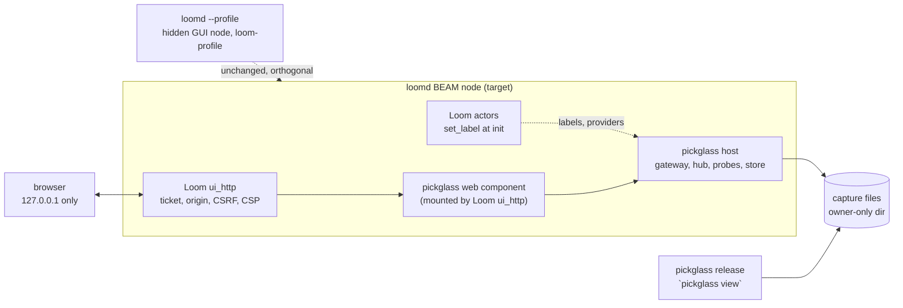
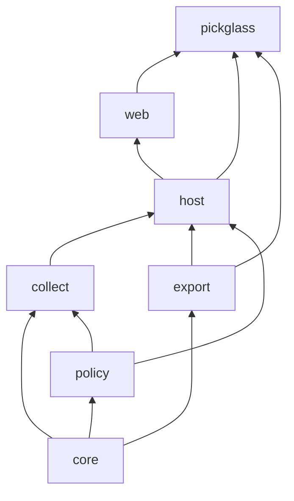
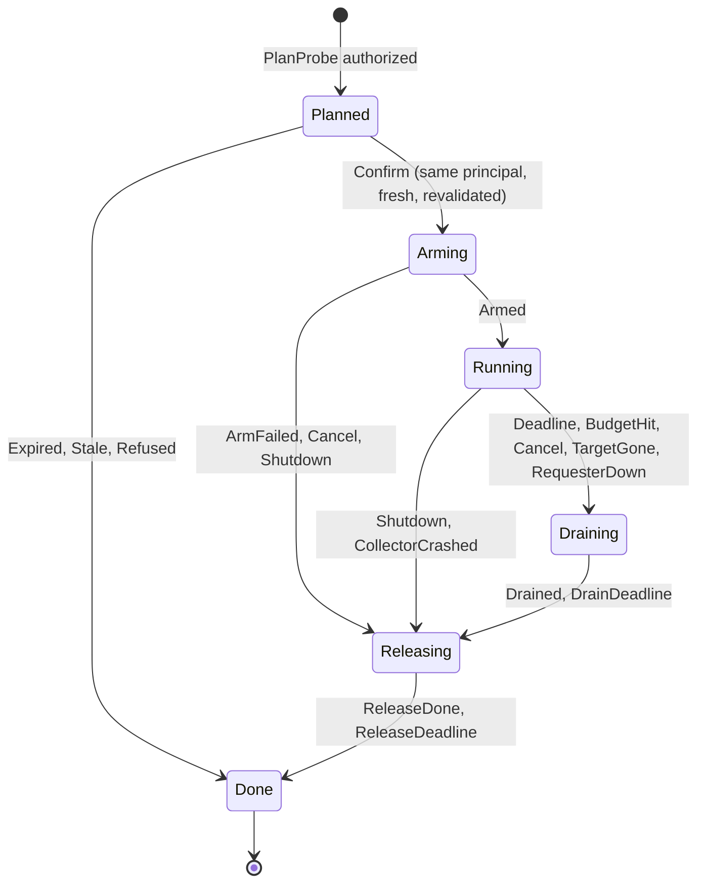

# Pickglass design concept: sonnet

Status: competing concept, written against the brief and the three research
notes. Claims tagged **[measured]** come from the research notes' experiments,
**[doc]** from OTP documentation, **[inferred]** are my reasoning and need
measurement, and **[checked]** are small facts I verified on OTP 29 while
writing this.

## 1. Thesis

Pickglass should be an **in-node host with a capture-first architecture**.
The collectors, the authority check and the ownership registry live inside the
target VM, because only code in the VM can own a trace session with
deterministic cleanup, read Loom's labels, run a reviewed domain summary, and
sit behind Loom's existing web authentication. No distribution is needed. The
web UI, the exports, the comparison and the offline viewer all read one thing,
a **capture**: a versioned, append-only, provenance-stamped record of typed
sections. The "live" view is a capture still being appended to. That rule makes
three of #720's hardest requirements fall out of the structure instead of being
bolted on: every number the UI shows already carries unit, method, coverage and
truncation (they are in the capture schema, not in view code); baseline versus
candidate comparison is a function over two captures; and an offline
`pickglass view` release can show a capture from a machine that has no
pickglass host at all. Authority is a second structural rule: collectors accept
only an `Authorized(Command)` value that a pure policy function alone can
construct, so a forged Lustre event, a direct HTTP request or a bug in a page
cannot reach a collector without passing the same check. Ownership is declared
by the host application through two small extension points (process labels and
typed summarizers), never inferred from supervision or names, and unknown
ownership is a first-class row in every table.

The position is deliberately narrow in v1. It does not attach to other nodes,
does not use a sidecar, does not ship JavaScript beyond Lustre's runtime, and
treats flame graphs as labelled evidence of a specific kind (polled stacks,
traced calls, call counters) rather than as one generic view.

## 2. Deployment model

### 2.1 What runs where



There are three deliverables with different trust levels.

1. **The host library** (`pickglass_host` plus `pickglass_collect`), linked into
   the target application. It is the only component that reads the live VM.
2. **The web package** (`pickglass_web`), a Lustre server component plus page
   shell. Loom mounts it behind its existing `ui_http`/`ui_socket` machinery and
   supplies the `Principal`. A non-Loom host can mount it behind a
   pickglass-supplied minimal listener (loopback only, ticket exchange as in
   Loom's 051 design).
3. **The static release** (`pickglass`, bundled ERTS), which in v1 is an
   **offline tool**: `pickglass view capture.pgc` serves the web package over a
   file-backed capture source on loopback, `pickglass export`, `pickglass
   compare`, and `pickglass doctor` (prints the capability matrix for the
   bundled OTP). It contains no collectors and opens no distribution port. It
   is how an operator opens a capture taken on another machine, and how CI
   consumes captures.

### 2.2 How it reaches a Loom daemon

The Loom side is an adapter that lives in Loom's repository, not in pickglass:

- a config switch `[daemon] diagnostics = true` (and `loomd --diagnostics`)
  starts the host and mounts the routes. Unlike `--profile`, this needs no boot
  flag and no distribution, so it can be restart-only for policy reasons rather
  than technical ones. When off, no host process exists and no route resolves.
- the adapter maps Loom's existing page credential exchange to a pickglass
  `Principal`: the daemon owner gets the grants in section 6, a transcript
  observer or invited operator gets none, and the route answers 404 to them.
  The adapter reuses Loom's ticket, `Origin`, `SameSite=Strict` cookie, per-page
  nonce and CSP machinery. Pickglass does not invent a second login.
- Loom actors call `pickglass_label.set(...)` once in their init, and the
  adapter registers the ownership provider (section 4.4).

### 2.3 Relationship to the existing `--profile` path

`loomd --profile`, `loomd observer`, `loom-profile` and `mem_report.erl` stay as
they are. They are the right tool for an operator who wants the OTP GUI and
accepts distribution. Pickglass differs on the axes #720 cares about: it is
reachable from the browser, it attributes ownership, and it never needs the
cookie. Two interactions:

- `--profile` starts the VM with `+Muatags true`, which makes
  `instrument:allocations(#{flags => [per_process]})` produce per-process heap
  data **[measured, with the eheap tag flag]**. Pickglass reads that when
  present and reports "per-process allocation tags: absent" otherwise. A
  profiled daemon is therefore strictly more capable, and the capability
  handshake (section 5.1) says so.
- Pickglass never reads the cookie file and never needs `<state-root>/tokens/`.
  The two credentials stay separate: the distribution cookie, and the
  diagnostic page principal.

### 2.4 Trust boundary

Distribution is full mutual trust **[measured: a hidden sidecar ran
`os:cmd` on the target]**. That is the reason the primary model avoids it: an
"allow-listed observation sidecar" still holds an authority (the cookie) that
grants arbitrary execution, so a read-only label would be a UI fiction. In the
in-node model the trust boundary is the HTTP gateway: the browser holds a
bounded page credential, the gateway turns each request into a typed `Command`,
and `authorize` decides. Nothing the browser sends is evaluated, loaded as code,
or used as an MFA.

Attach mode (a second VM reading the target over `erpc`) is **not built in
v1-v3**. If it arrives later it is an observation-only transport behind the
same `Collector` interface, labelled "full-trust transport, read-only by
construction of the client, not by authority", default off, with the cookie in
owner-only storage by file path only. Probes cannot cross it: `erpc` runs each
call in a temporary process, so a trace session created inside a call dies when
the call returns **[doc, inferred from the measured ownership rules]**.

## 3. Package layout

Seven packages in the existing workspace plus one adapter in Loom.

| Package | Owns | Pure? | Depends on |
|---|---|---|---|
| `core` | Capture model (values, units, coverage, provenance, identity), stack and call-graph analysis, filters, layout, diff, comparability, capture codec. | Yes. No `@external`, no `gleam_erlang`/`gleam_otp`; JS-compilable. | `gleam_stdlib`, `gleam_json` |
| `policy` | `Principal`, `Capability`, `Command`, `authorize`, `Plan`, audit entry types, budget constants and caps. | Yes, same rules. | `core` |
| `export` | Chrome trace JSON, speedscope, collapsed stacks, pprof proto encoders; the loss-list data for each. | Yes. | `core` |
| `collect` | `internal/ffi_*` bindings, census and node collectors, probe state machines, the `Collector` interface. Accepts only `Authorized`. | No. | `core`, `policy`, `weft`, `gleam_erlang`, `gleam_otp`, `exception`, `simplifile` |
| `host` | Gateway actor, observation hub, capture store and ring, audit log, ownership registry, provider registration, view workers, subscription leases. The embedding API. | No. | `core`, `policy`, `export`, `collect`, `weft` |
| `web` | Lustre server component, page shell, SVG renderers, asset list, CSP page. | No. | `core`, `policy`, `host` (client API only), `lustre`, `mist` (Loom supplies its own) |
| `pickglass` | Release entry point: `view`, `export`, `compare`, `doctor`. | No. | `host` (file source only), `web`, `export` |



Why this cut:

- `policy` is separate from `core` so the part that decides "may this happen"
  is small enough to read in one sitting and to property-test exhaustively.
- `collect` knows nothing about HTTP, sessions or storage. It receives an
  `Authorized` value and a `Budget`, and returns a typed `Outcome`. That makes
  the probe state machines testable against a real VM without a browser.
- `web` never imports `collect`. It reaches the host only through a `Handle`
  (a record of `Subject`s). A page cannot call a collector even by accident.
- The Loom adapter (`loom/packages/diagnostics`, new) depends on `host` and on
  Loom's packages. Pickglass never imports Loom.

### 3.1 FFI surface

All bindings are typed `@external` to existing OTP functions, in
`collect/internal/ffi_*.gleam`, with no `.erl` file and no NIF. This matches the
research's minimum surface (about 35 functions). Anything that raises on bad
input is wrapped with `exception.rescue`.

| Module | OTP functions | Why no pure alternative |
|---|---|---|
| `ffi_proc` | `erlang:process_info/2`, `processes_iterator/0`, `processes_next/1`, `garbage_collect/2`, `port_info/2`, `ports/0`, `ets:all/0`, `ets:info/2`, `erts_debug:flat_size/1`, `erlang:pid_to_list/1` | gleam_erlang has no introspection module. `flat_size` is used only on bounded host summaries already copied to the collector. |
| `ffi_label` | `proc_lib:set_label/1` (self only) | No binding exists. Reads use `process_info(P, label)`, so no `get_label`. |
| `ffi_vm` | `erlang:memory/0`, `system_info/1` (finite key list), `statistics/1` (finite key list), `system_flag/2` for `scheduler_wall_time` only, `monotonic_time/1`, `system_time/1`, `os:getpid/0` | No binding. Time is exposed only as the injected `Clock`. |
| `ffi_alloc` | `system_info({allocator, A})`, `{allocator_sizes, A}`, `instrument:carriers/1`, `instrument:allocations/1` | No binding. One reader only, because `{allocator, A}` resets "max since last call" for every caller **[doc]**. |
| `ffi_trace` | `trace:session_create/3`, `session_destroy/1`, `session_info/1`, `process/4`, `function/4`, `info/3`, `system/3`, `delivered/2` | No binding. The session is an opaque external type. |
| `ffi_os` | `erlang:open_port/2` with `spawn_executable`, `port_close/1`, `port_info/2`; file reads via `simplifile` | Needed only for `ps`/`footprint` on Darwin. First check whether weft's `selecting` for ports already covers receive; bind only what it does not. |
| `ffi_beam` | `code:get_debug_info/1`, `code:which/1`, `application:get_application/1` | Source mapping. Decoding the abstract forms is pure Gleam over a `Dynamic`. |
| `ffi_proc_flag` (conditional) | `erlang:process_flag/2` for `max_heap_size` | Only if weft does not grow a heap-limit option for tasks. Propose the weft extension first; the house rule says extending weft is part of the job. |

Deliberately excluded: `erl_debugger`, `os_mon`, `lcnt`, tracer modules (they
need a NIF), `erpc`, `dbg`, `eprof`/`fprof`/`cprof` (legacy global session),
`tprof:profile/*` (kills the target on timeout), `tprof:get_session/1` (leaks a
strong handle), `sys:get_state/1`, `process_info(P, messages|dictionary)`.

`erts_debug:flat_size/1` is undocumented but stable and already used in Loom's
test support **[research note 3]**. It stays out of default browsing.

## 4. Data model

### 4.1 Cells, columns, additivity

The first design decision is that **a missing value cannot be a number**.

```gleam
pub type Cell {
  Value(Int)
  Absent(AbsentReason)
}

pub type AbsentReason {
  Unsupported        // this OTP, platform, or build cannot provide it
  NotCollected       // probe not run, or tier not enabled
  Denied             // OS refused (other user's process)
  ProcessGone        // target exited before the read
  OverBudget         // the budget stopped collection before this row
  ReadFailed(String) // bounded, redacted reason
}

pub type ValueType {
  ValueType(
    name: String,        // "heap_capacity", "reductions", "mailbox_len"
    unit: Unit,          // Bytes | Words | Count | Nanoseconds | ...
    kind: Kind,          // Gauge | Counter | DeltaOverInterval
    method: MethodId,    // which collector, which API, which parameters
    additivity: Additivity,
  )
}

pub type Additivity {
  Additive
  // Rows may overlap. Group totals must not be formed by summing.
  Overlapping(why: String)
}
```

`Additivity` is what makes the #720 rule "do not sum per-process binary
references into unique binary bytes" a property of the data: the group-by code
in `core` refuses to produce a total for an `Overlapping` column and returns
`Absent(NotSummable)` plus the explanation string, which the table renders as a
badge. Reductions are `unit: Count, kind: Counter` with display name "work
counter (reductions)"; no function in `core` converts them to time. Process
heap capacity (`process_info(memory)`, bytes), term size (`flat_size`, words,
only for host summaries), live-after-GC (a probe result), refc binary
references (`Overlapping`), ETS (`ets:info(T, memory)`, **words**
**[measured]**), allocator used vs carrier, native, and OS RSS/PSS/footprint are
separate columns with separate methods. Nothing in the schema offers a "total
memory of this owner" column.

### 4.2 Sample metadata

Every sample (one census, one node read, one stack poll batch) carries:

```gleam
pub type SampleMeta {
  SampleMeta(
    seq: Int,
    started: Instant,          // wall + monotonic, from the injected Clock
    finished: Instant,         // so elapsed collection interval is explicit
    method: MethodId,
    coverage: Coverage,
    truncation: List(Truncation),
  )
}

pub type Coverage {
  Coverage(
    population: Population,    // Known(n) from system_info(process_count) | Unknown
    scanned: Int,
    retained: Int,             // rows kept after top-K
    complete: Completeness,    // Complete | Partial(reason) | Failed(reason)
  )
}
```

Rates (reductions per second, minor GCs per second) are computed in `core`
from `finished - started` of **adjacent samples' monotonic instants**, never
from the requested interval, and a decreasing counter is reported as `Reset`
rather than a negative rate. This is the observer_cli "requested versus actual
interval" rule, and it also fixes the wire-visible monotonic-clock hazard noted
in Loom's memory: the monotonic instant is only ever used for differences; the
wall instant is the one stored as a timestamp.

### 4.3 Identity

Four layers, because pids alone are insufficient **[#720]**.

| Layer | Value | Source | Purpose |
|---|---|---|---|
| Incarnation | `IncarnationId` random 128-bit minted by the host at start from the injected id generator, plus `os_pid`, OS start identity, node name, `erlang:system_info(creation)` | host, `os:getpid`, `/proc/<pid>/stat` field 22 plus boot id on Linux, `ps -o lstart=` on Darwin (1 s resolution) | A restarted daemon is a different incarnation even if the OS PID is reused. |
| Process ref | `ProcessRef(incarnation, pid_text, birth)` | `birth` is a counter issued by the collector the first time it observes that pid within the incarnation | A pid recycled within an incarnation gets a new birth only if the collector saw it absent in between. |
| Revalidation fingerprint | registered name, `initial_call`, label claim, spawn parent | census row | Compared immediately before any probe starts. |
| Lineage | `(owner path, role, registered name)` | label claim | Links a restarted worker to its predecessor for display ("successor of"), never for authorization. |

Notes and limits, stated plainly:

- `erlang:system_info(creation)` returns `0` on a non-distributed node
  **[checked]**, so it cannot be the incarnation discriminator in a daemon run
  without `--profile`. The host-minted id carries that job.
- The collector cannot detect pid reuse between two censuses with the pid
  absent from neither. Reuse needs millions of spawns, so the odds are low, and
  the revalidation fingerprint is what stops a probe from acting on the wrong
  process: a probe plan binds `(ProcessRef, fingerprint)`, and `confirm`
  refuses on any mismatch. A terminated target stays in the capture as
  historical evidence with `last_seen_seq`.
- OS process start identity is `Absent(Unsupported)` where unreadable, not
  guessed.

### 4.4 The capture format

A capture is a newline-delimited JSON stream, one typed record per line:

```
{"t":"header", "v":1, "capture_id":"…", "provenance":{…}, "sections":[…]}
{"t":"valuetypes", …}
{"t":"procs", "rows":[…]}                       // process identity table
{"t":"census", "meta":{…}, "rows":[…]}          // one record per sample
{"t":"node", "meta":{…}, "cells":{…}}
{"t":"ossamples", …}
{"t":"stacks", "frames":[…], "stacks":[…]}      // interned tables
{"t":"stacksamples", "source":"polled_stacks", "meta":{…}, "rows":[…]}
{"t":"events", "clock":"mono0", "dropped_before":0, "rows":[…]}
{"t":"probe", "plan":{…}, "transitions":[…], "reason":"deadline", "perturbation":{…}}
{"t":"ownership", "edges":[…]}
{"t":"symbols", "modules":[…]}
{"t":"footer", "records":N, "digest":"sha256:…", "complete":true}
```

Why NDJSON rather than a binary format: the ring that backs live capture can be
written append-only and truncated at record boundaries; a reader can tell
"unterminated" (no footer) from "complete"; a total decoder is a line-at-a-time
parse with a bounded line length; and `jq` works on it for an operator in a
terminal. Size is bounded by top-K retention and interned stack tables, not by
format. An unterminated capture is displayed as `Partial(NoFooter)`. The digest
is computed through an injected `Digest` capability so `core` stays pure.

The **provenance header** is the comparability input:

| Field | Source |
|---|---|
| format version, pickglass version, host version | build |
| OTP release, ERTS version, emulator flavor, JIT yes/no, `emu_type` | `system_info` |
| emulator args that change measurement: `+Muatags`, `+S`, `+SDcpu`, `+hmax`, `+L` | `init:get_arguments` via the host |
| OS, architecture, kernel, CPU count | `system_info`, `/proc` or `uname` through the bounded port |
| application build revision, Gleam compiler version | **host-supplied** (`HostFacts`), `Unknown` is displayed as unknown |
| workload label, session counts at start and end, warmup, duration | operator label plus `HostFacts` |
| collector configuration: census cadence, top-K, probe configs, budgets | host |
| node incarnation | section 4.3 |

### 4.5 Ownership and the label provider

Ownership is **declared**, with three confidence levels and a closed shape.

```gleam
pub type OwnerClaim {
  OwnerClaim(
    path: List(Segment),   // at most 8 segments
    role: String,          // from the provider's declared vocabulary, <= 48 bytes
    confidence: Confidence,
  )
}

pub type Segment { Segment(kind: String, id: String) }  // each <= 64 bytes

pub type Confidence {
  Declared             // the process labelled itself with proc_lib:set_label
  Evidenced(List(Evidence))  // registration, link, ETS owner, port owner
  Unknown
}
```

The host application registers one `Provider` at startup:

```gleam
pub type Provider {
  Provider(
    name: String,
    kinds: List(KindDecl),             // closed vocabulary, with a redaction rule per kind
    decode_label: fn(Dynamic) -> Result(OwnerClaim, String),
    summarizers: List(Summarizer),     // section 5.6
    os_roles: fn() -> List(DeclaredOsProcess),
    facts: fn() -> Dict(String, String),
    operations: Option(OperationFeed), // timeline spans
  )
}
```

Mechanism:

1. A Loom actor calls `pickglass_label.set(LoomLabel(session, strand, role,
   generation))` in its init (and again if it changes owner, since
   `set_label` is a dictionary write on `self()` **[doc, source]**). This works
   for weft actors and closures, whose raw `initial_call` is `erlang:apply`
   **[research note 3]**, so labels are the only ownership channel that does
   not depend on spawn shape.
2. The census reads the label with `process_info(P, label)`, a cheap read
   (about 0.8 us **[measured]**). It is never read through the dictionary.
3. The collector runs `decode_label`, which is host code (not model-influenced
   code, so Rule Zero holds), inside the census worker. The result is clamped to
   the bounds above. A decode failure becomes `Unknown` with a counter, never an
   exception.
4. Kinds declare a redaction rule: `Plain`, `Hashed(prefix)`, `Truncate(n)`.
   Redaction happens at decode time, before the value enters any capture, log
   or export, because a label is readable by any local code and any distribution
   peer.
5. Where no label exists, pickglass records **evidence**, never ownership:
   `registered_name`, spawn parent, port-connected owner, `ets:info(T, owner)`.
   These populate the Supervision tree and a "possible owner" column, not the
   Ownership tree.

The supervision view is built from the census `parent` item **[checked: `parent`
exists on OTP 29]** instead of `application_master` walks and
`supervisor:which_children`. Two consequences: no blocking call on a busy
supervisor, and a root started outside any application callback (Loom's
production shape) still appears, because the walk starts from spawn parents,
not from the application controller.

## 5. Collectors and probes

### 5.1 Capability handshake

At host start, `collect` runs a handshake once and stores a `Capabilities`
record: OTP version, whether `processes_iterator`, `trace:system` and
`instrument` work, whether `+Muatags` is set, whether `/proc` is readable,
which OS reader exists, `backtrace_depth` (see 5.5), `msacc` state (enabled by
someone else?), `scheduler_wall_time` state. Every UI element and every
`Command` that needs a capability is gated by it, and an unsupported feature is
rendered as "unsupported on this runtime" with the reason, never hidden and
never zero. `pickglass doctor` prints the same record offline for the bundled
OTP.

### 5.2 Observation tier (capability `Observe`)

One **observation hub** serves all clients. It is a weft state machine with
states `Idle | Sampling`. It samples only while at least one client holds a
lease (a subscription renewed every 15 s by the UI; the lease is a periodic
timeout in the hub, so a crashed browser stops costing anything within one
interval). Collection never runs in a Lustre effect or in a client's process.

| Collector | Mechanism | Default cadence | Budget (defaults / hard caps) | Cleanup |
|---|---|---|---|---|
| Node counters | `erlang:memory/0`, `statistics` (run queues, reductions, GC), `system_info` counts | 1 s | none needed (about 60 us **[measured]**) | none |
| Scheduler utilization | `scheduler_wall_time` enabled with a ref-counted `system_flag` by the hub process; utilization from two samples | 2 s | one lease | hub holds the flag while alive; hub tracks its own state because counters stay frozen after the last disable **[measured]** |
| Process census | `processes_iterator/0` in chunks of 2,000; `process_info` with the bundle `[memory, message_queue_len, reductions, status, heap_size, total_heap_size, label, registered_name, parent, initial_call, garbage_collection]`; no `current_function`, `links`, `messages` or `dictionary` | adaptive, 10 s default | scan 100,000 processes / 500,000; wall 250 ms / 2 s; retained rows top-K 500 plus an aggregate "rest" row / 5,000; worker heap cap 8 M words | worker is a weft task; deadline kills and joins; success reported only after normal exit (observer_cli rule) |
| Allocators | one reader of `system_info({allocator_sizes, A})`, `instrument:carriers/0` | 10 s | 2 ms-class calls | none; carriers report `UnscannedSize` into coverage |
| ETS | `ets:all/0` then single-item `ets:info(T, size|memory|owner)` | with census | 20,000 tables | none |
| OS processes | `/proc/<pid>/{status,smaps_rollup,stat}` (Linux) or `ps`/`footprint` through a bounded port (Darwin) for the host's declared OS processes plus ports' `os_pid` children | 15 s | 64 OS processes; 5 s port deadline; fixed argv | port closed on every exit path |
| System events (optional, owner config) | `trace:system(S, long_gc | long_schedule | large_heap | long_message_queue, …)` in a session owned by the hub | continuous | bounded ring of 10,000 events | session destroyed at hub exit |

**Duty-cycle rule.** The next census is scheduled no sooner than 20 times the
last census's elapsed time (a 5% duty-cycle cap on one collector process), and
the UI shows that ratio as an "observer effect" meter. A census that exceeds
its wall budget returns `Partial(WallBudget)` with the rows it has. Rates are
computed only from complete pairs; a partial pair shows the rates it can with
the coverage figure beside them. With about 1 us per process **[measured]**, a
daemon with 5,000 processes costs about 5 ms per census, so the cap is rarely
the binding constraint; it exists for the pathological process count.

**Coalescing.** Collection is per node, not per client. Ten tabs share one
census; the per-tab cost is only view rendering.

**What the census never does.** No `garbage_collect`, no `messages`, no
`dictionary`, no `sys:get_state`, no `binary` item by default (a 3 us call on a
fat process, but it is the one item whose result size grows with content;
section 5.6 gives it a separate, budgeted "binary holders" probe).

### 5.3 Probe kinds and capabilities

Observation and probes are different capabilities. Each probe kind is its own
`Capability` so an owner can enable some and not others.

| Probe kind | Capability | Mechanism | Perturbation | Claims | Cannot claim |
|---|---|---|---|---|---|
| `Counters` | `ProbeCounters` | Own trace session; `trace:function(S, MFA, true, [local, call_count|call_time|call_memory])` with `silent`; read counters at the end | medium, 60-110 ns per call, no mailbox **[measured]** | exact per-function call counts, time and heap words for the traced functions in the named processes | caller-callee structure; untraced callees fold into the nearest traced caller **[doc]**; `call_count` is not per-process **[doc]** |
| `CallEdges` | `ProbeEvents` | Session with `call` and a match spec returning the caller (`{message, {caller}}`) on one MFA set | high per call; event budget | exact caller to callee counts for the named callees | time; calls to unnamed functions. **[inferred; the match-spec `caller` action is documented but I did not measure this pipeline]** |
| `Events` | `ProbeEvents` | Session with flags from `call`, `return_to`, `running`, `garbage_collection`, `send`, `receive` on explicit pids | high; message per event | exact order of events for those processes with timestamps from one clock | anything about untraced processes; absolute CPU time (wall timestamps include time scheduled out unless `running` is also traced) |
| `StackPoll` | `ProbeStacks` | Poll `process_info(P, [status, current_stacktrace, reductions])` for at most 32 pids at 20-100 Hz | low, about 50-100 us per sample **[measured]** | relative frequency of stacks observed at reduction safe points, split by `status` | wall-clock or CPU time share; time inside long non-yielding BIFs and NIFs (98% vs 45% true share in the bias test **[measured]**) |
| `SystemEvents` | `ProbeSystem` | `trace:system` long_gc, long_schedule, large_heap, long_message_queue (OTP 28+) | low | which events exceeded a threshold, when | normal-length GCs or schedules |
| `Gc` | `ProbeGc` | `garbage_collect(Pid, [{type, major}, {async, Ref}])` between two `garbage_collection_info` reads and two OS memory reads | intrusive: target paused | whether this process's heap shrank when forced; before/after counters | that memory returned to the OS; that the workload is unperturbed |
| `Summary` | `ProbeSummary` | Host-registered typed `Summarizer` run in a heap-capped task (5.6) | intrusive, measured and displayed | a bounded domain summary of one named process | a heap dominator graph; GC roots |
| `BinaryHolders` | `ProbeSummary` | `process_info(P, binary)` for at most 20,000 processes in chunks; dedupe by binary id within the pass | low-medium | unique refc binary bytes held, which owners reference them | stable identity of a binary across passes (the id is an address) |
| `Microstate` (optional, may be cut) | `ProbeMsacc` | read `statistics(microstate_accounting)` only if already enabled; enabling is node-global and not ref-counted **[doc]** | low | scheduler time by VM activity class | per-process attribution |

Every probe records its **perturbation**: collector wall time, bytes retained,
events received and dropped, and for tracing probes the overshoot past the
budget. The perturbation record is part of the probe section of the capture and
is displayed beside the result.

### 5.4 The probe lifecycle

A probe is one **weft state machine process**, started under a
`factory_supervisor` with restart type `temporary`. A restart would silently
re-arm tracing, which is exactly the failure the lifecycle exists to prevent.
That process is also the tracer for event probes and the sole holder of the
strong session handle. The strong handle never leaves it: it is not sent, not
returned, not logged. The UI gets a weak handle for display only.
The **VM destroys the session when the sole holder dies, before the `DOWN`
message** **[measured]**, so a probe crash releases its resources without a
janitor; explicit `session_destroy` on every normal exit path is the mechanism
and process death is the backstop.



<!-- transitions: pickglass_collect/probe.Phase -->

| From | Event | Guard | To | Actions |
|---|---|---|---|---|
| Planned | Confirm(principal) | plan unexpired (60 s), principal equals planner, target fingerprint matches, admission slot free | Arming | audit Allowed; take concurrency slot; record deadline |
| Planned | Confirm(principal) | any guard fails | Done(Refused(reason)) | audit Denied with reason |
| Planned | PlanExpired | none | Done(Expired) | none |
| Arming | Armed | session created, patterns matched at least one function | Running | arm state timeout for the wall budget; arm periodic timeout if polling |
| Arming | ArmFailed(reason) | none | Releasing(ArmFailed) | none |
| Arming | Cancel, Shutdown | none | Releasing(reason) | none |
| Running | BudgetHit(which) | events, samples, bytes or targets | Draining(BudgetHit) | `trace:process(S, P, false, …)`, `session_destroy`: stop new events at once |
| Running | DeadlineFired | none | Draining(Deadline) | same as above |
| Running | Cancel(by) | none | Draining(Cancelled) | same |
| Running | TargetDown(pid) | all targets dead | Draining(TargetGone) | otherwise record and continue |
| Running | RequesterDown | the requesting page's lease lapsed | Draining(Disconnected) | same |
| Running | Shutdown, CollectorCrashed | none | Releasing(reason) | skip drain |
| Draining | Drained | `trace:delivered` returned and the mailbox counted | Releasing(reason) | count overshoot as dropped; read counters; check `trace:info(S, MFA, traced)` and mark `Incomplete(ModuleReloaded)` if false |
| Draining | DrainDeadline | 2 s | Releasing(reason + DrainTimedOut) | discard remaining trace messages, counted |
| Releasing | ReleaseDone | session destroyed, port closed, timers dead | Done(reason) | publish probe record to the capture; audit outcome |
| Releasing | ReleaseDeadline | 2 s | Done(reason + ReleaseUnconfirmed) | process exits; VM backstop; flagged loudly |

Properties the tests assert (the weft rule: mutation-test every timeout):

1. After `Done`, `trace:session_info(all)` contains no session with this
   probe's name, and another probe's session and a legacy `dbg` session are
   untouched.
2. Killing the probe process at each state leaves no pattern behind
   (measured basis: sole-holder death destroys the session).
3. A tracer flood past the budget ends with `dropped` equal to the overshoot
   counted after `trace:delivered`; the mailbox is empty at `Done`.
4. Deleting the Running state timeout makes the deadline test fail.
5. Hot reload of a traced module between `Armed` and `Drained` yields
   `Incomplete(ModuleReloaded)`, not a clean result.
6. Two probes of different kinds run concurrently without sharing state; a
   third of the same kind is refused at `Planned` (one per kind per node).

The probe's tracer does as little work as possible, in the style of
`recon_trace`: it decodes each raw tuple with a total decoder into a compact
`Event` or counts it as `Unknown`, appends to a bounded buffer, and stops. A
process mailbox cannot be bounded, so the bound is the session budget plus
exact accounting of the overshoot **[measured: 544-553 events in flight past a
10,000 budget]**.

### 5.5 How flame graphs and the call-graph DAG are produced

All stack-shaped analysis works on one type, `StackSamples`, whose header
names its **source**: `PolledStacks`, `TracedCalls`, or `AllocationCounts`.
The source is part of every chart's title bar and cannot be switched off.

- **Polled stacks.** A `StackPoll` probe produces samples
  `(stack_id, status, weight = 1, owner path, pid ref)`. Stack depth is bounded
  by the node-global `backtrace_depth` flag, which defaults to 8
  **[checked: setting it returns 8; reading it without setting is not possible]**.
  Gleam tail-calls collapse frames, so polled stacks are shallow and
  root-truncated. The UI draws a synthetic `…(truncated)` root when a stack is
  at the observed maximum depth and prints "stack depth limit 8" in the title
  bar. Pickglass does not change the flag; a host that wants deeper stacks sets
  it at startup, and the capability handshake reports the observed maximum.
  Because `status` is read in the same `process_info` call as the stack, the
  flame graph can be split into running/runnable and waiting. The "waiting"
  view is the nearest BEAM analogue of an off-CPU graph, labelled as such.
  Label on screen: "Sampled at reduction safe points. Width is how often the
  sampler saw this stack, not time. Long BIFs and NIFs are under-sampled."
- **Traced calls.** An `Events` probe with `call` plus `return_to` on local
  patterns gives an exact call sequence for the named functions. `core`
  reconstructs per-process stacks and produces samples with `weight =
  nanoseconds between events` and a second column `calls`. Label: "Traced
  calls for N functions in M processes. Wall time between events, including
  time scheduled out. Untraced callees are folded into their caller."
- **Counters.** `Counters` yields per-function totals with no stacks, so it
  feeds Top and a flat function chart only. It cannot draw a flame graph or a
  DAG, and the UI does not offer one for it. That is the honest answer to #720's
  "function totals alone cannot reconstruct a calling tree".
- **Edge sets.** `CallEdges` yields caller to callee counts directly. `core`'s
  graph builder has two constructors: `from_stacks` and `from_edges`.
- **Allocation counts.** `call_memory` words per function, shown as a flat
  chart or, combined with `TracedCalls`, as a second value column on the same
  tree (`alloc_words`). Never labelled as a heap profile.

No view claims to be a CPU profile. There is no per-process CPU time on the
BEAM; reductions are a work counter **[#720]**, and the UI never converts them.

### 5.6 Typed summaries (restart-keeper callback environments)

The #720 case "did a restart factory retain a session-sized callback" cannot be
answered by `process_info`. The extension point is a host-registered
`Summarizer`:

```gleam
pub type Summarizer {
  Summarizer(
    role: String,
    describe: fn(Pid, SummaryBudget) -> Result(Summary, SummaryError),
  )
}

pub type Summary {
  Summary(entries: List(#(String, SummaryValue)))   // bounded count and depth
}
pub type SummaryValue { Bytes(Int) Count(Int) Text(String)  /* <= 80 bytes */ }
```

Pickglass runs the summarizer inside a heap-capped, deadline-bounded weft task,
only for a process the principal named, and only under `ProbeSummary`. Loom
writes `describe` for its restart keeper: it can report the `flat_size` of the
captured callback environment and a count of retained session-sized terms,
because it knows where its own state is. Pickglass never calls `sys:get_state`
and never sees raw state. The result is marked `intrusive` and carries the
measured collection cost, since inspecting the structure can allocate it.
What it proves: this process's callback environment has this measured size and
shape. What it does not prove: that the term is a GC root that keeps the heap
alive, or that it explains resident memory.

## 6. Authority model

### 6.1 Types

```gleam
pub type Capability {
  Observe            // read live census, node, OS roles, supervision
  Capture            // start and stop a recording; read recorded captures
  Export             // produce derived exports and downloads
  Import             // load a capture file into the store (data, not authority over the node)
  ProbeCounters ProbeEvents ProbeStacks ProbeSystem
  ProbeGc ProbeSummary ProbeMsacc
  Audit              // read the audit ring
}

pub type Principal {
  Principal(id: PrincipalId, grants: Set(Capability), epoch: Int)
}

pub type Command {
  Subscribe(ViewSpec)        Unsubscribe(SubId)
  StartRecording(RecordSpec) StopRecording(CaptureId)
  PlanProbe(ProbeSpec)       ConfirmProbe(PlanId)       CancelProbe(ProbeId)
  ReadView(ViewSpec)         ListCaptures               Compare(CaptureId, CaptureId)
  RequestExport(CaptureId, Format)   ImportCapture(Upload)
  ReadAudit(Window)
}

// Opaque. Only policy.authorize can construct it.
pub opaque type Authorized(a) { Authorized(command: a, by: PrincipalId, at: Instant) }

pub fn authorize(
  principal: Principal,
  command: Command,
  now: Instant,
) -> Result(Authorized(Command), Denial)
```

`required_capabilities(command)` is an exhaustive `case` over `Command` with no
catch-all, so adding a command without deciding its capability fails the build.
`authorize` is pure and lives in a package with no I/O, so a property test can
enumerate every constructor against every subset of grants.

### 6.2 Where it is enforced

1. **Admission.** The socket (or HTTP request) obtains a `Principal` from the
   embedder's `Authenticator` once, at admission, and the Lustre component holds
   it in its model. It is never read from an event payload. Loom's adapter calls
   its existing page grant check and returns `Denied` for anyone who is not the
   owner/admin, which becomes a 404 before any component starts.
2. **Event decoding.** Each handler decodes into a domain `Message` with a total
   decoder; `update` turns it into a `Command` and calls `gateway.submit`. A
   control is rendered only if the principal has the grant, but this is
   cosmetic. The lustre.md rule applies: every handler in the tree is callable
   by anyone holding the socket, so the handler is not the boundary.
3. **Gateway.** `gateway.submit(principal, command)` is the **only** function
   that calls `authorize`, writes the audit entry, and hands the resulting
   `Authorized` to the hub, store or a probe supervisor. The `Collector`
   interface takes `Authorized(Command)`; there is no other constructor, so a
   forged event or a direct HTTP request that skips the gateway cannot compile
   into a collector call.
4. **Direct requests.** The JSON API (`/diag/api/v1/...`) and downloads go
   through the same `gateway.submit`. A download is a two-step action:
   `RequestExport` (authorized over the socket) returns a one-time ticket valid
   for 30 s bound to the principal and capture; `GET /diag/dl/<ticket>` checks
   the ticket, the principal and `Sec-Fetch-Site`, so a cross-site GET cannot
   trigger an expensive export.

### 6.3 Plan and confirm for probes

A probe is never a single button press. `PlanProbe` is authorized under the
probe capability, validates the spec (explicit pids; concrete modules; no
wildcard module; at most 16 MFAs, 8 pids for call-time and memory; no
`set_on_spawn`; no `all`/`existing`/`new` flags, which are unrepresentable in
the `ProbeSpec` type), revalidates targets against their fingerprints, and
returns a `Plan`: the expected scope, the estimated cost range from the measured
per-call and per-sample costs, the budgets, the perturbation class, and a
digest. `ConfirmProbe(plan_id)` is authorized separately and is refused unless
the same principal confirms an unexpired plan whose digest and targets are
unchanged. Two visible steps give the operator the scope-and-cost display #720
requires, and make forged confirmation impossible without a prior authorized
plan.

### 6.4 Audit

```gleam
pub type AuditEntry {
  AuditEntry(
    seq: Int, at: Instant, principal: PrincipalId, kind: String,
    decision: Allowed | Denied(reason),
    target: Option(ProcessRef), plan: Option(PlanId),
    outcome: Option(Completion),    // filled when a probe ends
    perturbation: Option(Perturbation),
  )
}
```

Entries hold command kind and identifiers, never payloads. The host keeps a
bounded in-memory ring (4,096) and appends to an `AuditSink` the embedder
provides (Loom forwards to its event log). Probe audits include start, outcome
and perturbation, so "who traced what, for how long, and what did it cost" is
answerable. Denied attempts are audited; that is what makes forged-event tests
checkable.

### 6.5 Tests required by #720

A forged-event harness drives each `Command` constructor as a raw socket
message under (a) a principal with no grants, (b) a principal with every grant
except the required one, (c) a principal whose `epoch` is stale, and asserts
`Denied`, one audit entry, and zero collector calls (a spying gateway).
Fixtures include a second session's secret in a label and a summary to check
nothing crosses a boundary. The Lustre simulate test sends an event for a
handler not present in the current tree and asserts it never reaches `update`.
A real daemon and browser fixture covers cookie confinement: the distribution
cookie file contents are searched for in every response body, log and export.

### 6.6 What changes when remote access arrives

The seams exist; nothing else has to be rearchitected.

| Concern | Today | Later |
|---|---|---|
| Who is a principal | embedder's `Authenticator`, loopback owner | OIDC or mTLS authenticator; `grants` from roles; `epoch` for revocation |
| Transport | loopback listener | TLS terminated by the host; `Origin`/CSRF logic generalized from host-equals-origin |
| Rate limits | per-principal token buckets already in the gateway | per-principal, per-IP limits; admission control on `ReadView` |
| Multi-node | `ProcessRef` already carries `IncarnationId` and `Command` targets name it | a router forwards `Authorized` to a remote host over an authenticated channel; probes still run in-node on the target |
| Audit | local ring and sink | durable remote sink; per-principal retention |

What does not change: enforcement in `gateway.submit`, the opaque `Authorized`,
plan and confirm, and capture redaction.

## 7. Web UI

### 7.1 Information architecture

One `<pickglass-app>` server component, one socket per tab, route held in the
model and reflected in the URL (query parameters carry the `ViewSpec` so links
are shareable, but the principal is still checked).

```
Overview                  /diag
Memory                    /diag/memory           (Categories | By owner | Binaries | ETS)
Processes                 /diag/processes        (Table | Supervision | Ownership)
  Process detail          /diag/processes/<ref>
OS processes              /diag/os
Scheduler                 /diag/scheduler        (utilization, run queues, GC)
Probes                    /diag/probes           (Plan | Active | History)
  Profile                 /diag/profile/<probe>  (Flame | Icicle | Graph | Top | Peek | Source)
Timeline                  /diag/timeline
Captures                  /diag/captures         (list, record, import)
  Compare                 /diag/compare?base=&cand=
About                     /diag/about            (capability matrix, budgets, audit)
```

A persistent top strip carries: node and incarnation badge, "Live | Viewing
capture <id>", recording state, the observer-effect meter (collection duty
cycle), and an active-probe indicator that links to Probes. Every data panel has
a title bar with **source, method, interval, coverage and truncation** in a fixed
format, for example `census · process_info bundle v1 · 10.0 s (actual 10.02) ·
scanned 4,812 of 4,812 · top 500 + rest`.

### 7.2 Overview

```
+- pickglass --- loomd @ 127.0.0.1 -- inc 7f3a (os 48211, up 3h12m) -- ● live -- effect 0.3% ---+
| Overview | Memory | Processes | OS | Scheduler | Probes | Timeline | Captures | About          |
+-----------------------------------------------------------------------------------------------+
| Roles                                                                          [Record 10 min]|
|  daemon loomd      os 48211  RSS 1.84 GB  (anon 1.71 GB)    BEAM total 1.12 GB   ?  gap 0.72 GB|
|  client loom tui   os 48390  RSS 96 MB                                                         |
|  satellite codemode x2      RSS 310 MB, 305 MB          helper sandbox x3  RSS 18 MB each      |
|  language server   gopls     RSS 640 MB                                                         |
+- BEAM memory (erlang:memory, not atomic) ----------------+- Scheduler (wall time, 2 s) --------+
|  processes  412 MB   binary 301 MB   ets 88 MB           |  util  ▁▂▂▃▂▂▂▃▂▂  mean 11%         |
|  code 41 MB  atom 3 MB  system 277 MB                    |  run queue ▁▁▁▂▁▁▁▁▁▁  max 3         |
|  allocators: used 1.04 GB  carriers 1.31 GB  (frag 21%)  |  dirty CPU 0%  dirty IO 4%           |
+- Top owners by process heap capacity (census 10.0 s, 4,812/4,812) ------------------------------+
|  owner                         procs   heap cap   mailbox  reductions/s*   binary refs (overlap) |
|  session s_9f2 / strand 1         9     148 MB       0         12            71 MB  ≈           |
|  session s_a01 / keeper           2      96 MB       0          0             4 MB  ≈           |
|  unknown owner                  311      70 MB       4        180            90 MB  ≈           |
|  * work counter, not CPU time.   ≈ overlapping, not summable                                    |
+-------------------------------------------------------------------------------------------------+
```

The operator reads the roles panel first. The gap figure `RSS − carriers`
appears only when both are present, is labelled "derived", and is `?` if either
is absent. Clicking an owner row opens Memory by owner filtered to it.

### 7.3 Memory by owner

```
Memory › By owner        group by [owner path ▾]  compare to [checkpoint: idle-start ▾]  [Pause]
 census · 10.0 s · 4,812/4,812 scanned · top 500 + rest   window 14:02–14:31 (3 checkpoints)
+------------------------------------+---------+---------+---------+----------+-----------------+
| owner                              | procs   | heap cap| Δ cap   | mailbox  | binary refs ≈   |
+------------------------------------+---------+---------+---------+----------+-----------------+
| ▸ session s_9f2                    |    9    | 148 MB  | +91 MB  |    0     | 71 MB ≈ (n/a Σ) |
|    ├ strand 1 / worker             |    1    |  38 MB  |   +2 MB |    0     |  1 MB           |
|    └ strand 1 / restart-keeper     |    1    |  96 MB  | +89 MB  |    0     |  4 MB           |
| ▸ session s_a01 …                  |   …                                                       |
| ▸ unknown owner (no label)         |  311    |  70 MB  |  +1 MB  |    4     | 90 MB ≈         |
+------------------------------------+---------+---------+---------+----------+-----------------+
 Group totals for ≈ columns are not shown: a binary referenced by two processes is counted twice.
 [Open detail] [Plan GC probe…] [Plan summary probe…]
```

Heap capacity (`process_info(memory)`, bytes) is the column used for the
ranking, because it is dominated by heap block capacity (38,323,372 words times
8 matched `memory` within 800 bytes **[measured]**). The Δ columns are
differences between two checkpoint windows (median over the window, with the
window's min and max available on hover) so a single noisy sample does not
rank. The "unknown owner" row is always present, even at zero.

### 7.4 Process detail

```
Process <0.4112.0> · birth 18,204 · inc 7f3a · alive            [Plan GC probe…] [Plan summary…]
 label (declared):  session s_9f2 / strand 1 / role restart-keeper   gen 4
 successor of:      birth 17,990 (exited 14:07:11)                  (same owner path and role)
 registered: none   initial_call: erlang:apply/2   spawn parent: <0.211.0> (supervisor?)
 counters (census, 10 s):  heap cap 96 MB  heap 11.9 M words  total heap 12.0 M words
                           stack 40 w   mailbox 0   reductions Δ 0/s   status waiting
                           GC: minor 112, fullsweep_after 65535, max_heap_size off
 history   heap cap ▁▁▁▁▂▂▇▇▇▇▇▇▇▇ (window)             mailbox ▁▁▁▁▁▁▁▁
 evidence only (not ownership):  links 3 · monitors 1 · ETS tables owned 0 · port owner of 0
 Not shown by design: state, dictionary, messages.
```

### 7.5 Probe plan dialog

```
Plan probe · Gc on <0.4112.0> (session s_9f2 / restart-keeper)         needs: ProbeGc
 Scope:       1 process (revalidated 0.2 s ago: name, label, initial_call match)
 Action:      one asynchronous major collection; reads garbage_collection_info before and after,
              OS memory for daemon pid before and after
 Perturbation: intrusive. The process is stopped for the collection (est. 40-60 ms for 96 MB
               at 1.4 ms/MB, measured on another machine; will be measured here).
 Budgets:     wall 5 s · one probe of this kind at a time · result bytes < 4 KB
 Does not prove: that the OS reclaimed memory; that the workload is unaffected.
                                              [Cancel]            [Confirm and run]
```

The confirm button exists only for a principal with the grant, but the server
checks again (section 6.3).

### 7.6 Profile views

A profile page has one `StackSamples` source, a **filter chain** (breadcrumbs,
as in Firefox Profiler), and tabs.

```
Profile · probe p-41 · StackPoll · 62 s · 50 Hz · 3 pids · 3,096 samples · coverage 3/3 pids
 Source: polled current_stacktrace at reduction safe points. Width = share of samples, not time.
         Stack depth limit 8 (…truncated roots drawn). Long BIFs/NIFs under-sampled.
 Chain: [all] › [Focus owner=session s_9f2 ▾ changes totals: 3,096 → 1,204] › [Hide gleam/list ▾ display only]
 Value: [samples ▾] Split: [running+runnable | waiting]   Search: [________]   Tabs: Flame | Icicle | Graph | Top | Peek | Source
+----------------------------------------------------------------------------------------------+
| all (1,204)                                                                                   |
| loom@provider@gateway:run/2 (1,010)                                      | …other (194)       |
|  weft@actor:handle/3 (700)                       | json:decode/1 (310)  |                    |
|   loom@strand_runtime:step/4 (640)               |                      |                    |
+----------------------------------------------------------------------------------------------+
 Selected: loom@strand_runtime:step/4  flat 212 (17.6%) cum 640 (53.2%)   src/loom/strand_runtime.gleam:118 (function-level)
```

Filter semantics follow pprof's, but each step is typed and visible:

| Chain step | Class | Effect on totals | Reported |
|---|---|---|---|
| Focus, Ignore, TagFocus, TagIgnore, ShowFrom | `SampleFilter` | **changes** | "total 3,096 → 1,204" in the chip |
| Hide, Show | `StackRewrite` | unchanged, except samples left with no frames (dropped and counted) | chip shows "display only; 0 samples dropped" |
| NodeFraction, EdgeFraction, NodeCount | `DisplayPrune` | unchanged | strip shows "pruned 14 nodes, 33 edges, 2.1% of value" |

A filter that matches nothing says so instead of drawing an empty chart (pprof's
`warnNoMatches`). The graph view and Peek use pprof's algorithm as a pure
function in `core`: node and edge cutoffs from fractions of total (defaults
0.5% and 0.1%), top-N selection with entropy ordering, residual edges drawn
dotted, redundant-edge removal, square-root label scaling, and red/green
coloring for diffs. Layout is a small layered (Sugiyama-style) pass in Gleam,
sufficient for the default 80 nodes. No Graphviz dependency.

Top has flat and cum per function, one column per value type, and a delta
column when a baseline is loaded. Peek is the node's callers and callees with
edge weights. **Source** shows the Erlang MFA, the mapped Gleam file and, for
polled stacks (whose frames carry `{file, line}`), per-line counts; it shows
source text only if the embedder configured a read-only source root.
Mapping rules from the research: use the frame's relative `src/….gleam` file
(never the absolute build path in the first `-file` attribute), name the package
through `application:get_application/1`, label line numbers "function-level" on
Gleam 1.18 and exact on 1.19, and show the generated Erlang name when there is
no debug info or the release strips lines (`+L`).

### 7.7 Timeline

```
Timeline · window 14:30:00–14:31:00 · tracks: 6 · dropped events: 0 · coverage: census 6/6, op events 100%
 time ─────────────────────────────────────────────────────────────────────────▶
 sched util     ▁▂▂▃▂▂▂▅▇▇▆▃▂▂▁          [bands: sample interval 2.0 s, shown as step width]
 run queue      ▁▁▁▁▁▂▃▃▂▁▁▁▁▁▁
 s_9f2 heap     ▁▁▁▁▁▁▁▁▁▇▇▇▇▇▇▇  ← counter sampled every 10 s: value known only at ticks
 s_9f2 ops      [──provider call──────][tool exec─]   [──provider call───]   (host op events)
 s_9f2 GC       · · ·    ▮  ▮▮                      (SystemEvents: long_gc ≥ 5 ms only)
 node events    (none dropped)   ⚠ gap 14:30:41–14:30:46: collector over budget (Partial)
 Drag to select a range → table: count, total, mean by track and name
```

Rules: counters sampled by polling are drawn as steps whose width is the
collection interval, never interpolated, so uncertainty is visible. Event
tracks show a `dropped_before` marker at every gap. Operation spans come from
the provider's `OperationFeed`, a bounded ring written by the host application
with the same injected monotonic clock; if the host supplies none, the tracks do
not exist (they are not zero-filled). Alignment between provider spans and
traced events is offered only when both carry the same clock id and a shared
causal id; otherwise the page says "clocks not shared" and shows them in
separate groups. Area selection aggregates like Perfetto's.

### 7.8 Compare

```
Compare · baseline cap-a (rev 1c9e…, otp 29.0.5, idle 30 min, 12 sessions)  vs  candidate cap-b (rev 7a0d…, …)
 Comparability:  method ✓ same · units ✓ · warmup ✓ 5 min · workload label ✓ "idle-12" · sessions ✓ 12/12
                 build ≠ (expected, labelled) · emu flags ✓ · census cadence ✗ 10 s vs 20 s  → rates not comparable
 Verdict allowed on:  heap capacity (median) · process memory   Not allowed on: reductions/s (cadence differs)
+-----------------------------+-------------+-------------+--------+--------------+
| owner/role                  | baseline    | candidate   | Δ      | verdict      |
| keeper (heap cap, median)   | 96 MB [92–99]| 4 MB [4–5] | −92 MB | lower (bands disjoint) |
| daemon RSS (anon)           | 1.71 GB     | 1.70 GB     | −10 MB | unchanged (within noise) |
+-----------------------------+-------------+-------------+--------+--------------+
 "Process memory fell; resident memory did not. The allocator carriers still hold the space."
```

### 7.9 Rendering and responsiveness

**Choice: server-rendered SVG, one input handler per chart, no custom client
JavaScript in v1.**

Justification against `docs/lustre.md`:

- Every message runs `update`, `view` and a whole-tree diff, and a `Mount`
  serializes the whole tree **[lustre.md §2]**. So the rendered window must be
  bounded by construction. Charts are bounded to **at most 2,000 rects** per
  flame or icicle graph: the server lays out the full graph in a view worker and
  culls any frame narrower than 1 px at the current zoom (the same rule as
  pprof's `stacks.js` minimum box width), merging culled siblings into one
  "…N more" box. A layout over the cap raises the minimum width until it fits.
- A per-rect event handler would put thousands of entries in the event cache.
  Instead the `<svg>` carries **one** `click` handler that includes
  `offsetX`/`offsetY` through `server_component.include`; the server hit-tests
  against its cached layout. Selection, zoom (click) and pivot are model state.
  Hover is not a server event; native `<title>` is added only to frames wider
  than 40 px.
- CSP: no inline `<style>`, no inline script, no `unsafe_raw_html`. Geometry is
  numeric presentation attributes (`x`, `width`, `height`), which are not
  `style`. Colors come from a closed type mapped to complete literal class
  strings (12 package hues, 3 diff classes), as the Tailwind rule requires.
  Labels are text nodes only, never attribute names or values from content.
  Text fit uses a monospace estimate (characters per pixel) so the server needs
  no font measurement.
- Estimated bandwidth **[inferred, to be measured in phase 1]**: 2,000 rects at
  about 110 bytes of JSON patch each is 220 KB for a full re-layout (zoom), far
  less for a selection change (two attributes). Budget: a patch over 256 KB
  triggers coarser culling. If measurement shows full re-layout patches are too
  large, the fallback is a **client component** `<pg-flame>` that draws on a
  `<canvas>` from a compact attribute, following the `packages/web_client`
  rules (data only from attributes, one short `internal/dom.mjs`, no
  `innerHTML`), and that decision is deferred until after the measurement.
- Tables are server-windowed (50 rows per window, sort by column on columnar
  data in the store); the model holds only the visible window.

**Large captures.** Captures are stored columnar: each value column is a
`BitArray` of fixed-width integers, read in O(1) with sub-binary slicing,
because Gleam's stdlib has no array **[inferred; needs a read-throughput test
against `Dict` and an ETS-backed option]**. A **view worker** (a weft task with
a 2 s deadline) computes a `ViewModel` off the Lustre process and sends it as a
message; the component shows the previous model marked `Stale` and a spinner
until the reply arrives. View models are cached by
`(capture, seq, spec digest)`, so ten tabs on the same view cost one
computation. Capture import is a streaming total decoder bounded to 64 MiB
and 1,000,000 records, with a visible progress record; the capture list reads
only header and footer, never the body.

## 8. Answering #720

### 8.1 "Resident memory grows while sessions appear idle: which actor owns it?"

Assume Loom runs with `diagnostics = true` and the Loom adapter has labelled
sessions, strands, workers and restart keepers.

**Step 1: Overview, Roles panel.** The operator sees RSS (anon) for the daemon
beside BEAM total and allocator carriers, and RSS for clients, satellites, the
language server and helpers as separate OS processes with their roles
**declared by Loom** (`os_roles`), not inferred from executable names.
*Evidence:* whether the growth is in the daemon at all, and whether the BEAM
accounts for it. *Cannot prove:* why. A gap between RSS and carriers is
"derived" and may be native allocation, carrier slack or untouched pages.

**Step 2: Record an idle window with checkpoints.** The operator presses
Record (10 minutes) and marks "idle start". Loom's operation feed adds
automatic checkpoints for session close, worker restart and keeper retirement.
*Evidence:* trends per memory category (processes, binary, ETS, code, system)
and allocator used vs carriers, each with interval and coverage. If
`memory(processes)` is flat while carriers grow, the question moves to
allocators and binaries, and the page says so. *Cannot prove:* which actor.

**Step 3: Memory by owner, Δ against "idle start".** The table groups by owner
path from labels. The result is a ranked list: `session s_9f2 / restart-keeper`
gained 89 MB of heap capacity; `unknown owner` gained 1 MB. *Evidence:* heap
capacity growth attributable to a declared owner and role; the unknown row's
size bounds how much attribution is missing. *Cannot prove:* that the memory is
live, or that the keeper's callback causes it. Also shown: ETS tables grouped
by `ets:info(T, owner)` as evidence, words converted to bytes with the unit
labelled.

**Step 4: Process detail of the keeper.** Heap history is flat then a step.
Mailbox is 0. `successor of` shows it was restarted at 14:07. *Evidence:* the
step happened at the checkpoint "worker restart". *Cannot prove:* causality
beyond timing.

**Step 5: Is it live or dead data?** The operator plans a `Gc` probe on this
process. The plan dialog shows scope and cost. After confirmation the page
shows heap before and after and `garbage_collection_info` before and after:
- heap fell to 3 MB: the data was dead and awaiting collection, so the growth is
  a GC timing issue (and `fullsweep_after`/hibernation is the next question);
- heap stayed at 96 MB: the data is reachable from this process's roots.
*Cannot prove:* that RSS fell; the Overview re-read after the probe shows the
OS side separately. The probe's perturbation is recorded.

**Step 6: Retention path.** If the heap stayed, the operator plans a
`Summary` probe using Loom's keeper summarizer. It reports the callback
environment's measured size and the count of session-sized terms it holds.
*Evidence:* a retention path (this callback captures this much).
*Cannot prove:* a generic dominator graph, or that this is the only retainer.

**Step 7: Binaries, ETS, shared memory.** The Binaries tab (a `BinaryHolders`
probe) dedupes by binary id and shows unique refc bytes and which owners
reference them; ETS shows tables by owner. This separates "heap" from "shared
binary" from "ETS", which the per-process sum would blur.

**Step 8: Fix and compare.** After a patch, the operator records the same idle
window on the candidate build and opens Compare. Provenance is checked; if the
census cadence or build labelling differs, the verdict is withheld (section
7.8). The result might read: keeper heap capacity fell by 92 MB; daemon
anon RSS unchanged within noise. That is the "does a patch shrink copied terms
but leave resident memory unchanged" answer: both facts, with their separate
methods, side by side.

### 8.2 CPU question: "the daemon burns CPU while sessions are idle"

1. **Scheduler and OS CPU.** The Overview shows scheduler utilization (wall
   time, 2 s windows) and OS CPU time deltas per declared OS process (daemon,
   satellites, helpers). *Evidence:* whether the CPU is in the BEAM at all, or
   in a helper. *Cannot prove:* which actor.
2. **Processes by reductions/s grouped by owner.** The page labels it "work
   counter, not CPU time", shows mailbox length and GC minor-count deltas next
   to it, and uses measured elapsed intervals. *Evidence:* which owner does the
   most reductions; whether a large mailbox or GC churn accompanies it.
   *Cannot prove:* time, because a NIF or long BIF burns time per reduction.
3. **StackPoll probe on the top owner's processes (≤ 32 pids, 60 s).** The flame
   graph shows where the sampler saw them, split by running vs waiting.
   *Evidence:* the dominant function at safe points. *Cannot prove:* time share,
   and under-samples long BIFs; depth is limited to 8 frames.
4. **Counters probe on the suspected module** (concrete MFAs): exact call counts
   and, with `call_time`, time per function in the named processes. *Evidence:*
   an exact count that confirms or refutes the sampled suspicion.
5. **Why it exists.** The timeline's operation tracks (from Loom's feed) show
   which `{session, strand, op, step}` span overlaps the activity. This is the
   part a flame graph cannot give, and it exists only because the host supplied
   the spans.

## 9. Phasing

Phases follow #720's four. "Ships first" is the smallest thing that answers
the idle-daemon question.

### Phase 1: feasibility and authority contract

Deliverables:

- Observer Web sidecar run against a real Loom daemon, recorded in a doc:
  what it answers, what needs target code, what Loom-specific gaps remain.
- `pickglass doctor` and a measurement harness: census cost at 1k/10k/100k
  processes; `scheduler_wall_time` overhead; StackPoll rate and overhead;
  trace-counter overhead; Lustre patch size for a 2,000-rect SVG; label read
  cost; `BitArray` column read throughput; `trace:system` behaviour.
- `core` types (capture, cells, identity, ownership), the NDJSON codec with
  total decoders, `policy` with the `Command` table and property tests, and the
  Loom `protocol-change/NNN.md` (routes, principal mapping, probe schema).

Exit criteria: capability matrix published for the shipped OTP on Linux and
macOS; measured defaults chosen for census cadence and budgets; `authorize`
property test covers every `Command` and capability subset; the protocol
proposal written in the 001/006 format.

### Phase 2: bounded observation page

**Ships first (M2a):** the census collector, the label provider, the capture
writer, and the offline viewer (`pickglass view`) with Overview and Memory by
owner as server-rendered pages. The Loom adapter labels sessions, workers and
keepers and exposes one owner-only `Command` that records an idle-window
capture. This answers the owner question from a downloaded capture before the
live page exists. **M2b** adds the live subscription (hub, leases), Processes
with Supervision and Ownership trees, OS processes, Scheduler, and the full
authentication and forged-event test suite.

Exit criteria: real daemon and browser fixtures prove ticket, origin, CSRF,
cross-session denial and cookie confinement; a stress fixture with 100,000
processes and ten tabs shows census duty cycle under 5%, one collection per
node, truncation markers visible, and ordinary session operations responsive;
supervision tree and ownership tree shown separately; unknown ownership visible.

### Phase 3: memory evidence and comparison

Deliverables: capture export/import with redaction; Compare with the
comparability policy; `Gc` and `Summary` probes with plan/confirm; `Binaries`
and ETS tabs; Chrome trace JSON, speedscope and collapsed exports with loss
lists; lifecycle checkpoints from the Loom operation feed.

Exit criteria: a fixture with an oversized restart-callback, worker release,
keeper retirement, ETS growth and a shared binary, where each measurement is
shown to prove only what it proves; ordinary sampling is shown never to call
`garbage_collect` and never to copy mailboxes or dictionaries (a VM-level test
counts calls through a trace session over the collector itself); Compare
refuses directional verdicts when method or cadence differs.

### Phase 4: bounded deep probes

Deliverables: the probe lifecycle machine and the six lifecycle tests;
`Counters`, `StackPoll`, `SystemEvents`, `Events`/`CallEdges`; flame, icicle,
graph, Top, Peek, Source; Timeline; the pprof proto export if wanted.

Exit criteria: every lifecycle test in 5.4 passes against a real VM, including
a concurrent unrelated `dbg` user and a hot reload; event-storm and
backpressure tests keep memory and duration within budget with `dropped`
visible; measured overhead is displayed beside every result; Linux and macOS
runs recorded with the capability each platform lacked (no `+JPperf` on Darwin,
no native BEAM-symbolized profiling).

## 10. Risks and open questions

Needs measurement before commitment:

1. **Census cost on a real Loom daemon shape**, including `process_info` on
   busy processes (the signal-ordering delay) **[#720; inferred]**. The 20x
   duty-cycle rule and the 10 s default depend on it.
2. **Whether `processes_iterator` chunking meets the wall budget** at 100k
   processes while other work runs.
3. **Server-rendered SVG patch size.** If zooming a 2,000-rect graph costs more
   than the 256 KB budget, the canvas client component enters scope.
4. **`BitArray` columnar store performance** for sorting and group-by on
   hundreds of thousands of rows in Gleam. Alternatives: ETS through a hex
   wrapper (a new dependency needing owner approval) or DuckDB-free offline
   analysis only.
5. **`CallEdges` via the match-spec `caller` action.** Documented, not measured
   here, including its per-call cost and the tracer's ability to keep up.
6. **Whether weft grows a task heap-limit option** or the `process_flag`
   binding stays; whether weft's `selecting` covers port data for `ffi_os`.
7. **`backtrace_depth`.** The default of 8 makes polled flame graphs shallow.
   Whether Loom may set it at startup (a host decision) and the cost of a
   larger value are unmeasured.
8. **OS reads on Darwin.** `footprint` (26 ms) is acceptable at 15 s; `vmmap`
   is not. Sampling `sample(1)` output is out of scope.
9. **Core's JSON dependency.** `core` forbids `@external` in its own source and
   `gleam_otp`/`gleam_erlang` in its manifest; whether `gleam_json` (which has
   externals internally) is acceptable under lint R6 must be confirmed. The
   fallback is a hand-written JSON codec in `core`.
10. **Label cost and staleness for pooled workers** that serve multiple
    sessions over time; the contract is "the process re-labels on handoff".
11. **Retention of `trace:system`** events when the host owner enables the
    always-on option: ring size and cost on a stormy node.

What I would cut first, in order: pprof proto export; the layered DAG layout
(ship Top and Peek and the DOT text instead); `Events`/timeline trace-event
tracks (keep counter tracks and operation spans); `Microstate`; differential
flame (keep the Compare table); attach mode (already out).

Known gaps I am deliberately not closing: no heap dominator graph, no
cluster-wide tracing, no remote access, no durable capture storage beyond
owner-only files, and no agent access to the diagnostic authority (no MCP
surface). The principal model makes a later read-only agent principal possible
without changing the gateway, but #720 says to exclude it now.

## 11. What I rejected

| Alternative | Why not |
|---|---|
| **Sidecar-first** (Observer Web or a hidden-node pickglass). | Probes need a long-lived owner process on the target; `erpc` temp processes die with the call. The cookie is full trust, so "read-only" is a UI fiction **[measured]**. Observer Web's `:read_only` is not enforced at the event layer **[#720 and research note 1]**. A sidecar remains a Phase 1 comparison, not the design. |
| **Fork or wrap Spectator.** | Take: the stack choice (mist, Lustre server components, gleam_otp), the ETS-plus-monitor tag manager idea (reduced here to labels), the OTP-process check before sending system messages. Reject: about 730 lines of Erlang FFI where about 35 typed bindings suffice; a full `process_info` poll every second per client; census then render; `exit(Pid, kill)` and `sys:suspend` run directly from Lustre `update` with no authorization; atoms created from user-typed node names. |
| **Copy observer_cli's TUI/CLI model.** | Take: the complete/partial/error envelope (here, section outcomes and per-section coverage), heap-capped deadline-bounded workers, scan admission budgets, capability handshake, "refused is not healthy", observer-effect wording, and alias redaction in exports. Reject: injecting code into the target and a global trace clear that cannot clear OTP sessions. |
| **Pull-based ownership** (`sys:get_state`, supervisor walks, name parsing). | Blocks on busy processes, copies state that may hold secrets, and treats evidence as proof. Declared labels and typed summaries put the secret-handling decision in the host that knows its data. |
| **pprof proto as the native capture format.** | Cannot express truncation, method or coverage per sample **[research note 2]**. It is a derived export with a loss list. |
| **Chrome trace JSON or speedscope as the native format.** | Same reason; they are interchange formats for views pickglass does not build. |
| **WASM Graphviz or a JavaScript flame renderer.** | Adds a client code surface that `docs/lustre.md` restricts, to solve a bandwidth problem not yet measured. |
| **tprof ad-hoc `profile/*`.** | Kills the target on timeout; #720 forbids it. Server-aided tprof or direct `trace:function` counters are used instead, with the owner holding the only strong handle. |
| **Legacy tracing (`erlang:trace/3`, `dbg`, `fprof`, `eprof`).** | One global state; clearing it clears other tools. Trace sessions are isolated **[measured]**. |
| **Tracer modules (`erl_tracer`).** | Would bound events at the source but must be a NIF **[doc]**. Out of the no-custom-native-code rule. |
| **`os_mon`.** | Starts ports, `sasl` and alarms; system-wide numbers only **[measured]**. `/proc` and a bounded port instead. |
| **Per-client collection and per-client timers.** | Multiplies cost with tabs. One hub and leases. |
| **Always-on `msacc`.** | Node-global and not reference counted **[doc]**: it would disrupt other tools. Offered only as a probe that reads state someone else enabled. |
| **Auto-forced GC in comparisons or baseline sampling.** | Changes the quantity being measured; `recon:bin_leak` shows the pattern to avoid. GC is a separate, audited probe. |
| **SQLite for captures.** | Pickglass is generic and should not require a NIF; NDJSON is streamable, inspectable and ring-friendly. |
| **A UI-only authorization model** (hide controls, resolver modes, one boolean). | The failure #720 documents. Authorization is a type-level gate at the gateway. |
| **One Lustre component per page.** | A single shell component keeps one socket and one lifecycle per tab; per-page state bounded by the rendered window. |
