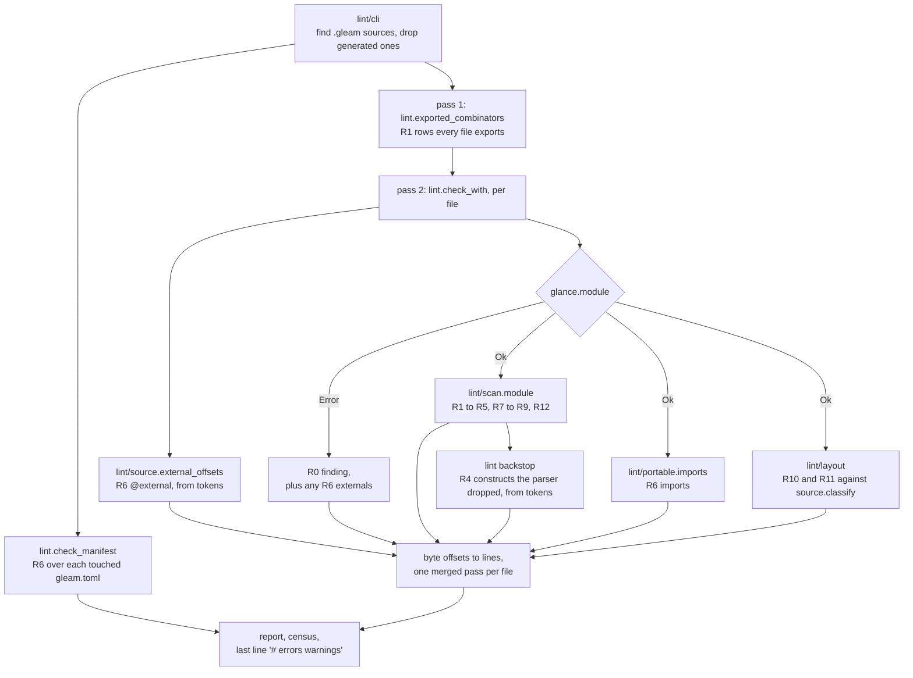
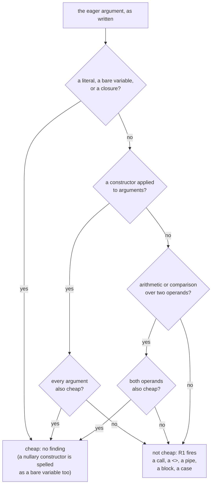
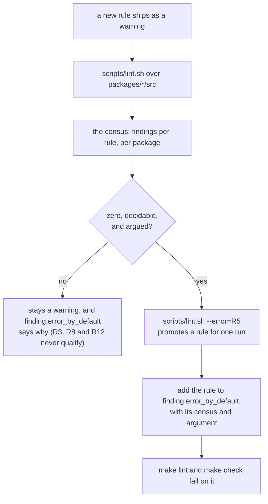

# lint

Loom's own lint: the house rules `gleam check` and `gleam format` do not
know about. Gleam ships no lint command. `gleam check` typechecks,
`gleam format` lays out, and neither has an opinion about whether an
eagerly-evaluated fallback is expensive, how deep a `case` may nest,
whether a `_ ->` arm is hiding a sibling variant, whether `panic`
belongs in `src/`, or whether a comment has a blank line above it. Those
rules lived in review and in prose until the prose stopped being enough.

The package is a developer tool, not part of any plane. It depends on no
Loom package and no Loom package depends on it; `scripts/lint.sh` runs
it, and `make lint` and `make check` call that script. It knows thirteen
rules, `R0` through `R12`. Five of them gate the build (R0, R2, R4, R6
and R10), and the other eight report without failing anything. Nothing
here is a security control; `codemode/vet` is the one that decides
whether hostile source may run.

## Why this exists, in two commits

`08cdbce` is the origin story. A de-nesting pass flattened
`core/json.gleam`'s string parser, and in doing so wrote one guard the
eager way: its `return:` built a `CorruptionReport`, and a report carries
an excerpt of the remaining input, and the excerpt measured that input's
length to decide whether to add an ellipsis. Gleam evaluates a function's
arguments before the function runs, so that report, excerpt and length
walk included, was constructed on *every character that parsed*, whether
the guard fired or not. Nothing was wrong on any error path. Every cost
landed on the happy one, which is why the tests stayed green and only a
timing assertion noticed. The commit's own fix is the fingerprint this
package's R1 and R5 are built to recognize: an eager guard becomes
`bool.lazy_guard`, and the excerpt's own length test stops walking the
whole tail to answer a question about the first twenty-five elements.

`186c78e` is why prose was never going to be enough on its own. It landed
one commit after this package did (`82dd7aa: lint: check the rules the
compiler cannot`), and its message states the finding plainly: *"The
first thing the new lint found was that the flattening wave had
reintroduced its own headline bug."* A rewrite's placement check in
`session/repo.gleam` built a full corruption report, id formatting
included, once per entry, on a fold; `machine/planner.gleam` had the same
shape on a recovery path. Both were written by the same pass that had
just flattened those files, and reviewed by the same eye that had just
written the rule against exactly this. Grep would have missed both
regressions: neither line contains `list.length`, and the second guard's
`return:` is a multi-line record build with nothing textually
distinctive about it. An AST walk reads every call the same way.

## The rules

`lint/finding.Rule` has one constructor per rule, and `finding.id`
prints it as `R0` to `R12`. The tier column is
`finding.error_by_default`, which `test/lint_test` pins.

| Rule | Name | What fires | Tier |
| --- | --- | --- | --- |
| R0 | `unparseable` | a file `glance` could not parse | **error** |
| R1 | `eager-fallback` | an eager combinator whose eagerly evaluated argument is not trivially cheap | warning |
| R2 | `nesting-depth` | `case` nesting deeper than 3, measured on the AST | **error** |
| R3 | `catch-all` | a final `_ ->` or bare-variable arm beside flat constructor patterns | warning, forever |
| R4 | `panic-in-src` | `panic` or `let assert` in `src/`, outside the `conformance` harness | **error** |
| R5 | `bounded-length` | `list.length` or `string.length` compared against a bound | warning |
| R6 | `portable-purity` | an `@external`, a BEAM-only import, or a BEAM-only dependency in a portable package | **error** |
| R7 | `assert-without-message` | a `let assert` in `src/` with no `as "…"` | warning |
| R8 | `lone-caller-arity` | a private function with more than 7 parameters and one caller | warning, forever |
| R9 | `naked-bool` | a `Bool` in a function parameter or a record field | warning |
| R10 | `comment-stanza` | a `//` comment between two siblings with code on the line directly above it | **error** |
| R11 | `dense-stanza` | a function with more than 8 statements in a row and no blank line or comment between them | warning |
| R12 | `broad-closure-capture` | a closure, returned, assigned or stored in a constructor, that uses an outer binding only to read its fields | warning, forever |

The thresholds in the table (3, 7 and 8) are `policy.default`. R4 and R7
are off for `test/` sources, which `make lint` does not read unless given
`--tests`. The package's [`CLAUDE.md`](CLAUDE.md) has a paragraph per
rule, with each narrowing and the census it was measured at.

## The pipeline

A run is two passes over the sources. R1's structural half has to know
every `use`-compatible combinator the run can see before it can judge any
call site, because a combinator defined in `tools/tool` is called from
other modules.

Everything except `lint/cli` is pure. `lint.check(path, code, policy)`
takes a string and a policy and returns a list of findings, given only
what `glance` gives back. The AST walk never sees a line number: it emits
byte offsets, and `lint` converts the whole batch to lines in one pass
over the file's own line index, which keeps the conversion linear rather
than a lookup per finding. `lint/cli` is the only module that touches a
filesystem or a terminal. It discovers files, skips the five generated
modules that carry a `DO NOT EDIT.` header (`lint.is_generated`), derives
the `gleam.toml` of every package whose sources it read, and prints the
report, the census and the `# <errors> <warnings>` line
`scripts/lint.sh` turns into an exit code.

Two rules keep working on a file `glance` cannot parse. R0 reports the
file, and R6's `@external` half reads tokens rather than the AST, so an
external in an unparseable file is still an error rather than an R0
warning. The other rules are silent about such a file, which is why R0
gates.

## R1's decision: what makes an argument cheap

R1 is the rule that pays for the tool, because it is the one `08cdbce`
and `186c78e` both are. Gleam evaluates every call argument before the
call runs; a combinator built for `use` position (`bool.guard`,
`result.unwrap`, or a locally-defined one shaped the same way) takes a
value that is *supposed* to be needed only sometimes, and Gleam builds it
every time regardless. The question the whole rule turns on is narrow:
given the argument at that position, would the call happily compute it
anyway?

Reading a record field, indexing a tuple, and building a closure are all
O(1) regardless of what they touch, so they join the cheap side without
recursing further into what they read. `<>` is deliberately on the
expensive side of "operator": it allocates a new binary proportional to
both operands, which is precisely the shape `excerpt`'s length walk and
`186c78e`'s id formatting both had. A `case`, a `block`, `panic`, `todo`
and `echo` are always expensive; none of them is a value a caller would
compute for free.

R1 finds a call two ways, and both feed the same decision tree once an
eager argument is in hand. The **hand-curated** half
(`lint/policy.eager_combinators`) knows six stdlib names
(`bool.guard`, `result.replace_error`, `result.unwrap`, `option.unwrap`,
`result.or`, `option.or`) plus the rare locally-defined function whose
shape the second half cannot reach: `tools/fs.require`, a two-argument
"optional becomes required" helper with no continuation to key off. The
**structural** half (`lint/scan.exported_eager_rows` and the rows each
file synthesizes for itself) finds this tree's own `or_fault` lineage by
*signature*: a locally-defined function whose last parameter is a
continuation `fn(…)` producing the function's own return type, and whose
other parameters are not functions, is `use`-compatible the same way
`bool.guard` is. The parameter at position zero is exempt, because it is
the subject the combinator is built to receive; only a parameter sitting
*between* the subject and the continuation is asked whether it is cheap.
The walk also reads the combinator's body, and a parameter the body
branches on before choosing is not reported, because the callee has
already used it.

That is also this half's limit. Telling a parameter that is wasted
whenever the continuation runs apart from one the callee uses on every
branch needs the callee's full control flow, which the walk does not
model, so R1 can over-report and stays a warning.

## Staging: how a rule reaches the error tier

A rule earns the error tier by a census that is zero, decidable without
types, and argued; being written is not enough. This is
`scripts/doc_check.sh`'s precedent (D2,
`docs/design-notes/four-decisions.md`), reused rather than reinvented. A
lint that fails correct code gets switched off.

The staging is data in `finding.error_by_default`, not a flag in
`scripts/lint.sh` or the `Makefile`, so a promotion is a one-line change
beside the argument for it. `finding.gate` turns a run's findings into
the `#(errors, warnings)` pair the CLI prints last, and the tests assert
against that pair: a test that a rule *fires* is not a test that it
gates.

The five gating rules got there in two ways. R0, R2 and R4 reached zero
by measurement once the first census was triaged: `glance` 7 parses the
whole tree, no function nests `case` more than three deep, and R4 is zero
once `policy.harness_packages` exempts `conformance`, whose `src/` is a
test harness that must compile as a library. R6 and R10 were driven to
zero in the change that wrote them. R10's sweep inserted 1137 blank lines
and was checked against `gleam format --check`, the one tool that could
contradict it; its two exemptions, a comment opening a block and a
comment between two constructor fields, are exactly the two places the
formatter deletes a blank line.

Of the warnings, R1, R5, R7 and R9 are decidable and could be promoted
once their censuses are fixed to zero. R11's threshold of eight
statements is a judgement rather than a fact, so it reports a reading.
R3, R8 and R12 over-report by construction and will never gate. The
current counts, and the reason for each disposition, are in `CLAUDE.md`
under **Staging**.

## R6 and the portable subset

R6 holds four packages, `policy.portable_packages`, to a stricter rule
than the rest of the tree: no `@external` of any target, and no
`gleam_erlang` or `gleam_otp` (`policy.beam_only_dependencies`) as an
import or as a key in `gleam.toml`. The packages are `core`, `machine`
and `prompt`, which stay property-testable without processes and
compilable to the JavaScript target, and `session_view`, which is held
to the same rule so that neither host that drives it, the terminal or
the daemon's web view, can leak into it.

The rule names no target on purpose. An Erlang external ends the
portability, a JavaScript one breaks the BEAM build Loom ships on, and a
matched pair still puts trusted-unchecked foreign code inside packages
whose claim is that they are pure. Each half looks where a miss would be
least likely: `@external` is found in the token stream, imports in the
AST, and dependencies by a line scan of `gleam.toml` that does not tell
`[dependencies]` from `[dev_dependencies]`. `lint/portable`'s module doc
has the whole argument, including why "portable" does not mean the
harness can run in a browser.

## Why it parses rather than greps

A column counter and an AST walk disagree on what "deep" means, and the
disagreement runs in both directions. `gleam format` gives a wide call or
literal one argument per line once it will not fit on one, so a nested
`json.Object([#("k", json.Array(...))])` indents as far as any `case`
staircase and means nothing of the kind. `client/protocol.gleam` and
`machine/codec.gleam` both read as deep to any indentation census, and
neither contains a pyramid: every deep line in both is inside a literal
the formatter wrapped, and R2's walk, measured on the `case` nodes
themselves, reports zero for both. A tool that counted columns would flag
two files with nothing wrong, and could miss a real staircase sitting at
a shallow column because the arm above it happened to be short. The same
reasoning is why R11 counts statements rather than lines. Only a parse
tells the two apart.

## Why R3 will never gate

R3 flags a final catch-all arm, spelled `_ ->` or as a bare variable such
as `other ->`, whose sibling arms are flat constructor patterns. That is
the arm that would silently stop compiling when a type gains a new
variant, if only the wildcard were not standing in the way. Three
narrowings, all decidable from syntax alone, keep it from drowning in its
own false positives. A `case` where any arm matches a literal is left
alone, because no enumeration of `Int` exists and `_ ->` is mandatory
there. A `case` whose arms match *combinations*, such as
`Ok(Some(Cell(..)))`, is left alone, because `_ ->` there stands for the
remaining combinations rather than for one missing sibling. And a `case`
with a guarded arm is left alone, because a guarded arm cannot be
exhaustive on its own, so the final arm is mandatory.

What is left still mixes two things `glance` cannot tell apart: genuine
variant dispatch, where a new constructor would compile silently past
the wildcard, and an idiomatic two-arm predicate returning `True`/`False`,
where enumerating every current and future variant would be worse code
than the wildcard it replaces. Telling them apart needs the subject's
*type* (how many variants it has, and whether the other arms cover them),
and `glance` resolves no types. It is the same undecidable class
`scripts/doc_check.sh` lives with for a citation that names a symbol
absent from the file it points at. R3 says so in every finding's text
rather than guessing.

## The `glance` pins differ on purpose

This package depends on `glance >= 7.0.0 and < 8.0.0`; `codemode`
depends on `glance >= 6.1.0 and < 7.0.0`. That is not drift to unify.
`lint` needs a `Span` on every expression and pattern to name a byte
offset for each finding, and it is written against the 7.x AST.
`codemode/vet`'s rules and its `Vetted` token are written against the AST
of the release it pins. The two packages build independently, so the
pins never interact. Bumping either one is a compatibility check against
that package's own AST usage, not a version number to bring in line with
the other.

## The modules

| Module | What it holds |
| --- | --- |
| `lint` | `check`, `check_with`, `exported_combinators` and `check_manifest`, the library entry points; `package_of`, `is_generated`, and R4's token backstop. |
| `lint/scan` | The AST walk: R1 to R5, R7 to R9 and R12; `cheap`, R1's predicate; `exported_eager_rows`, R1's structural half. |
| `lint/layout` | R10 and R11: `blocks` finds where each sibling begins, and `findings` judges the lines between them. |
| `lint/portable` | R6's three halves (`externals`, `imports`, `manifest`) and the argument for the rule. |
| `lint/policy` | `Policy` and its thresholds, `eager_combinators` (R1), `counted_calls` (R5), `harness_packages` (R4), `portable_packages` and `beam_only_dependencies` (R6). |
| `lint/finding` | `Rule`, `Finding`, `error_by_default`, `gate`, and the rendering every report shares. |
| `lint/source` | Byte offsets to lines, the `glexer` token scans (R4's backstop, R6's `@external`, comments, variant heads), and `classify`, the line table the layout rules read. |
| `lint/cli` | Argument parsing, file and manifest discovery, the generated-source skip, the report and the census. The only module here that does I/O. |

Paths are relative to `packages/lint/src/`: `lint/scan` is
`packages/lint/src/lint/scan.gleam`.

## Tests

`make check-lint` is the package gate: `gleam format --check`, a
warning-free build, and the EUnit suite through `scripts/test.sh`.
`make test-lint` runs the tests alone. `make lint` runs the tool over
every `packages/*/src`, and `make lint-lint` runs it over this package.

All tests are in `test/lint_test.gleam`, and they run the library on
source strings rather than on files. Every rule has a positive and a
negative case, because a rule that cannot fail reads as coverage and
provides none. R0, R2, R4 and R10 each have a test that runs a
violation through `finding.gate` and checks the error count, other tests
check that an unpromoted rule only warns, and
`the_gating_rules_are_pinned_test` fixes the contents of
`error_by_default`, R6 included. The narrowings are tested from both
sides, so removing one fails a test rather than quietly flooding the
census. R1 is pinned to the `core/json` regression shape verbatim, and
R6's negative cases pin the shape of each check: `@external` inside a
string or a comment, a `gleam/erlangish` import, and a commented-out
dependency line.

## Reading further

- [`CLAUDE.md`](CLAUDE.md): the reference doc for changing this code,
  with a paragraph per rule, the full staging table with current
  censuses, and the invariants that break things when violated. Read it
  before editing.
- [`src/lint/finding.gleam`](src/lint/finding.gleam):
  `error_by_default`'s doc comment carries one census and one argument
  per gating rule.
- [`src/lint/portable.gleam`](src/lint/portable.gleam): R6 in full.
- [`src/lint/layout.gleam`](src/lint/layout.gleam): R10 and R11 in full,
  including why layout cannot live in the AST walk.
- [`scripts/lint.sh`](../../scripts/lint.sh): the wrapper `make lint`
  calls, the `# <errors> <warnings>` contract, and `--error` for
  promoting a rule for one run.
- [`docs/gleam-style.md`](../../docs/gleam-style.md): Part II's
  "Stanzas: how code breathes" (R10, R11), Part III's "Eager arguments",
  "Short-circuit combinators" and "No naked `Bool`" (R1, R9), and Part IV
  rules 3 and 5 (R4 and R7, then R6).
- [`docs/design-notes/four-decisions.md`](../../docs/design-notes/four-decisions.md):
  D2, the staging precedent this package follows.
